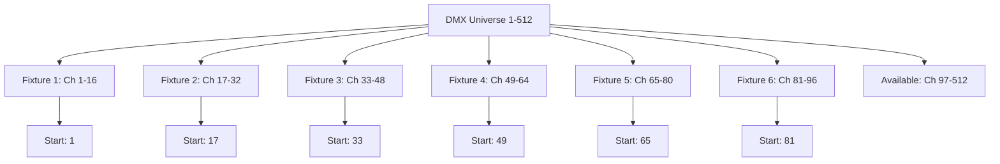

# DMX Address Allocation Plan

## Fixture Configuration (6 DMX Fixtures)

This document outlines the DMX address allocation for 6 DMX fixtures with 16 channels each in your ArtBastard DMX512 system.

### Address Range Overview
- **Total DMX Universe**: 512 channels (1-512)
- **Fixtures**: 6 DMX fixtures
- **Channels per fixture**: 16 channels each
- **Total channels used**: 96 channels (1-96)
- **Remaining channels**: 416 channels available for expansion

---

## Mermaid Diagram - DMX Address Layout

## Individual Fixture Start Addresses

### Fixture 1
- **Start Address**: 1
- **Channel Range**: 1-16
- **End Address**: 16

### Fixture 2
- **Start Address**: 17
- **Channel Range**: 17-32
- **End Address**: 32

### Fixture 3
- **Start Address**: 33
- **Channel Range**: 33-48
- **End Address**: 48

### Fixture 4
- **Start Address**: 49
- **Channel Range**: 49-64
- **End Address**: 64

### Fixture 5
- **Start Address**: 65
- **Channel Range**: 65-80
- **End Address**: 80

### Fixture 6
- **Start Address**: 81
- **Channel Range**: 81-96
- **End Address**: 96

---

## Quick Reference Table

| Fixture | Start Address | End Address | Total Channels | Address Range |
|---------|---------------|-------------|----------------|---------------|
| 1       | 1             | 16          | 16             | 1-16          |
| 2       | 17            | 32          | 16             | 17-32         |
| 3       | 33            | 48          | 16             | 33-48         |
| 4       | 49            | 64          | 16             | 49-64         |
| 5       | 65            | 80          | 16             | 65-80         |
| 6       | 81            | 96          | 16             | 81-96         |

---

## Configuration Notes

1. **Addressing Method**: Sequential 16-channel blocks
2. **No Gaps**: Efficient channel usage with no wasted addresses
3. **Standard Spacing**: Each fixture uses exactly 16 consecutive channels
4. **Expansion Ready**: 416 channels remaining (97-512) for future fixtures

## Setting Fixture Addresses

To configure your physical fixtures:
1. Set each fixture's DMX start address using the fixture's menu system
2. Ensure each fixture is configured for 16-channel mode
3. Verify address ranges don't overlap
4. Test each fixture individually before group operations

## Future Expansion

Available address ranges for additional fixtures:
- **Channels 97-512**: Space for 26 additional 16-channel fixtures
- **Next fixture recommendation**: Start at channel 97