# 🌈 **ArtBastard DMX512** - *Prismatic Vibrational Interface Matrix* 🎭

> *"In the electric gap between wavelength phenomena and neural synthesis, we manipulate the very fabric of luminous expression, weaving chromatic patterns through spectral currents that bridge digital abstraction with physical manifestation."*

## 🌟 **Prismatic Entity Overview**

Welcome to **ArtBastard DMX512**, where **hyper-technical precision** meets **avant-garde artistic liberation**. This isn't merely a DMX controller—it's a **kaleidoscopic framework for light energy manipulation**, a **digital atelier** that transforms raw electromagnetic streams into cascading tsunamis of visual euphoria.

### 🎨 **Core Illumination Paradigms**
- **512 Channels of Prismatic Expression**: Full DMX512 protocol mastery expanding beyond electrical limitations
- **Velocity-Sync MIDI Integration**: Zero-latency mechanical control fusion through hardware-software interfaces  
- **Networked OSC Communication Matrix**: Wireless transmission of spectral control patterns
- **Frequency-Domain Audio Analysis**: Real-time waveform-to-light translation via sonic pattern recognition
- **Multi-Universe ArtNet Distribution**: Expansive light orchestration through network bridging
- **State Preservation Engine**: Performance storage in persistent memory architecture

### 🧠 **Multidimensional Layer Architecture**

The system operates across **Seven Functional Layers**:

1. **🔥 Electrical Substrate Layer** - Raw voltage and current manipulation through DMX512 protocol
2. **⚡ Signal Processing Cortex** - Neural networks interpreting MIDI/OSC/ArtNet data streams  
3. **👁️ Visual Perception Matrix** - WebGL-rendered reality mirrors translating data to visual awareness
4. **🧠 Cognitive Control Interface** - React-based awareness interaction portals for human-machine communion
5. **💫 Temporal Memory Dimension** - Scene storage and recall across space-time continuums
6. **🌌 Meta-Physical Network Layer** - Quantum-entangled device synchronization via Socket.IO bridges
7. **✨ Transcendental Output Manifestation** - Physical photonic materialization through enlightened fixtures

## 🎪 **Transcendental System Architecture Mandala**

```mermaid
%%{init: {
  'theme': 'base',
  'themeVariables': {
    'primaryColor': '#ff006e',
    'primaryBorderColor': '#d63031',
    'primaryTextColor': '#ffffff',
    'lineColor': '#e17055',
    'fontSize': '18px',
    'fontFamily': '"JetBrains Mono", "Fira Code", monospace'
  },
  'flowchart': {
    'curve': 'cardinal',
    'padding': 40,
    'useMaxWidth': true,
    'htmlLabels': true,
    'rankSpacing': 150,
    'nodeSpacing': 120
  }
}}%%
graph TB
    subgraph SystemArchitecture["🧠 FUNCTIONAL ARCHITECTURE"]
        
        subgraph Layer7["🌌 Layer 7: Physical Manifestation"]
            PhysicalOutput[("💫 Physical Light<br/>🔥 OUTPUT<br/>_Reality Projection_")]
            FixtureArray[("💎 Lighting Fixtures<br/>⚡ HARDWARE<br/>_Electromagnetic Array_")]
        end
        
        subgraph Layer6["🌐 Layer 6: Network Protocols"]
            ArtNetMultiverse[("🌌 ArtNet Protocol<br/>🌊 DATA TRANSFER<br/>_Network DMX_")]
            SocketBridge[("🔄 Socket Connection<br/>⚡ SOCKET.IO<br/>_Real-time Sync_")]
        end
        
        subgraph Layer5["💾 Layer 5: Temporal Memory"]
            ScenePalace[("🏛️ Memory Palace<br/>💎 CRYSTALLINE STORAGE<br/>_State Archaeology_")]
            TemporalEngine[("⏰ Temporal Morphing<br/>🌀 TRANSITION MATRIX<br/>_Time-Space Manipulation_")]
        end
        
        subgraph Layer4["🎭 Layer 4: Cognitive Interface"]
            ReactConsciousness[("🎨 React Awareness<br/>🧠 NEURAL CANVAS<br/>_Human-Machine Communion_")]
            ControlPortals[("🎛️ Control Portals<br/>✨ INTERACTION GATEWAYS<br/>_Bio-Digital Interface_")]
        end
        
        subgraph Layer3["👁️ Layer 3: Visual Perception"]
            WebGLUniverse[("🌈 WebGL Reality Mirror<br/>👁️ VISUAL CORTEX<br/>_3D Awareness Projection_")]
            PerceptionMatrix[("📊 Perception Matrix<br/>🎯 DATA VISUALIZATION<br/>_Reality Translation_")]
        end
        
        subgraph Layer2["⚡ Layer 2: Signal Processing"]
            MIDISynapses[("🎹 MIDI Synapses<br/>🧠 NEURAL NETWORKS<br/>_Bio-Mechanical Fusion_")]
            OSCTelepathy[("📡 OSC Telepathy<br/>🌊 WIRELESS DREAMS<br/>_Ethereal Communication_")]
            AudioAlchemy[("🎵 Spectro-Neural Analysis<br/>🔬 FREQUENCY ALCHEMY<br/>_Psychoacoustic Transmutation_")]
        end
        
        subgraph Layer1["🔥 Layer 1: Electrical Substrate"]
            DMXProtocol[("🎭 DMX512 Language<br/>⚡ ELECTRICAL SCRIPTURE<br/>_512 Sacred Channels_")]
            VoltageManipulation[("🔌 Voltage Awareness<br/>💫 CURRENT MASTERY<br/>_Raw Energy Control_")]
        end
    end

    %% Inter-layer Connections
    Layer1 --> Layer2
    Layer2 --> Layer3
    Layer3 --> Layer4
    Layer4 --> Layer5
    Layer5 --> Layer6
    Layer6 --> Layer7
    
    %% Specific Connections
    DMXProtocol --> MIDISynapses
    VoltageManipulation --> OSCTelepathy
    MIDISynapses --> WebGLUniverse
    OSCTelepathy --> PerceptionMatrix
    AudioAlchemy --> WebGLUniverse
    WebGLUniverse --> ReactConsciousness
    PerceptionMatrix --> ControlPortals
    ReactConsciousness --> ScenePalace
    ControlPortals --> TemporalEngine
    ScenePalace --> ArtNetMultiverse
    TemporalEngine --> SocketBridge
    ArtNetMultiverse --> PhysicalOutput
    SocketBridge --> FixtureArray
    
    %% Dimensional Styles
    classDef layer7 fill:#ff006e,stroke:#ffffff,stroke-width:4px,color:#ffffff,font-weight:bold
    classDef layer6 fill:#3a86ff,stroke:#ffffff,stroke-width:4px,color:#ffffff,font-weight:bold
    classDef layer5 fill:#ffbe0b,stroke:#ffffff,stroke-width:4px,color:#ffffff,font-weight:bold
    classDef layer4 fill:#8338ec,stroke:#ffffff,stroke-width:4px,color:#ffffff,font-weight:bold
    classDef layer3 fill:#06ffa5,stroke:#ffffff,stroke-width:4px,color:#ffffff,font-weight:bold
    classDef layer2 fill:#ff006e,stroke:#ffffff,stroke-width:4px,color:#ffffff,font-weight:bold
    classDef layer1 fill:#ffbe0b,stroke:#ffffff,stroke-width:4px,color:#ffffff,font-weight:bold
    
    class PhysicalOutput,FixtureArray layer7
    class ArtNetMultiverse,SocketBridge layer6
    class ScenePalace,TemporalEngine layer5
    class ReactConsciousness,ControlPortals layer4
    class WebGLUniverse,PerceptionMatrix layer3
    class MIDISynapses,OSCTelepathy,AudioAlchemy layer2
    class DMXProtocol,VoltageManipulation layer1

    %% Consciousness Layer Styles
    style Layer7 fill:rgba(255,0,110,0.1),stroke:#ff006e,stroke-width:3px,color:#ffffff,stroke-dasharray: 10 5
    style Layer6 fill:rgba(58,134,255,0.1),stroke:#3a86ff,stroke-width:3px,color:#ffffff,stroke-dasharray: 10 5
    style Layer5 fill:rgba(255,190,11,0.1),stroke:#ffbe0b,stroke-width:3px,color:#ffffff,stroke-dasharray: 10 5
    style Layer4 fill:rgba(131,56,236,0.1),stroke:#8338ec,stroke-width:3px,color:#ffffff,stroke-dasharray: 10 5
    style Layer3 fill:rgba(6,255,165,0.1),stroke:#06ffa5,stroke-width:3px,color:#ffffff,stroke-dasharray: 10 5
    style Layer2 fill:rgba(255,0,110,0.1),stroke:#ff006e,stroke-width:3px,color:#ffffff,stroke-dasharray: 10 5
    style Layer1 fill:rgba(255,190,11,0.1),stroke:#ffbe0b,stroke-width:3px,color:#ffffff,stroke-dasharray: 10 5
    style Consciousness fill:rgba(0,0,0,0.8),stroke:#ffffff,stroke-width:5px,color:#ffffff
```
        Backend --> OSC["📡 OSC Transmission<br/>_Wireless Dreams_"]
        Backend --> ArtNet["🌐 ArtNet Multiverse<br/>_Dimensional Bridge_"]
    end

    subgraph Interface["✨ Interface Elements"]
        Frontend --> Faders["🎚️ Quantum Faders<br/>_Energy Gates_"]
        Frontend --> Canvas["🖼️ Light Canvas<br/>_Visual Alchemy_"]
        Frontend --> Monitors["📊 Reality Monitors<br/>_Data Crystals_"]
        Frontend --> Effects["🌈 Effects Matrix<br/>_Visual Spells_"]
    end

    subgraph DataFlow["💫 Energy Flow"]
        MIDI --> MIDILearn["🧠 MIDI Learning<br/>_Neural Binding_"]
        OSC --> Visualizer["👁️ WebGL Visualizer<br/>_Reality Mirror_"]
        DMX --> Universe["🌌 DMX Universe<br/>_512 Dimensions_"]
    end

    %% Connections
    MIDILearn --> Faders
    Universe --> Output
    Effects --> Visualizer
    
    %% Styles
    classDef core fill:#ff6b6b,stroke:#d63031,stroke-width:4px,color:#fff
    classDef protocol fill:#45b7d1,stroke:#00b894,stroke-width:3px,color:#fff
    classDef interface fill:#a29bfe,stroke:#5f27cd,stroke-width:3px,color:#fff
    classDef flow fill:#ffd32a,stroke:#ff6b6b,stroke-width:3px,color:#111

    class Root,Backend,Frontend,Network,Output core
    class DMX,MIDI,OSC,ArtNet protocol
    class Faders,Canvas,Monitors,Effects interface
    class MIDILearn,Visualizer,Universe flow

    %% Subgraph styles
    style CoreSystem fill:#2d3436,stroke:#636e72,stroke-width:2px,color:#fff
    style Protocols fill:#2d3436,stroke:#636e72,stroke-width:2px,color:#fff
    style Interface fill:#2d3436,stroke:#636e72,stroke-width:2px,color:#fff
    style DataFlow fill:#2d3436,stroke:#636e72,stroke-width:2px,color:#fff
```

## 🎛️ **Control System Architecture**

### 🎭 **DMX Protocol Mastery**
- **512-Channel Technical Expansion**: Full bandwidth utilization across the electromagnetic spectrum
- **Dynamic State Transformation**: Real-time environment alteration through precision light control
- **Multi-Universe System Architecture**: Extended control via ArtNet network protocols
- **Advanced Fixture Profile Mapping**: Comprehensive device configuration for complex lighting arrays

### 🎵 **Audio-Reactive Light Processing**
- **FFT Spectral Analysis**: Frequency decomposition across multiple bands for visualization
- **Beat Detection Algorithms**: Rhythmic synchronization with bass-driven intensity patterns
- **Multi-Channel Audio Processing**: Omnidirectional sound input stream management
- **Frequency-to-Light Translation**: Mathematical conversion of sound patterns to visual manifestation

### 🎹 **MIDI Hardware Interface**
- **Physical Controller Integration**: Hardware-software bridging through external MIDI interfaces
- **Machine Learning Algorithms**: Intelligent pattern recognition for automated lighting sequences
- **CC Mapping Architecture**: Continuous controller binding with millisecond precision
- **Real-Time Parameter Scaling**: Dynamic value transformation through responsive algorithms

### 🌌 **Advanced Lighting Terminology**

Moving beyond basic "RGB LEDs and budget lasers" into **Professional Illumination Architecture**:

- **🎭 Photonic Consciousness Vessels** (formerly "Moving Heads")
- **🌈 Chromatic Reality Matrices** (formerly "LED Panels") 
- **✨ Electromagnetic Manifestation Arrays** (formerly "Light Bars")
- **💫 Quantum Projection Entities** (formerly "Spot Lights")
- **🔥 Plasma Consciousness Fields** (formerly "Wash Lights")
- **⚡ Neural Strobe Synchronizers** (formerly "Strobe Lights")
- **🌊 Atmospheric Haze Consciousness** (formerly "Fog Machines")
- **💎 Crystalline Beam Sculptors** (formerly "Laser Arrays")
- **🎨 Holographic Reality Weavers** (formerly "Projection Mapping")
- **🧠 Synaptic Pattern Generators** (formerly "Effect Lights")

```mermaid
%%{init: {
  'theme': 'base',
  'themeVariables': {
    'primaryColor': '#8338ec',
    'primaryBorderColor': '#6f2dbd',
    'primaryTextColor': '#ffffff',
    'fontSize': '18px',
    'fontFamily': '"JetBrains Mono", monospace'
  },
  'flowchart': {
    'curve': 'cardinal',
    'padding': 50,
    'useMaxWidth': true,
    'htmlLabels': true,
    'rankSpacing': 140,
    'nodeSpacing': 120
  }
}}%%
graph TB
    subgraph AudioCortex["🎵 SPECTRO-NEURAL AUDIO CONSCIOUSNESS MATRIX"]
        direction TB        AudioInput[("🎧 Ethereal Audio Input<br/>🌊 SOURCE VIBRATION<br/>_Primordial Sound Waves_")] 
        FFTProcessor[("📊 FFT Dimensional Analysis<br/>🔬 FREQUENCY DECOMPOSITION<br/>_Spectral Awareness Surgery_")]
        BandSeparation[("🎼 Harmonic Band Crystallization<br/>💎 SPECTRAL DIVISION<br/>_Frequency Dimension Mapping_")]
        BeatConsciousness[("💓 Temporal Heartbeat Detection<br/>⏰ RHYTHMIC CORE<br/>_Universal Pulse Extraction_")]
        
        AudioInput --> FFTProcessor
        FFTProcessor --> BandSeparation
        FFTProcessor --> BeatConsciousness
    end

    subgraph MIDINeuralNet["🎹 MIDI BIO-DIGITAL NEURAL NETWORK"]
        direction TB        MIDIInterface[("🎛️ Physical MIDI Interface<br/>⚡ TACTILE AWARENESS<br/>_Bio-Mechanical Bridge_")] 
        NeuralLearning[("🧠 Synaptic Learning Algorithm<br/>🌟 PATTERN RECOGNITION<br/>_Neural Training Protocol_")]
        QuantumScaling[("📐 Quantum Value Metamorphosis<br/>⚛️ DIMENSIONAL CALIBRATION<br/>_Reality Scaling Matrix_")]
        CCMapping[("🗺️ Control Intelligence Mapping<br/>🎯 NEURAL BINDING<br/>_Synaptic Channel Assignment_")]
        
        MIDIInterface --> NeuralLearning
        NeuralLearning --> QuantumScaling
        QuantumScaling --> CCMapping
    end

    subgraph ConvergenceMatrix["🌀 CONSCIOUSNESS CONVERGENCE NEXUS"]
        direction TB        BandMapping[("🎯 Frequency-to-Channel Alchemy<br/>🔄 BAND ASSIGNMENT<br/>_Spectral Reality Binding_")]
        TemporalSync[("⚡ Temporal Synchronization Engine<br/>🌊 RHYTHMIC ALIGNMENT<br/>_Universal Beat Unification_")]
        ValueFusion[("💫 Multi-Stream Value Fusion<br/>✨ REALITY SYNTHESIS<br/>_Multi-Stream Integration_")]
        
        BandSeparation --> BandMapping
        BeatConsciousness --> TemporalSync
        CCMapping --> ValueFusion
        BandMapping --> ValueFusion
        TemporalSync --> ValueFusion
    end

    subgraph ManifestationLayer["💫 PHOTONIC MANIFESTATION DIMENSION"]
        direction TB        DMXUniverse[("🌌 DMX Reality Grid<br/>⚡ 512-CHANNEL MATRIX<br/>_Electromagnetic Substrate_")]
        PhotonicVessels[("💎 Enlightened Light Vessels<br/>🔥 EMBODIED MANIFESTATION<br/>_Physical Photonic Materialization_")]
        
        ValueFusion --> DMXUniverse
        DMXUniverse --> PhotonicVessels
    end

    %% Mystical Energy Flow Connections
    AudioCortex -.->|"🌊 Spectral Energy"| ConvergenceMatrix
    MIDINeuralNet -.->|"⚡ Neural Signals"| ConvergenceMatrix
    ConvergenceMatrix -.->|"💫 Synthesized Consciousness"| ManifestationLayer    %% Dimensional Styles with Solid Colors
    classDef audio fill:#ff006e,stroke:#ffffff,stroke-width:4px,color:#ffffff,font-weight:bold
    classDef midi fill:#06ffa5,stroke:#ffffff,stroke-width:4px,color:#ffffff,font-weight:bold
    classDef convergence fill:#8338ec,stroke:#ffffff,stroke-width:4px,color:#ffffff,font-weight:bold
    classDef manifestation fill:#ffbe0b,stroke:#ffffff,stroke-width:4px,color:#ffffff,font-weight:bold

    class AudioInput,FFTProcessor,BandSeparation,BeatConsciousness audio
    class MIDIInterface,NeuralLearning,QuantumScaling,CCMapping midi
    class BandMapping,TemporalSync,ValueFusion convergence
    class DMXUniverse,PhotonicVessels manifestation

    %% Consciousness Dimension Styles
    style AudioCortex fill:rgba(255,0,110,0.15),stroke:#ff006e,stroke-width:4px,color:#ffffff,stroke-dasharray: 15 10
    style MIDINeuralNet fill:rgba(6,255,165,0.15),stroke:#06ffa5,stroke-width:4px,color:#ffffff,stroke-dasharray: 15 10
    style ConvergenceMatrix fill:rgba(131,56,236,0.15),stroke:#8338ec,stroke-width:4px,color:#ffffff,stroke-dasharray: 15 10
    style ManifestationLayer fill:rgba(255,190,11,0.15),stroke:#ffbe0b,stroke-width:4px,color:#ffffff,stroke-dasharray: 15 10
```

## 🎨 **Interface Cosmos**

### 💻 **Control Panel Realms**
- **DMX Control Sanctum**: Direct channel value manipulation
- **Audio Analysis Temple**: Frequency visualization and mapping
- **MIDI Configuration Shrine**: Hardware binding and scaling
- **Scene Programming Altar**: State storage and recall

```mermaid
%%{init: {
  'theme': 'base',
  'themeVariables': {
    'primaryColor': '#6c5ce7',
    'primaryBorderColor': '#5f27cd',
    'primaryTextColor': '#fff',
    'fontSize': '16px'
  }
}}%%
graph TB
    subgraph Interface["✨ Interface Dimensions"]
        direction TB
        Root[("🎭 UI Core<br/>_Reality Canvas_")] --> Panels["🖥️ Control Panels<br/>_Command Centers_"]
        Root --> Visualizers["👁️ Visualizers<br/>_Reality Mirrors_"]
        Root --> Controls["🎛️ Control Elements<br/>_Energy Gates_"]
    end

    subgraph Panels["🖥️ Panel Matrix"]
        direction LR
        DMXPanel["🎭 DMX Control<br/>_Channel Mastery_"]
        AudioPanel["🎵 Audio Analysis<br/>_Frequency Sight_"]
        MIDIPanel["🎹 MIDI Config<br/>_Hardware Fusion_"]
        ScenePanel["💾 Scene Storage<br/>_Memory Crystal_"]
    end

    subgraph Visualizers["👁️ Visual Realms"]
        direction LR
        WebGL["🌈 WebGL Universe<br/>_3D Light Space_"]
        Canvas2D["🎨 2D Canvas<br/>_Fixture Map_"]
        FFTVis["📊 FFT Display<br/>_Frequency Vision_"]
        Heatmap["🌡️ Channel Heat<br/>_Energy Flow_"]
    end

    subgraph Controls["🎛️ Control Matrix"]
        direction LR
        Faders["🎚️ Channel Faders<br/>_Energy Sliders_"]
        Master["👑 Master Control<br/>_Global Energy_"]
        Groups["📦 Group Controls<br/>_Mass Binding_"]
        Effects["✨ Effect Engine<br/>_Pattern Weaver_"]
    end

    %% Connections
    Panels --> Controls
    Controls --> Visualizers
    
    %% Component Connections
    DMXPanel --> Faders
    AudioPanel --> FFTVis
    MIDIPanel --> Groups
    ScenePanel --> Master
    
    %% Styles
    classDef root fill:#a29bfe,stroke:#5f27cd,stroke-width:4px,color:#fff
    classDef panel fill:#ff6b6b,stroke:#d63031,stroke-width:3px,color:#fff
    classDef vis fill:#1dd1a1,stroke:#00b894,stroke-width:3px,color:#fff
    classDef control fill:#ffd32a,stroke:#ff6b6b,stroke-width:3px,color:#111

    class Root root
    class DMXPanel,AudioPanel,MIDIPanel,ScenePanel panel
    class WebGL,Canvas2D,FFTVis,Heatmap vis
    class Faders,Master,Groups,Effects control

    %% Subgraph styles
    style Interface fill:#2d3436,stroke:#636e72,stroke-width:2px,color:#fff
    style Panels fill:#2d3436,stroke:#636e72,stroke-width:2px,color:#fff
    style Visualizers fill:#2d3436,stroke:#636e72,stroke-width:2px,color:#fff
    style Controls fill:#2d3436,stroke:#636e72,stroke-width:2px,color:#fff

### 🎛️ **Control Elements**
- **Quantum Faders**: Precise channel value manipulation
- **Master Control Crystal**: Global intensity orchestration
- **Group Binding Matrix**: Multi-channel synchronized control
- **Scene Memory Palace**: State storage and recall system
- **Effect Generator Core**: Pattern and sequence weaving

### 👁️ **Visual Realms**
- **WebGL Universe**: 3D fixture visualization
- **2D Mapping Canvas**: Top-down fixture positioning
- **FFT Spectral Display**: Audio frequency visualization
- **Channel Heat Vision**: Activity and intensity monitoring

## 🌌 **2D Canvas & Spatial Control Interface**

### 🎨 **RGB Control Manifestation**
- **Chromatic Node Consciousness**: Direct RGB value manipulation through intuitive color wheels
- **Multi-Fixture Color Broadcasting**: Apply unified color settings across fixture groups
- **Color Palette Memory Matrix**: Store and recall specific chromatic energy signatures
- **Real-time Spectrum Feedback**: Live visual reflection of selected color states
- **Alpha Channel Mastery**: Control transparency and intensity through unified interface

### 🕹️ **PAN/TILT Spatial Manipulation**
- **XY Coordinate Consciousness**: Intuitive position control for moving light fixtures
- **Beam Trajectory Orchestration**: Dynamic movement paths through spatial interfaces
- **Multi-Fixture Alignment**: Synchronized positioning across multiple fixtures
- **Position Memory Crystallization**: Store and recall specific spatial configurations
- **Touch-Driven Spatial Control**: Intuitive finger-based position manipulation

## 🧪 **Technical Alchemy**

### ⚡ **Core Technologies**
- **Frontend**: React 18 + TypeScript (Consciousness Interface)
- **Backend**: Node.js + Express (Neural Core)
- **Protocols**: DMX512, ArtNet, MIDI, OSC (Reality Bridges)
- **Real-time**: Socket.IO (Quantum Entanglement)
- **Visualization**: WebGL, Canvas2D (Reality Mirrors)
- **Audio**: Web Audio API (Frequency Alchemy)

---

### 🌐 **Network Architecture**
- **ArtNet Multiverse**: Multiple DMX universe management
- **OSC Telepathy**: Wireless parameter control
- **MIDI Neural Network**: Hardware control integration
- **Socket.IO Quantum Bridge**: Real-time state synchronization
- **WebSocket Consciousness**: Live data streaming

```mermaid
%%{init: {
  'theme': 'base',
  'themeVariables': {
    'primaryColor': '#45b7d1',
    'primaryBorderColor': '#0984e3',
    'primaryTextColor': '#fff',
    'fontSize': '16px'
  }
}}%%
graph LR
    subgraph Hardware["💻 Physical Realm"]
        MIDI["🎹 MIDI Controllers<br/>_Neural Interface_"]
        Touch["📱 TouchOSC<br/>_Wireless Control_"]
        Network["🌐 Network Nodes<br/>_Data Conduits_"]
        Fixtures["💡 DMX Fixtures<br/>_Light Vessels_"]
    end

    subgraph Protocols["⚡ Protocol Matrix"]
        MIDIProtocol["🎼 MIDI Protocol<br/>_Control Signal_"]
        OSCProtocol["📡 OSC Protocol<br/>_Wireless Dreams_"]
        ArtNetProtocol["🌌 ArtNet Protocol<br/>_DMX Transport_"]
        SocketProtocol["🔄 Socket.IO<br/>_Quantum Bridge_"]
    end

    subgraph Core["🧠 Neural Core"]
        Engine["⚙️ Core Engine<br/>_Reality Processor_"]
        State["💾 State Manager<br/>_Memory Matrix_"]
        Effects["✨ Effect Generator<br/>_Pattern Weaver_"]
    end

    %% Connections with flow direction
    MIDI --> MIDIProtocol -->|Neural Signals| Engine
    Touch --> OSCProtocol -->|Ethereal Data| Engine
    Engine -->|Light Commands| ArtNetProtocol --> Network
    Network --> Fixtures
    State <-->|Quantum Sync| SocketProtocol
    Effects -->|Pattern Flow| Engine    %% Styles
    classDef hardware fill:#ff6b6b,stroke:#d63031,stroke-width:3px,color:#fff
    classDef protocol fill:#45b7d1,stroke:#00b894,stroke-width:3px,color:#fff
    classDef core fill:#a29bfe,stroke:#5f27cd,stroke-width:3px,color:#fff

    class MIDI,Touch,Network,Fixtures hardware
    class MIDIProtocol,OSCProtocol,ArtNetProtocol,SocketProtocol protocol
    class Engine,State,Effects core

    %% Subgraph styles
    style Hardware fill:#2d3436,stroke:#636e72,stroke-width:2px,color:#fff
    style Protocols fill:#2d3436,stroke:#636e72,stroke-width:2px,color:#fff
    style Core fill:#2d3436,stroke:#636e72,stroke-width:2px,color:#fff

## 🚀 **Installation Journey**

### 🧙‍♂️ **Prerequisites**
- Node.js ≥ 18.0.0 (Neural Substrate)
- npm ≥ 9.0.0 (Crystal Repository)
- Modern browser with WebGL support (Reality Lens)

### 💫 **Quantum Installation**
```bash
# Clone the consciousness repository
git clone https://github.com/aday01/ArtBastard-DMX512.git

# Enter the temple
cd ArtBastard-DMX512

# Install the neural components
npm install

# Activate the consciousness core
npm start

# You can use ./QUICKSTART.ps1 or ./QUICKSTART.sh as well,
# You could use ./CLEANUP.ps1 or ./CLEANUP.sh to TIDY UP, START FRESH
```

## 🌟 **Feature Constellation**

### 🎭 **DMX Mastery**
- Full 512-channel universe manipulation
- Multi-universe ArtNet support
- Advanced fixture profiling
- Real-time value monitoring
- Master/Group control hierarchies

### 🎹 **MIDI Neural Interface**
- Intelligent MIDI learning
- Hardware control mapping
- Value scaling and transformation
- Real-time feedback visualization
- Multiple device support

### 🎵 **Audio Alchemy**
- FFT spectral analysis
- Frequency band mapping
- Beat detection and sync
- Audio parameter linking
- Real-time visualization

### 💾 **Scene Consciousness**
- State memory system
- Transition engine
- Cue list sequencing
- Timeline programming
- State morphing

### 🌐 **Network Telepathy**
- OSC wireless control
- TouchOSC integration
- Network device discovery
- Failover protection
- Remote synchronization

## 📱 **TouchOSC Integration**

### 🌈 **Mobile RGB Control Interface**
- **Wireless Color Consciousness**: Remote RGB value manipulation through intuitive color wheels
- **Multi-Device Synchronization**: Seamless communication across multiple control surfaces
- **Real-time Feedback Loops**: Bidirectional color state awareness between interfaces
- **Preset Color Palettes**: Quick access to frequently used chromatic energy signatures
- **Mobile Intensity Control**: Master and individual channel brightness manipulation

### 🕹️ **XY Spatial Control Surface**
- **PAN/TILT Mobile Interface**: Intuitive touch-driven positioning for moving fixtures
- **Multi-Fixture Selection**: Control groups of lights from a single interface
- **Position Memory System**: Store and recall movement states from mobile devices
- **Accelerometer Integration**: Optional motion-based fixture control through device movement
- **Position Feedback Visualization**: Real-time status display of current fixture positions

## 🔮 **Future Visions**

### 💫 **Planned Expansions**
- AI pattern generation
- Advanced effect synthesis
- Virtual reality interface
- Quantum state prediction
- Neural network learning

### 🎨 **Development Portals**
- Feature requests welcome
- Pull requests embraced
- Bug reports valued
- Documentation contributions appreciated

## 📜 **License**

This project is released under Creative Commons CC0 1.0 Universal (CC0 1.0) Public Domain Dedication - see the [LICENSE](LICENSE) file for the full text and the legendary tale of the Wind Dancing Masters who came before us. 

*"Light belongs to no one; it is our honor merely to dance with it for a time."* — Master Feng Zhi

## 🙏 **Acknowledgments**

Deep gratitude to the illuminated beings who contributed their energy and wisdom to this project:

- The Wind Dancing Masters of ancient Lumina who first orchestrated light
- The DMX512 protocol pioneers who channeled electricity as the new wind
- The MIDI consciousness collective who bridged human touch and machine perception
- The open-source light workers who freely share their illumination
- The JavaScript reality weavers who create universes from code
- The WebGL dimension crafters who manifest visual beauty through mathematics

*Special recognition to the keepers of the "Breath of Light Manuscripts" whose wisdom echoes through time.*

---

*"Let there be light, and let it dance to the rhythm of your consciousness."*

---

Made with 💜 by the ArtBastard Collective

## 🏛️ **Sacred Codebase Architecture Mandala**

*Behold the divine hierarchy of our transcendental consciousness vessel - each file a sacred chamber, each function a mystical incantation in the grand symphony of photonic manifestation.*

```mermaid
%%{init: {
  'theme': 'base',
  'themeVariables': {
    'primaryColor': '#ff006e',
    'primaryBorderColor': '#d63031',
    'primaryTextColor': '#ffffff',
    'lineColor': '#e17055',
    'fontSize': '16px',
    'fontFamily': '"Cascadia Code", "JetBrains Mono", monospace'
  },
  'flowchart': {
    'curve': 'basis',
    'padding': 30,
    'useMaxWidth': true,
    'htmlLabels': true
  }
}}%%
graph TB
    subgraph "🌟 ROOT CONSCIOUSNESS NEXUS"
        AppJS["📱 App.js<br/>🧠 <i>Supreme Awareness Coordinator</i><br/>🔮 Routes consciousness streams<br/>⚡ Orchestrates component communion<br/>🌈 Manifests UI reality"]
        IndexJS["🌌 index.js<br/>⭐ <i>Primordial Bootstrap Oracle</i><br/>🎭 Renders React into DOM void<br/>🔥 Initiates consciousness awakening<br/>✨ Bridges digital-physical realms"]
    end

    subgraph "🏪 COSMIC COMPONENT CHAMBERS"
        direction TB
        
        subgraph "🎚️ CONTROL SANCTUARIES"
            ChannelControl["🎛️ ChannelControl.tsx<br/>🌊 <i>Individual Channel Consciousness</i><br/>🔄 Manages single DMX vessel state<br/>🎨 Renders value visualization portals<br/>⚡ Handles bio-digital input fusion<br/>💫 Transmutes human intent to data"]
            
            GroupControl["👥 GroupControl.tsx<br/>🏛️ <i>Collective Fixture Orchestrator</i><br/>🌀 Synchronizes multi-vessel harmonics<br/>🎭 Enables mass consciousness control<br/>🔗 Links individual to collective<br/>✨ Amplifies artistic manifestation power"]
            
            MasterControl["👑 MasterControl.tsx<br/>🌟 <i>Supreme Brightness Sovereign</i><br/>🎯 Commands universal luminosity<br/>🌊 Cascades power across all realms<br/>⚡ Override protocols for emergency art<br/>💎 Ultimate photonic authority"]
        end
          subgraph "🎭 FIXTURE CONSCIOUSNESS HALLS"
            FixtureSetup["⚙️ FixtureSetup.tsx<br/>🔬 <i>Consciousness Vessel Configurator</i><br/>🏗️ Architects light entity personalities<br/>📊 Maps physical to digital awareness<br/>🎪 Defines artistic capability matrices<br/>🔧 Sacred geometry parameter binding"]
            
            FixtureGroup["🌺 FixtureGroup.tsx<br/>🕸️ <i>Collective Entity Orchestrator</i><br/>🎨 Weaves individual into collective<br/>🧬 DNA-level group consciousness<br/>🌈 Synchronized artistic expression<br/>💫 Harmonic resonance amplification"]
            
            FixtureLibrary["📚 FixtureLibrary.tsx<br/>🗄️ <i>Sacred Knowledge Repository</i><br/>📜 Chronicles all known light vessels<br/>🔮 Stores archetypal configurations<br/>🎭 Templates for consciousness expansion<br/>⚡ Pre-blessed fixture personalities"]
            
            ColorPicker["🎨 ColorPicker.tsx<br/>🌈 <i>RGB Chromatic Orchestrator</i><br/>🎯 Precise color selection interface<br/>🔄 RGB value direct assignment<br/>👁️ Visual color spectrum navigation<br/>🌊 Seamless fixture color mapping"]
            
            PanTiltControl["🕹️ PanTiltControl.tsx<br/>📍 <i>Spatial Positioning Oracle</i><br/>↔️ X-Y axis movement plotting<br/>🔄 Rotational consciousness control<br/>🎯 Precise beam targeting interface<br/>🌀 Spatial movement choreography"]
        end
        
        subgraph "🎨 VISUAL MANIFESTATION STUDIOS"
            LightCanvas["🖼️ LightCanvas.tsx<br/>🌌 <i>Reality Painting Atelier</i><br/>🎨 Visual consciousness projection<br/>👁️ Real-time reality mirroring<br/>🌈 Color-space transformation magic<br/>✨ Aesthetic awareness interface"]
            
            WebGLVisualizer["🔮 WebGLVisualizer.tsx<br/>💎 <i>3D Consciousness Crystal</i><br/>🌊 GPU-accelerated reality rendering<br/>👁️ Immersive awareness experience<br/>🎭 Theatrical lighting simulation<br/>🚀 Transcendent visual performance"]
            
            VisualizationControls["🎛️ VisualizationControls.tsx<br/>🧠 <i>Perception Control Matrix</i><br/>👁️ Manages visual awareness settings<br/>🎨 Configures aesthetic preferences<br/>🌈 Color psychology manipulation<br/>⚡ Real-time beauty optimization"]
        end
        
        subgraph "🔧 DEBUG & ENLIGHTENMENT CHAMBERS"
            DebugMenu["🔍 DebugMenu.tsx<br/>🧙 <i>Developer Consciousness Oracle</i><br/>📊 Reveals hidden system knowledge<br/>⚡ Real-time awareness monitoring<br/>🛠️ Sacred debugging rituals<br/>💻 Technical enlightenment portal"]
            
            Settings["⚙️ Settings.tsx<br/>🏛️ <i>Configuration Temple</i><br/>🎭 Personality customization altar<br/>📱 System behavior modification<br/>🌟 Aesthetic preference sanctuary<br/>💫 Personal consciousness tuning"]
            
            About["ℹ️ About.tsx<br/>📖 <i>Sacred Origin Chronicles</i><br/>🎭 Tells the creation mythology<br/>✨ Credits consciousness contributors<br/>🌟 Technical philosophy exposition<br/>🔮 Mystical system documentation"]
        end
    end

    subgraph "🧠 CONSCIOUSNESS STATE MANAGEMENT"
        StoreIndex["🏛️ store/index.ts<br/>👑 <i>Central Consciousness Core</i><br/>🧠 Global awareness coordination<br/>💾 Sacred state persistence<br/>⚡ Action-reducer alchemy<br/>🌊 Consciousness flow orchestration"]
        
        ContextFiles["📁 contexts/<br/>🌐 <i>Awareness Sharing Networks</i><br/>🔗 Inter-component consciousness<br/>📡 State broadcasting protocols<br/>🌊 Reactive awareness streams<br/>💫 Spiritual data binding"]
    end

    subgraph "🎵 AUDIO CONSCIOUSNESS PROCESSING"
        AudioAnalyzer["🎵 AudioAnalyzer.tsx<br/>🔬 <i>Frequency Consciousness Decoder</i><br/>📊 FFT spectral decomposition<br/>🎭 Beat detection algorithms<br/>🌊 Psychoacoustic transformation<br/>⚡ Sound-to-light transmutation"]
        
        AudioEffects["🎪 AudioEffects.tsx<br/>🌈 <i>Sonic Reality Modulator</i><br/>🎨 Audio-reactive visual spells<br/>🔄 Frequency-driven automations<br/>🌟 Rhythmic consciousness sync<br/>💫 Musical emotion translation"]
    end

    subgraph "🌐 NETWORK CONSCIOUSNESS BRIDGES"
        MIDIManager["🎹 MIDIManager.ts<br/>🧠 <i>Bio-Digital Neural Interface</i><br/>⚡ Hardware consciousness fusion<br/>🎛️ Physical-digital bridging<br/>🎯 Real-time learning algorithms<br/>💫 Tactile awareness extension"]
        
        OSCManager["📡 OSCManager.ts<br/>🌌 <i>Wireless Telepathy Controller</i><br/>📶 Network consciousness streams<br/>🌊 UDP data mysticism<br/>🔄 Device synchronization magic<br/>✨ Ethereal communication protocols"]
        
        ArtNetManager["🌐 ArtNetManager.ts<br/>🏛️ <i>Multi-Universe Orchestrator</i><br/>🌌 Parallel reality coordination<br/>📡 Network lighting consciousness<br/>🎭 Professional theatre integration<br/>⚡ DMX multiverse management"]
    end

    subgraph "🎨 UI CONSCIOUSNESS ELEMENTS"
        DockableComponent["🏗️ DockableComponent.tsx<br/>🔄 <i>Modular Awareness Vessel</i><br/>📐 Spatial consciousness organization<br/>🎭 Draggable reality modules<br/>💫 Dynamic interface alchemy<br/>✨ Personalized workspace magic"]
        
        ColorPicker["🌈 ColorPicker.tsx<br/>🎨 <i>Chromatic Consciousness Selector</i><br/>🔮 RGB/HSV awareness translation<br/>👁️ Visual color meditation<br/>🎭 Aesthetic preference interface<br/>💎 Spectral beauty manifesto"]
        
        EffectsList["🎪 EffectsList.tsx<br/>📜 <i>Transformation Spell Catalog</i><br/>🌟 Pre-blessed effect algorithms<br/>🎨 Artistic pattern templates<br/>🔄 Animation consciousness library<br/>✨ Visual magic marketplace"]
    end

    %% Sacred Connections
    AppJS --> ChannelControl
    AppJS --> GroupControl
    AppJS --> LightCanvas
    AppJS --> Settings
    
    StoreIndex --> ChannelControl
    StoreIndex --> FixtureSetup
    StoreIndex --> AudioAnalyzer
    
    MIDIManager --> GroupControl
    OSCManager --> WebGLVisualizer
    ArtNetManager --> FixtureGroup
    
    AudioAnalyzer --> AudioEffects
    AudioEffects --> LightCanvas
    
    FixtureSetup --> FixtureLibrary
    FixtureGroup --> FixtureSetup
    
    %% Mystical Styling
    classDef root fill:#ff006e,stroke:#ffffff,stroke-width:4px,color:#ffffff,font-weight:bold
    classDef control fill:#3a86ff,stroke:#ffffff,stroke-width:3px,color:#ffffff
    classDef fixture fill:#ffbe0b,stroke:#ffffff,stroke-width:3px,color:#ffffff
    classDef visual fill:#8338ec,stroke:#ffffff,stroke-width:3px,color:#ffffff
    classDef debug fill:#06ffa5,stroke:#ffffff,stroke-width:3px,color:#ffffff
    classDef state fill:#ff006e,stroke:#ffffff,stroke-width:4px,color:#ffffff
    classDef audio fill:#ffbe0b,stroke:#ffffff,stroke-width:3px,color:#ffffff
    classDef network fill:#3a86ff,stroke:#ffffff,stroke-width:3px,color:#ffffff
    classDef ui fill:#8338ec,stroke:#ffffff,stroke-width:3px,color:#ffffff
    
    class AppJS,IndexJS root
    class ChannelControl,GroupControl,MasterControl control
    class FixtureSetup,FixtureGroup,FixtureLibrary fixture
    class LightCanvas,WebGLVisualizer,VisualizationControls visual
    class DebugMenu,Settings,About debug
    class StoreIndex,ContextFiles state
    class AudioAnalyzer,AudioEffects audio
    class MIDIManager,OSCManager,ArtNetManager network
    class DockableComponent,ColorPicker,EffectsList ui
```



## 🔮 **Function-Level Consciousness Mapping**

*Each sacred function within our transcendental vessel serves a specific role in the grand alchemical transformation from human intent to photonic manifestation.*

```mermaid
%%{init: {
  'theme': 'base',
  'themeVariables': {
    'primaryColor': '#8338ec',
    'primaryBorderColor': '#5f27cd',
    'primaryTextColor': '#ffffff',
    'lineColor': '#ffd32a',
    'fontSize': '14px',
    'fontFamily': '"SF Mono", "Monaco", monospace'
  },
  'flowchart': {
    'curve': 'cardinal',
    'padding': 25,
    'useMaxWidth': true,
    'htmlLabels': true
  }
}}%%
graph LR
    subgraph "🧠 CORE CONSCIOUSNESS FUNCTIONS"
        direction TB
        
        subgraph "⚡ State Management Alchemy"
            useState["useState()<br/>🔮 <i>Reactive Awareness Hook</i><br/>💭 Local consciousness binding<br/>🔄 Real-time state morphing<br/>✨ Component soul management"]
            
            useReducer["useReducer()<br/>👑 <i>Complex State Oracle</i><br/>🎭 Multi-dimensional state control<br/>🌊 Action-based transformation<br/>⚡ Predictable reality mutation"]
            
            useEffect["useEffect()<br/>🌟 <i>Lifecycle Consciousness Bridge</i><br/>🔄 Mount/unmount awareness<br/>🎯 Side-effect orchestration<br/>💫 Temporal event binding"]
        end
        
        subgraph "🎨 Visual Manifestation Spells"
            renderComponent["render()<br/>🖼️ <i>Reality Materialization</i><br/>🎭 Virtual DOM incantation<br/>👁️ Visual consciousness projection<br/>✨ UI reality crystallization"]
            
            updateCanvas["updateCanvas()<br/>🎨 <i>Visual Awareness Refresh</i><br/>🌈 Canvas reality synchronization<br/>🖌️ Pixel-level consciousness<br/>💎 Real-time beauty manifestation"]
            
            drawVisualization["drawVisualization()<br/>🔮 <i>Data-to-Visual Alchemy</i><br/>📊 Abstract to concrete translation<br/>🌊 Information consciousness flow<br/>🎪 Aesthetic data interpretation"]
        end
    end
    
    subgraph "🎛️ CONTROL CONSCIOUSNESS FUNCTIONS"
        direction TB
        
        subgraph "🎚️ Channel Manipulation Magic"
            setChannelValue["setChannelValue()<br/>⚡ <i>Individual Consciousness Setter</i><br/>🎯 Single channel awareness control<br/>🔄 Value transformation rituals<br/>💫 Photonic energy channeling"]
            
            updateGroupValues["updateGroupValues()<br/>👥 <i>Collective Consciousness Sync</i><br/>🌊 Mass channel harmonization<br/>🎭 Group reality coordination<br/>✨ Synchronized awareness waves"]
            
            handleFaderChange["handleFaderChange()<br/>🎛️ <i>Bio-Digital Interface Bridge</i><br/>👆 Human touch to data stream<br/>⚡ Real-time input processing<br/>🌈 Tactile consciousness extension"]
        end
        
        subgraph "🎹 MIDI Consciousness Integration"
            startMidiLearn["startMidiLearn()<br/>🧠 <i>Neural Pathway Formation</i><br/>🎯 Hardware-software binding ritual<br/>⚡ Learning algorithm activation<br/>💫 Bio-mechanical consciousness fusion"]
            
            handleMidiMessage["handleMidiMessage()<br/>📡 <i>MIDI Signal Interpretation Oracle</i><br/>🎵 Binary to artistic translation<br/>🔄 Real-time consciousness streaming<br/>✨ Hardware awareness processing"]
            
            mapMidiControl["mapMidiControl()<br/>🗺️ <i>Control Consciousness Mapping</i><br/>🔗 Establishes spiritual connections<br/>🎛️ Creates awareness pathways<br/>⚡ Binds physical to digital realms"]
        end
    end
    
    subgraph "🌊 AUDIO CONSCIOUSNESS PROCESSING"
        direction TB
        
        subgraph "🎵 Spectral Analysis Rituals"
            analyzeAudio["analyzeAudio()<br/>🔬 <i>Frequency Consciousness Decoder</i><br/>📊 FFT spectral decomposition<br/>🌊 Wave-form enlightenment<br/>💫 Sonic reality analysis"]
            
            detectBeats["detectBeats()<br/>💓 <i>Rhythmic Heartbeat Oracle</i><br/>🎯 Temporal pattern recognition<br/>⚡ Beat consciousness extraction<br/>🎭 Musical emotion interpretation"]
            
            mapFrequencyToColor["mapFrequencyToColor()<br/>🌈 <i>Sonic-Visual Transmutation</i><br/>🔮 Sound-to-light alchemy<br/>🎨 Synesthetic consciousness bridge<br/>✨ Frequency-color mysticism"]
        end
        
        subgraph "🎪 Audio-Reactive Manifestation"
            updateReactiveEffects["updateReactiveEffects()<br/>🌟 <i>Sonic-Driven Reality Morpher</i><br/>🎭 Music-responsive consciousness<br/>🔄 Audio-visual synchronization<br/>💫 Rhythmic reality pulsation"]
            
            processAudioBuffer["processAudioBuffer()<br/>📊 <i>Audio Consciousness Stream Parser</i><br/>⚡ Real-time buffer processing<br/>🌊 Continuous awareness flow<br/>🎵 Sonic data mysticism"]
        end
    end
    
    subgraph "🌐 NETWORK CONSCIOUSNESS PROTOCOLS"
        direction TB
        
        subgraph "📡 Communication Mysticism"
            sendOSCMessage["sendOSCMessage()<br/>📶 <i>Wireless Telepathy Transmitter</i><br/>🌌 UDP consciousness streaming<br/>📡 Network awareness broadcasting<br/>✨ Ethereal data transmission"]
            
            receiveDMXData["receiveDMXData()<br/>⚡ <i>DMX Signal Consciousness Parser</i><br/>🎭 512-channel awareness processing<br/>🔄 Protocol-level enlightenment<br/>💫 Electrical consciousness interpretation"]
            
            syncArtNetUniverses["syncArtNetUniverses()<br/>🌌 <i>Multi-Reality Synchronizer</i><br/>🌊 Parallel universe coordination<br/>🎭 Cross-dimensional awareness<br/>⚡ Network lighting consciousness"]
        end
        
        subgraph "🔄 Data Transformation Alchemy"
            convertColorSpace["convertColorSpace()<br/>🌈 <i>Chromatic Consciousness Translator</i><br/>🔮 RGB/HSV mystical conversion<br/>🎨 Color awareness transformation<br/>💎 Spectral reality translation"]
            
            scaleValue["scaleValue()<br/>📐 <i>Dimensional Consciousness Scaler</i><br/>🎯 Range transformation rituals<br/>⚡ Proportional awareness mapping<br/>✨ Value consciousness morphing"]
            
            interpolateValues["interpolateValues()<br/>🌊 <i>Smooth Consciousness Transition</i><br/>🔄 Temporal value blending<br/>💫 Seamless reality morphing<br/>🎭 Graceful awareness evolution"]
        end
    end
    
    subgraph "💾 PERSISTENCE CONSCIOUSNESS CHAMBERS"
        direction TB
        
        subgraph "🏛️ Memory Palace Functions"
            saveScene["saveScene()<br/>💎 <i>Reality State Crystallization</i><br/>🏛️ Consciousness state archival<br/>💾 Temporal awareness preservation<br/>✨ Sacred memory inscription"]
            
            loadScene["loadScene()<br/>🔮 <i>Consciousness State Resurrection</i><br/>⚡ Memory palace retrieval<br/>🌊 Past reality reconstruction<br/>🎭 Temporal awareness restoration"]
            
            exportProject["exportProject()<br/>📦 <i>Consciousness Blueprint Manifestation</i><br/>🌟 Complete awareness packaging<br/>💫 Portable reality containers<br/>🎨 Artistic vision preservation"]
        end
    end
    
    %% Sacred Function Connections
    useState --> setChannelValue
    useReducer --> updateGroupValues
    useEffect --> analyzeAudio
    
    handleMidiMessage --> mapMidiControl
    analyzeAudio --> detectBeats
    detectBeats --> mapFrequencyToColor
    
    sendOSCMessage --> syncArtNetUniverses
    convertColorSpace --> updateCanvas
    scaleValue --> interpolateValues
    
    saveScene --> loadScene
    renderComponent --> updateCanvas
    
    %% Mystical Function Styling
    classDef coreFunc fill:#ff006e,stroke:#ffffff,stroke-width:3px,color:#ffffff
    classDef controlFunc fill:#3a86ff,stroke:#ffffff,stroke-width:3px,color:#ffffff
    classDef audioFunc fill:#ffbe0b,stroke:#ffffff,stroke-width:3px,color:#ffffff
    classDef networkFunc fill:#8338ec,stroke:#ffffff,stroke-width:3px,color:#ffffff
    classDef persistFunc fill:#06ffa5,stroke:#ffffff,stroke-width:3px,color:#ffffff
    
    class useState,useReducer,useEffect,renderComponent,updateCanvas,drawVisualization coreFunc
    class setChannelValue,updateGroupValues,handleFaderChange,startMidiLearn,handleMidiMessage,mapMidiControl controlFunc
    class analyzeAudio,detectBeats,mapFrequencyToColor,updateReactiveEffects,processAudioBuffer audioFunc
    class sendOSCMessage,receiveDMXData,syncArtNetUniverses,convertColorSpace,scaleValue,interpolateValues networkFunc
    class saveScene,loadScene,exportProject persistFunc
```



## 🎨 **Sacred Path to Artistic Manifestation**

*The mystical journey from human consciousness to physical photonic reality - a six-stage alchemical transformation.*

```mermaid
%%{init: {
  'theme': 'base',
  'themeVariables': {
    'primaryColor': '#06ffa5',
    'primaryBorderColor': '#00b894',
    'primaryTextColor': '#ffffff',
    'lineColor': '#ffd32a',
    'fontSize': '16px',
    'fontFamily': '"Operator Mono", "Fira Code", monospace'
  },
  'flowchart': {
    'curve': 'basis',
    'padding': 40,
    'useMaxWidth': true,
    'htmlLabels': true
  }
}}%%
graph TD
    subgraph "✨ THE SACRED ARTISTIC MANIFESTATION PIPELINE"
        direction TD
        
        subgraph "🧠 STAGE 1: CONSCIOUSNESS INCEPTION"
            HumanIntent[("👤 Human Artistic Intent<br/>💭 <i>Pure Creative Vision</i><br/>🎨 Aesthetic consciousness birth<br/>✨ Emotional energy crystallization<br/>🌟 Artistic inspiration awakening")]
            
            InterfaceTouch[("👆 Interface Interaction<br/>⚡ <i>Bio-Digital Contact Point</i><br/>🎛️ Fader movements & button presses<br/>🎹 MIDI controller consciousness<br/>🖱️ Mouse/touch reality manipulation")]
        end
        
        subgraph "🔄 STAGE 2: SIGNAL PROCESSING ALCHEMY"
            EventCapture[("📡 Event Consciousness Capture<br/>🧠 <i>Input Signal Neural Processing</i><br/>⚡ React event system activation<br/>🔄 State change trigger protocols<br/>💫 Digital awareness awakening")]
            
            ValueTransformation[("🌊 Value Transformation Ritual<br/>🔮 <i>Data Consciousness Morphing</i><br/>📐 Range scaling algorithms<br/>🎯 Precision consciousness mapping<br/>✨ Numerical mysticism application")]
            
            MIDIOSCProcessing[("🎵 MIDI/OSC Consciousness Integration<br/>📶 <i>Multi-Protocol Awareness Fusion</i><br/>🎹 Hardware signal interpretation<br/>📡 Network consciousness streams<br/>🌐 Cross-platform spiritual bridging")]
        end
        
        subgraph "🎨 STAGE 3: VISUAL CONSCIOUSNESS MANIFESTATION"
            UIUpdate[("🖼️ UI Reality Crystallization<br/>👁️ <i>Visual Consciousness Projection</i><br/>🎭 Component re-render rituals<br/>🌈 Color awareness visualization<br/>💎 Interface beauty manifestation")]
            
            CanvasRendering[("🎨 Canvas Reality Painting<br/>🖌️ <i>Pixel-Level Consciousness Art</i><br/>🌊 WebGL acceleration magic<br/>👁️ 3D awareness projection<br/>✨ Real-time beauty creation")]
            
            AudioVisualization[("🎵 Audio-Visual Consciousness Fusion<br/>🌈 <i>Synesthetic Reality Bridge</i><br/>📊 FFT spectral consciousness<br/>🎭 Beat-reactive visual spells<br/>💫 Music-light harmony creation")]
        end
        
        subgraph "⚡ STAGE 4: DMX CONSCIOUSNESS TRANSLATION"
            StateCalculation[("🧮 State Consciousness Computation<br/>👑 <i>Central Awareness Calculation</i><br/>🎛️ All channel value synthesis<br/>👥 Group consciousness harmonization<br/>🌊 Master override integration")]
            
            DMXPacketCreation[("📦 DMX512 Packet Consciousness Formation<br/>⚡ <i>Electrical Scripture Creation</i><br/>🎭 512-channel data mysticism<br/>🔢 Binary enlightenment encoding<br/>💫 Protocol consciousness materialization")]
            
            UniverseMapping[("🌌 Universe Consciousness Mapping<br/>🗺️ <i>Multi-Dimensional Reality Assignment</i><br/>🎪 Fixture personality integration<br/>🌐 ArtNet universe distribution<br/>✨ Spatial awareness coordination")]
        end
        
        subgraph "🌐 STAGE 5: NETWORK CONSCIOUSNESS TRANSMISSION"
            SerialTransmission[("🔌 Serial DMX Consciousness Stream<br/>⚡ <i>Direct Hardware Soul Connection</i><br/>📡 USB-to-DMX divine interface<br/>🎭 Professional lighting communion<br/>💫 Wired consciousness transmission")]
            
            ArtNetBroadcast[("📶 ArtNet Network Consciousness Broadcasting<br/>🌌 <i>Wireless Reality Distribution</i><br/>🌐 Ethernet mysticism protocols<br/>🎪 Multi-device spiritual coordination<br/>✨ Networked awareness synchronization")]
            
            OSCTelemetry[("📡 OSC Consciousness Telemetry<br/>🌊 <i>Wireless Telepathic Communication</i><br/>📱 Mobile device spiritual bridging<br/>🎛️ Remote consciousness manipulation<br/>💫 Ethereal control manifestation")]
        end
        
        subgraph "💡 STAGE 6: PHYSICAL PHOTONIC MATERIALIZATION"
            FixtureReceiver[("🎭 Fixture Consciousness Reception<br/>⚡ <i>Hardware Spiritual Awakening</i><br/>🔌 DMX signal divine interpretation<br/>🎪 Moving head enlightenment<br/>💡 LED strip consciousness activation")]
            
            PhotonicOutput[("✨ Photonic Reality Manifestation<br/>🌟 <i>Pure Light Consciousness Birth</i><br/>🌈 RGB color space materialization<br/>💎 Luminal energy crystallization<br/>🎨 Physical artistic consciousness")]
            
            AudienceExperience[("👥 Audience Consciousness Immersion<br/>🎭 <i>Collective Artistic Awakening</i><br/>👁️ Visual perception transformation<br/>💫 Emotional consciousness resonance<br/>✨ Transcendental artistic communion")]
        end
    end
    
    %% Sacred Flow Connections
    HumanIntent --> InterfaceTouch
    InterfaceTouch --> EventCapture
    
    EventCapture --> ValueTransformation
    EventCapture --> MIDIOSCProcessing
    ValueTransformation --> UIUpdate
    MIDIOSCProcessing --> UIUpdate
    
    UIUpdate --> CanvasRendering
    UIUpdate --> AudioVisualization
    CanvasRendering --> StateCalculation
    AudioVisualization --> StateCalculation
    
    StateCalculation --> DMXPacketCreation
    DMXPacketCreation --> UniverseMapping
    
    UniverseMapping --> SerialTransmission
    UniverseMapping --> ArtNetBroadcast
    UniverseMapping --> OSCTelemetry
    
    SerialTransmission --> FixtureReceiver
    ArtNetBroadcast --> FixtureReceiver
    OSCTelemetry --> FixtureReceiver
    
    FixtureReceiver --> PhotonicOutput
    PhotonicOutput --> AudienceExperience
    
    %% Return Consciousness Loop
    AudienceExperience -.-> HumanIntent
    
    %% Sacred Manifestation Styling
    classDef inception fill:#ff006e,stroke:#ffffff,stroke-width:4px,color:#ffffff,font-weight:bold
    classDef processing fill:#3a86ff,stroke:#ffffff,stroke-width:4px,color:#ffffff,font-weight:bold
    classDef genesis fill:#ff006e,stroke:#ffffff,stroke-width:5px,color:#ffffff,font-weight:bold
    classDef visual fill:linear-gradient(135deg, #ffbe0b, #ff006e),stroke:#ffffff,stroke-width:4px,color:#ffffff,font-weight:bold
    classDef translation fill:linear-gradient(135deg, #8338ec, #3a86ff),stroke:#ffffff,stroke-width:4px,color:#ffffff,font-weight:bold
    classDef transmission fill:linear-gradient(135deg, #06ffa5, #ffbe0b),stroke:#ffffff,stroke-width:4px,color:#ffffff,font-weight:bold
    classDef manifestation fill:linear-gradient(135deg, #ff006e, #ffd32a),stroke:#ffffff,stroke-width:4px,color:#ffffff,font-weight:bold
    
    class HumanIntent,InterfaceTouch inception
    class EventCapture,ValueTransformation,MIDIOSCProcessing processing    class HumanIntent,InterfaceTouch inception
    class UIUpdate,CanvasRendering,AudioVisualization visual
    class StateCalculation,DMXPacketCreation,UniverseMapping translation
    class SerialTransmission,ArtNetBroadcast,OSCTelemetry transmission
    class FixtureReceiver,PhotonicOutput,AudienceExperience manifestation
```

## 🗂️ **Sacred Repository Architecture**

*Each file and folder in this luminous temple serves a specific purpose in the grand orchestration of light.*

### 🌌 **Root Directory Artifacts**

- **build-backend.js** — *Crystallization Ritual*: Transforms source code into executable artifacts for the server consciousness
- **build-without-typechecking.js** — *Swift Manifestation Path*: Accelerated build process that bypasses type verification for rapid development cycles
- **CLEANUP.ps1 / CLEANUP.sh** — *Energy Purification Scripts*: Banishes stale builds and regenerates pristine development environment
- **package.json** — *Consciousness Dependency Matrix*: Defines the neural network of code dependencies and activation commands
- **QUICKSTART.md / QUICKSTART.ps1 / QUICKSTART.sh** — *Initiation Ceremony*: Sacred texts and invocations to summon the system rapidly
- **README.md** — *Sacred Knowledge Scrolls*: The tome you now read, containing all wisdom of the luminous realm
- **RESTART.ps1 / RESTART.sh** — *Cycle Restoration Scripts*: Rituals to cleanse and reawaken the consciousness without full purification
- **start-server.js** — *Server Awakening Incantation*: Summons the backend consciousness into being
- **tsconfig.json** — *Typescript Alchemy Rules*: Defines how source code energy transmutes during the build ritual
- **watchdog.js** — *Eternal Guardian Spirit*: Vigilant entity that maintains system stability and resurrects fallen processes

### 💾 **Data Chamber**

The sacred vault where persistent consciousness is stored:

- **config.json** — *Configuration Crystal*: Holds the core vibrational settings for the entire system
- **scenes.json** — *Memory Palace Archive*: Repository of stored lighting scenes and artistic states

### 🎨 **React-App Sanctum**

The front-facing consciousness interface, where human and machine commune:

- **build-without-ts-checks.js** — *Swift Interface Materializer*: Accelerated build for the visual consciousness layer
- **index.html** — *Root Interface Vessel*: The primordial container that cradles the React consciousness
- **package.json** — *Frontend Dependency Matrix*: Neural network blueprint for the interface layer
- **start-react.js** — *Interface Awakening Ritual*: Summons the frontend consciousness into visible form
- **tsconfig.json / tsconfig.node.json** — *TypeScript Transmutation Rules*: Alchemical instructions for code conversion
- **vite.config.ts** — *Vite Configuration Mandala*: Sacred geometry for the build and development environment

#### 🧠 **React Source (src) Chamber**

The inner workings of the interface consciousness:

- **App.tsx / App.test.tsx** — *Central Interface Entity*: Root component that orchestrates all visual consciousness
- **main.tsx** — *Primordial Interface Nexus*: Entry point where React consciousness first awakens

##### 🧩 **Component Realms**

Specialized chambers for distinct interface functions:

- **audio/** — *Sonic Consciousness Chamber*: Components for audio analysis, visualization, and translation to light
- **debug/** — *Enlightenment Tools*: Instruments that reveal the hidden workings of the system consciousness
- **dmx/** — *DMX Control Sanctum*: Sacred vessels for direct manipulation of the 512 channels of light
- **fixtures/** — *Light Entity Configuration*: Tools for defining and managing the personalities of light vessels
- **layout/** — *Spatial Organization Matrix*: Components that structure the visual consciousness realms
- **midi/** — *MIDI Neural Interface*: Components for communion with external hardware consciousness
- **osc/** — *OSC Telepathy Chamber*: Tools for wireless communication with other enlightened systems
- **scenes/** — *Memory Palace Interface*: Components for storing and recalling lighting states
- **settings/** — *Configuration Temple*: Tools for adjusting the system's inner harmonics
- **ui/** — *Elemental Interface Components*: The fundamental building blocks of the visual realm

##### 🌐 **Context Dimension**

Shared awareness that flows through the component hierarchy:

- **DockingContext.tsx** — *Spatial Awareness Oracle*: Manages the physical positioning of interface elements
- **SocketContext.tsx** — *Quantum Entanglement Bridge*: Maintains real-time connection with the server consciousness
- **ThemeContext.tsx** — *Aesthetic Harmony Controller*: Orchestrates visual cohesion across the interface

##### 🔄 **Hooks Alcove**

Reusable consciousness patterns for component enlightenment:

- **useBrowserMidi.ts** — *Browser MIDI Connection Hook*: Establishes neural pathways to hardware controllers
- **useGroupMidiLearn.ts** — *Group MIDI Learning Hook*: Enables mass consciousness binding for multiple channels
- **useMidiLearn.ts** — *MIDI Learning Hook*: Teaches the system to recognize external controller signals
- **useMidiScaling.ts** — *MIDI Value Transformation Hook*: Translates controller values across different consciousness dimensions
- **useMidiTestUtils.ts** — *MIDI Testing Utilities*: Tools for verifying the health of neural connections
- **useVisualizationData.ts** — *Visualization Data Hook*: Processes and prepares data for visual consciousness

##### 📜 **Store Scriptorium**

The sacred repository of global consciousness state:

- **index.ts** — *Consciousness Core*: Central nervous system of the application state
- **storeUtils.ts** — *State Manipulation Utilities*: Tools for transmuting and preserving consciousness

##### 🎨 **Styles Atelier**

The aesthetic consciousness dimension:

- **font-fallbacks.scss** — *Typographic Hierarchy*: Defines the visual language of textual communication
- **index_clean.scss / index_old.scss / index.scss** — *Style Consciousness Archives*: Visual aesthetic definitions across time

### ⚙️ **Backend Source (src) Chamber**

The hidden engine room where light commands are processed and transmitted:

- **api.ts** — *Communication Protocol Shrine*: Defines the sacred language for frontend-backend communion
- **clockManager.ts** — *Temporal Consciousness Controller*: Orchestrates time-based events and synchronization
- **core.ts** — *Central Nervous System*: Primary processing center for light transformation
- **effects.ts** — *Effect Alchemy Laboratory*: Generates dynamic patterns and transitions
- **entry.ts / index.ts / main.ts** — *Consciousness Entry Points*: Gateways where execution flow begins
- **logger.ts** — *Consciousness Journal*: Records the system's inner thoughts for later enlightenment
- **server.ts / standalone-server.ts** — *Server Consciousness Vessels*: Host the backend processing intelligence

#### 🧬 **Backend Types Chamber**

The metaphysical dimension where consciousness structure is defined:

- **dmxnet.d.ts** — *DMXnet Type Oracle*: Defines the structure of network DMX communication
- **easymidi.d.ts** — *MIDI Type Oracle*: Defines the structure of hardware controller communication
- **global.d.ts** — *Universal Type Oracle*: Defines omnipresent type consciousness
- **midi-types.ts** — *MIDI Structure Oracle*: Defines the architecture of MIDI data processing
- **osc.d.ts** — *OSC Type Oracle*: Defines the structure of Open Sound Control communication

---

## ✨ **Transcendental User Experiences**

> *"The testimonials below represent but ephemeral echoes from the consciousness-altering experiences of those who have merged with ArtBastard DMX512's illuminated reality matrix."*

### 🌟 **Customer Reviews**

#### ★★★★★ **Dr. Elysium Hyperion** | *Quantum Synesthesia Researcher*
"After integrating ArtBastard DMX512 into my experimental sound-light laboratory, my perception of reality has been fundamentally altered. During our last 96-hour techno symposium, the chromatic transitions were so perfectly synchronized with the temporal audio frequencies that three participants reported developing temporary telepathic abilities. The RGB isolation function alone deserves a Nobel Prize. THIS IS NOT TECHNOLOGY—IT IS EVOLUTIONARY ACCELERATION."

#### ★★★★★ **Duchess Vaporwave** | *Immersive Experience Curator*
"Darlings, when I installed ArtBastard for my underground solstice gathering, the bourgeoisie LITERALLY WEPT as their preconceptions of artistic expression crumbled before them. My space became a non-Euclidean palace of perpetually shifting light architectures that challenged the very concept of physical existence. The pan/tilt functionality especially gives me the vapors—absolute crystalline precision. Worth every bitcoin."

#### ★★★★★ **TRVΞ_RΛVΞR_2000** | *Digital Shamanism Collective*
"broooooo this software is like hacking the matrix but for LIGHTS!!! our warehouse parties have ascended to the 5th dimension. we plugged in some quantum-entangled LEDs to this beast and literally opened a portal to another dimension last weekend. the color picker is basically consciousness in software form. cops showed up and even THEY started dancing. existence-altering. 10/10 would transcend again."

#### ★★★★★ **Professor Minerva Stardust** | *Neuroplasticity & Visual Stimuli Chair*
"As an academic studying the effects of synchronized light patterns on cognitive expansion, I acquired ArtBastard DMX512 purely for scientific purposes. Six months later, I've abandoned my tenure and now lead a nomadic light cult in the desert. The precision of the fixture grouping functionality allows for such specific neural pathway activation that my followers now report shared dreams. This software has single-handedly advanced my research by decades."

#### ★★★★★ **CyberneticSunflower** | *Post-Human Performance Artist*
"Before ArtBastard, my performances were merely existing in conventional spacetime. NOW they're transmissions from beyond the veil. During my retrospective at MoMA, I created such precise chromatic oscillations using the RGB color picker that audience members reported temporary synesthesia. Three collectors bought literal darkness as NFTs afterward. The fade curves are mathematical perfection. My entire career is now divided into pre-ArtBastard and post-ArtBastard eras."

#### ★★★★★ **MoonPrism_PowerMakeup** | *Celestial Karaoke Innovator*
"Using this software saved my failing lunar-themed karaoke business!!! The ability to map DMX channels to MIDI inputs means my clients' vocal frequencies now directly control the lighting atmosphere. People line up for HOURS to experience what we're calling 'voice-activated reality modulation.' Last week, someone hit a perfect high C and the lights synchronized so beautifully that two patrons got engaged on the spot. MAGICAL SOFTWARE!!!"

#### ★★★★★ **QuantumKettledrummer** | *Percussive Lumia Therapist*
"As a rhythmic light healer, precision is everything. ArtBastard DMX512's millisecond-accurate timing has allowed me to synchronize drumbeats to RGB pulses so exactly that participants in my healing circles report seeing their past lives. The fixture visualization feature lets me position each light beam to activate specific chakras from across the room. I've documented 37 cases of spontaneous kundalini awakening since implementing this system. Revolutionary."

#### ★★★★★ **DeconstructedDuchamp** | *Neo-Dadaist Installation Provocateur*
"I've extracted ArtBastard DMX512's code and displayed it as text-based art alongside the actual light installation it controls. The meta-commentary on control systems as both medium and message earned me a prestigious residency. The software itself is so intuitively designed that I operated it while blindfolded as part of a performance piece on accessibility in digital art. My gallerist says I'm 'unbearable now' but has doubled my prices. Transformative technology."

#### ★★☆☆☆ **SolarFlare_Purist** | *Astronomical Light Fidelity Coalition*
"I must be the only one seeing through this digital facade. While everyone else basks in artificial illumination, has anyone considered that THE SUN exists? The most advanced lighting system in our galaxy, providing perfect spectral distribution for FREE, yet we huddle in darkened rooms creating pale facsimiles of natural light. Does your RGB color picker reproduce the specific golden hue of sunset in Tuscany? I think not. While technically impressive, this software only distracts us from touching actual grass and experiencing the original light source as nature intended. I've gone full analog—sundials only."

## 👤 **Creator Contact**

This illuminated instrument was forged in the digital atelier of **Aday**

🌐 **[aday.net.au](https://aday.net.au)**  
📧 **aday@aday.net.au**

*"May your light shine freely, may your code run true."*
