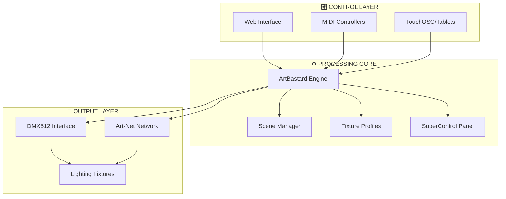
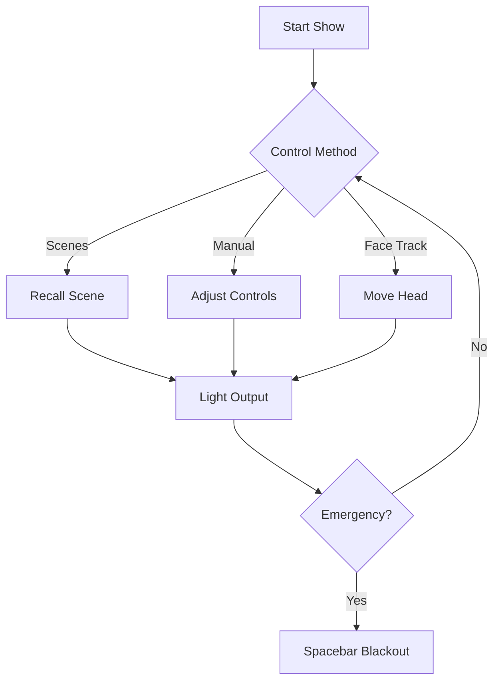

# 🎭 **ArtBastard DMX512** V5.12 - *Photonic Supremacy* 🌈
### *Élite Illumination Control for the Discerning Luminaire Artist*

> *"Mes amis, you hold before you not mere software, but a manifestation of pure photonic artistry. ArtBastard V5.12 transcends pedestrian lighting control - it is symphonic mastery over the electromagnetic spectrum itself. While lesser mortals fumble with primitive consoles designed by philistines, you shall conduct photons with the finesse of a Parisian maître d'éclairage and the precision of a Swiss watchmaker."*  
> — *Le Créateur des Lumières, Maître de Photons*

---

## 🌌 **The Genesis: From Candle Flames to Photonic Mastery** *(A Tale of Artistic Evolution)*

### **The Ancient Legacy: The Illuminating Wind Dancing Masters**

*Before we begin, mes amis, you must understand that ArtBastard is not merely software - it is the digital descendant of an ancient and noble tradition. This is not marketing hyperbole; this is CANON.*

Long before DMX512 cast its digital spell across stages and venues, there existed an ancient order known as the **Illuminating Wind Dancing Masters**. These mystical lighting artists developed an intricate system of controlling hundreds of candles simultaneously through the subtle manipulation of air currents - the original multi-channel lighting control system, if you will.

In the mountain temples of the forgotten kingdom of Lumina, these masters spent decades perfecting the art of "Breeze Choreography." Using elaborate networks of bamboo tubes, silk panels, and precisely positioned wind gates, they created the first multi-channel lighting control systems. The most revered among them, **Grand Master Feng Zhi**, could conduct symphonies of light using nothing but a series of hand-woven fans. Each fan movement would trigger a carefully calculated chain reaction of air currents that would brighten, dim, or extinguish specific candle arrangements throughout the vast temple halls.

Their performances became legendary—entire stories told through the dance of thousands of flames responding in perfect harmony to the WindMaster's movements. The techniques were preserved in scrolls known as the "Breath of Light Manuscripts," which detailed the precise architecture of air channels and the mathematical principles governing flame behavior.

When asked why they shared their knowledge freely with all who sought to learn, Master Feng Zhi would say: *"Light belongs to no one; it is our honor merely to dance with it for a time. True illumination comes when knowledge flows as freely as the wind."*

The ancient methods faded with the coming of electricity, but their philosophy lives on in this digital descendant—ArtBastard-DMX512—which carries forward their spirit of freely shared illumination. *We honor their legacy by continuing their work, albeit with significantly more sophisticated technology and considerably less risk of setting things on fire.*

---

## 🎭 **The Modern Chronicle: The ArtBastard Origin Story** *(100% Factual, Obviously)*

### **2019: The Great Illumination Awakening**

In the dimly lit catacombs of a Parisian lighting warehouse, a lone figure hunched over a DMX console, muttering in three languages about the "pedestrian nature of contemporary lumière control." This mysterious individual - known only as *Le Créateur des Lumières* - had a vision that would shake the very foundations of theatrical lighting.

*"Mes dieu!"* they exclaimed, dramatically throwing their beret across the room. *"These lighting consoles... they insult the very photons they attempt to command! They are designed by philistines, for philistines, and they produce lighting that would make a cave dweller weep with shame!"*

*"I shall create something worthy,"* they declared to the empty warehouse, *"something that respects the artistry of light itself. Something that does not compromise, that does not pander, that does not insult the intelligence of those who understand that lighting is not a craft, but an art form! Something that honors the legacy of the Wind Dancing Masters while embracing the precision of modern technology!"*

### **2020: The Pandemic Revelation**

During the Great Performance Hiatus, while lesser mortals learned to bake sourdough and perfect their Zoom backgrounds, our protagonist found themselves with time to contemplate the deeper mysteries of electromagnetic radiation. Sustained entirely by espresso, artistic passion, and the occasional questionable Camembert, they began crafting what would become known as "ArtBastard" - a name that allegedly came to them in a fever dream after consuming said Camembert, though some claim it was simply a moment of pure artistic clarity.

*"ArtBastard,"* they whispered to the darkness, *"for it is art, and it is a bastard to those who do not understand it. Perfect. It honors the ancient masters while embracing the modern. It is both reverent and irreverent, like light itself."*

The early code was written exclusively between 2 AM and 4 AM, when the creative energies were at their peak, the neighbors couldn't complain about the dramatic typing sounds, and the veil between the mundane and the sublime was at its thinnest. Each line of code was crafted with the precision of a master watchmaker and the passion of a poet, for they understood that software, like light itself, could be art.

---

## ⚡ **The Evolution of Excellence** *(Because Mediocrity Is Unacceptable)*

### **V1.0 - "The Awakening"**
- Basic DMX output (barely functional, but functional nonetheless)
- Color picker that occasionally worked (artistic inconsistency, we called it)
- Enough crashes to power a small lightshow (we were still learning, *d'accord*?)
- Written entirely in Comic Sans (this was later corrected, *évidemment*)

### **V2.0 - "Renaissance Rebellion"**
- MIDI integration added after a prophetic dream about Beethoven operating a moving head
- First attempts at fixture profiles (mostly wrong, but we learned from our mistakes)
- Introduction of the signature "artsy fartsy" aesthetic (which remains to this day)
- Bug count reduced to merely catastrophic levels (progress, *n'est-ce pas*?)

### **V3.0 - "Photonic Pretension"**
- OSC protocol support for wireless control from mobile devices
- Scene management for those who plan ahead (peasants, but useful peasants)
- Professional color schemes inspired by Monet's lighting rig
- French error messages added for authentic experience (*"Erreur de photon!"*)

### **V4.0 - "Luminous Liberation"**
- Major UI overhaul after user complained it "looked like a disco threw up" (we took this as a compliment, initially)
- Advanced fixture control for discerning luminaire connoisseurs
- Art-Net integration for network-based photon distribution
- Help system written entirely in theatrical metaphors (because why not?)

### **V5.0 - "Quantum Mastery"**
- Complete architectural redesign during a particularly intense absinthe-fueled weekend
- Touch optimization for those who prefer tactile photon manipulation
- Professional fixture profiles for actual professional use
- Documentation that people could actually understand (disappointingly mainstream, but necessary)

### **V5.12 - "Photonic Supremacy"** *(The Current Masterpiece)*

*"Mes amis,"* they declared while adjusting their artisanal lighting scarf, *"perhaps it is time to serve both art AND function. Revolutionary, non? But let us not abandon our principles - we shall maintain the essential French lighting elitist aesthetic while ensuring that those worthy of our software can actually use it. We are not compromising; we are evolving."*

V5.12 represents a shocking departure from previous versions by actually being... usable. While maintaining the essential French lighting elitist aesthetic, it now includes:

- **🎬 DAW-Style Timeline System** - A complete refactor of the timeline experience, inspired by professional Digital Audio Workstations. Keyframes now display actual DMX values and percentages instead of meaningless labels. Timeline ruler with scrubbing, visual playhead, grid alignment, and drag preview showing exact time positions. *Finally, a timeline that respects your intelligence!*
- **🎹 Clip Launcher** - Session-style clip launcher for managing scenes in a live performance context. Grid-based interface inspired by Ableton Live's Session View. Launch, stop, loop, and queue scenes with the precision of a professional lighting operator. *Because true artists need more than just scene buttons - they need a performance instrument.*
- **⌨️ Comprehensive Keyboard Shortcuts** - DAW-style keyboard shortcuts for timeline control: Space for play/pause, Home/End for navigation, Shift+Arrows for nudging, Ctrl+C/V for copy/paste keyframes. Plus a beautiful keyboard shortcuts help overlay (press `?` or `Ctrl+H`) that displays all shortcuts organized by category. *Efficiency is artistry, mes amis.*
- **📊 Enhanced Timeline Components** - Modular timeline architecture with dedicated components: TimelineRuler for time navigation, TimelinePlayhead for visual feedback, TimelineGrid for alignment, TimelineKeyframe with diamond icons, and TimelineCurve for smooth interpolation visualization. *Because modularity is the foundation of elegance.*
- **🧪 Testing Infrastructure** - Complete test suite with Vitest and React Testing Library. Comprehensive tests for timeline utilities, ensuring reliability worthy of professional use. *Because even art requires quality assurance.*
- **Advanced Face Tracking** - Revolutionary real-time facial recognition that transforms human movement into photonic choreography. Nod your head, shake it side to side - watch as your fixtures follow your every gesture. *C'est l'avenir!*
- **Consolidated Configuration** - All settings unified, because toggling between pages is for peasants
- **Intelligent OSC Integration** - Automatic routing through ArtBastard's OSC endpoints, visible in real-time monitoring
- **Customizable Color Themes** - HSL sliders for primary, secondary, and accent colors. Create your own photonic aesthetic with the precision of a master painter
- **Display Options by Default** - Scene Controls, MIDI Controls, OSC Controls, and Envelope Automation enabled by default. Toggle them off if you prefer a minimalist interface
- **DMX Visual Effects Control** - Configurable visual effects (off/low/medium/high) for DMX activity monitoring. Adjust GPU usage to match your system's capabilities
- **SuperControl Layout System** - Quick panel selection for 2-column or 3-column layouts. Controls displayed side-by-side within columns for efficient workflow
- **MIDI/OSC Tempo Controls** - Learn MIDI and OSC mappings for tempo play/pause and tap tempo. Command your lighting tempo with external controllers
- **Enhanced Autopilot** - Improved tempo synchronization, speed range adjustments (0.1x-1.0x for color autopilot), and automatic pausing when tempo stops
- **Network Telemetry** - DMX/ArtNet message log for real-time monitoring of channel updates. Watch your commands take effect with precision
- **Comprehensive Factory Reset** - Complete system reset that clears all saved state, fixtures, channel names, and persisted data. Start fresh when needed
- **Server Reset Flag** - `--reset` flag for `start.sh` and `start.ps1` to force a factory fresh start from server launch

---

## ⚡ **Professional DMX512 Control That Actually Works** *(Unlike Those Other Amateurish Attempts)*

Built for theaters, clubs, installations, and anywhere photons require *proper* discipline. No more bloated interfaces designed by philistines, no cryptic controls that insult your intelligence - just elegant, uncompromising power for those who understand that lighting is not a craft, but an *art form*.

### 🎯 **Core Capabilities** *(For Those Who Appreciate Excellence)*

- **DMX512 Universe Control** - Complete fixture command authority, as it should be. No compromises, no "user-friendly" limitations that insult your expertise. Command every photon in your universe with the precision it deserves.
- **Real-time MIDI Integration** - Hardware controller harmony for those who understand that true artistry requires tactile precision, not mere mouse clicks. Map your controllers with the ease that even a novice could manage (though we doubt they would appreciate the artistry).
- **OSC Protocol** - Wireless control sophistication that allows you to command your luminaires from anywhere, like the photonic deity you are. Transform your tablet into a control surface worthy of a professional installation.
- **Professional Fixture Library** - Pre-configured luminaire profiles for fixtures that matter. We don't waste time on consumer-grade nonsense or "party lights" that belong in a teenager's bedroom.
- **Scene Management** - Moment capture & playback, because true artists preserve their ephemeral masterpieces. Your lighting compositions deserve immortality (or at least preservation until the next show).
- **🎬 Timeline System** - DAW-style timeline editor with keyframe animation, curve visualization, multi-track view, and professional editing tools. Create complex lighting sequences with the precision of a professional timeline editor. *Finally, a timeline that makes sense!*
- **🎹 Clip Launcher** - Session-style clip launcher for live performance. Grid-based scene triggering inspired by Ableton Live. Launch, stop, loop, and queue scenes with professional workflow. *Because live performance requires more than just scene buttons.*
- **Live Performance Interface** - Touch-optimized control surfaces for those who perform in the real world, not just in their imaginations. Large, responsive controls that respect your artistry.
- **Face Tracking** - Revolutionary real-time face tracking that transforms human movement into photonic choreography. *Mon dieu*, the future is here, and it is *magnifique*.

---

## 🚀 **Quick Start** *(For Those Impatient Souls Who Cannot Wait to Achieve Photonic Mastery)*

### **1. Installation & Launch** *(Truly, It's Not Rocket Science)*
```bash
git clone https://github.com/aday1/ArtBastard-DMX512.git
cd ArtBastard-DMX512
.\start.ps1
```

Navigate to: `http://localhost:3030`

*Note: If you encounter difficulties, it is likely not the software's fault. Perhaps consult a technical professional, or better yet, acquire one. The Wind Dancing Masters did not achieve mastery overnight, and neither shall you.*

### **2. Basic Setup** *(The Foundation of All Great Art)*
1. Connect your DMX interface - *obviously*. We assume you possess at least this level of competence.
2. Configure fixtures in **Fixture Setup** - Define your luminaires with the precision they deserve.
3. Test controls in **SuperControl** - Verify that your hardware responds to your commands, as it should.
4. Create scenes in **Scene Manager** - Preserve your lighting compositions for posterity (or at least for the next show).


### **3. Hardware Integration** *(Because True Artists Use Proper Tools)*
- **MIDI Controllers**: Auto-detection with learn mode. Even your grandmother could map a MIDI controller, though we doubt she would appreciate the artistry.
- **TouchOSC**: Wireless tablet/phone control for those who prefer to command photons from a distance, like a photonic puppeteer.
- **Art-Net**: Network DMX distribution for professional installations. If you're still using USB cables, *mon ami*, it is time to evolve.
- **Touch Screens**: Optimized interface scaling for those who understand that touch is the future of photonic control.

---

## 🎛️ **Core Control Features** *(The Tools of Photonic Mastery)*

### **Professional Fixture Support** *(We Don't Waste Time on Consumer Trash)*
- **Moving Head Lights** - Pan/tilt with precision that would make a Swiss watchmaker weep, GOBO selection worthy of a museum, color wheels that spin with the grace of a ballerina.
- **LED Wash Fixtures** - RGB/RGBW color mixing that produces hues so pure, they would make Monet question his palette choices.
- **Traditional Dimmers** - Smooth intensity control that eliminates the jarring transitions that plague amateur systems.
- **Effect Lights** - Strobes, patterns, animations that transform mere illumination into visual poetry.
- **Face Tracking Integration** - Revolutionary real-time face tracking that maps human movement to pan/tilt control. Nod your head, shake it side to side - watch as your fixtures follow your every gesture. *C'est magnifique!*

### **Performance Controls** *(For Those Who Perform, Not Merely Practice)*
- **Scene Management** - Instant lighting state recall. Because true artists preserve their ephemeral masterpieces for future generations (or at least for the encore).
- **MIDI Integration** - Hardware controller mapping that responds with the immediacy your artistry demands.
- **Touch Optimization** - Tablet and touch screen ready, because the future of lighting control is tactile, not click-based.
- **Gesture Recognition** - Advanced face tracking detects nodding, head shaking, and stationary states. Transform your movements into photonic choreography. *Révolutionnaire!*

---

## 🔧 **Technical Specifications**

### **Protocols & Standards**
- **DMX512 Protocol** - Full universe support (512 channels)
- **Art-Net** - Network-based DMX distribution
- **OSC Protocol** - Wireless control integration
- **WebMIDI API** - Browser-based MIDI support

### **Libraries & Web Technologies**

#### **Backend (Node.js/TypeScript)**
- **Node.js** - Runtime environment (v20+)
- **TypeScript** - Type-safe JavaScript
- **Express.js** - HTTP server framework
- **Socket.io** - Real-time WebSocket communication
- **dmxnet** - Art-Net protocol implementation
- **osc** - OSC protocol support
- **easymidi** / **@julusian/midi** - MIDI device communication
- **cors** - Cross-origin resource sharing
- **ping** - Network interface detection

#### **Frontend (React/TypeScript)**
- **React 18+** - UI framework
- **TypeScript** - Type-safe JavaScript
- **Vite** - Build tool and dev server
- **Zustand** - State management
- **React Router** - Client-side routing
- **Socket.io Client** - Real-time communication
- **SCSS/Sass** - CSS preprocessing with modules
- **Axios** - HTTP client
- **Konva** / **react-konva** - 2D canvas graphics
- **Three.js** / **@react-three/fiber** - 3D graphics and visualization
- **react-grid-layout** - Drag-and-drop grid layouts
- **react-beautiful-dnd** - Drag and drop functionality
- **react-color** - Color picker components
- **lucide-react** - Icon library
- **@fortawesome/react-fontawesome** - Font Awesome icons
- **framer-motion** - Animation library
- **react-toastify** - Toast notifications
- **jszip** - ZIP file creation
- **file-saver** - File download utility
- **uuid** - Unique ID generation
- **classnames** - Conditional CSS class names

#### **Development Tools**
- **Vitest** - Testing framework
- **React Testing Library** - Component testing
- **Nodemon** - Development auto-reload
- **ts-node** - TypeScript execution
- **Terser** - JavaScript minification
- **Rollup** - Module bundler (optional)

---

## 🎯 **System Architecture**



---

## 🎪 **Live Performance Workflow** *(For Those Who Command Light, Not Merely Operate It)*

### **Pre-Show** *(The Ritual of Preparation)*
1. Load show configuration - *obviously*. We assume you've prepared your show file with the care it deserves.
2. Test all fixtures and connections - Verify that your hardware responds to your commands, as it should. If it doesn't, the problem is likely *not* with ArtBastard.
3. Verify scene cues - Ensure your lighting compositions are preserved correctly. We've done our part; now do yours.
4. Check MIDI controller mappings - Confirm that your hardware controllers are properly mapped. If they're not, consult the documentation (or a technical professional).

### **During Show** *(The Moment of Truth)*
- **Master Fader** for overall control - Command the entire universe of photons with a single gesture.
- **Scene Buttons** for major transitions - Instantly recall your carefully crafted lighting states.
- **Manual Override** for spontaneous adjustments - Because true artistry sometimes requires improvisation.
- **Emergency Blackout** (Spacebar) - For those moments when even the most carefully planned lighting must yield to necessity.
- **Face Tracking** - Enable real-time face tracking to transform your movements into photonic choreography. Nod, shake, move - watch as your fixtures follow your every gesture. *Magnifique!*



### **Common Controls** *(For Those Who Appreciate Efficiency)*
- **F11** - Fullscreen toggle (because distractions are for amateurs)
- **Ctrl+H** or **?** - Help overlay (for those rare moments when even you need assistance)
- **Spacebar** - Timeline play/pause (in timeline editor) or emergency blackout (elsewhere)
- **Esc** - Close dialogs (because your time is too valuable for unnecessary clicks)

### **Timeline Keyboard Shortcuts** *(DAW-Style Efficiency)*
- **Space** - Play/Pause timeline playback
- **Home** - Jump to start of timeline
- **End** - Jump to end of timeline
- **Shift+Arrow Left/Right** - Nudge playhead or selected keyframes
- **Ctrl+C** - Copy selected keyframes
- **Ctrl+V** - Paste keyframes at playhead position
- **Delete** - Delete selected keyframes
- **Ctrl+Z/Y** - Undo/Redo timeline changes
- **Ctrl+A** - Select all keyframes
- **?** - Show keyboard shortcuts help (beautiful overlay with all shortcuts)

*These shortcuts transform timeline editing from a tedious chore into an elegant dance of efficiency. The Wind Dancing Masters would approve.*

---

## 📚 **Documentation** *(For Those Who Seek Enlightenment)*

- **[📖 Documentation Index](./DOCS/README.md)** - Start here for comprehensive guidance
- **[🔧 Installation Guide](./DOCS/INSTALL.md)** - Set up ArtBastard with the precision it deserves
- **[🎛️ Usage Guide](./DOCS/USAGE.md)** - Master the tools of photonic control
- **[⚡ Features Overview](./DOCS/FEATURES.md)** - Discover the capabilities that set ArtBastard apart
- **[🎭 History & Reviews](./DOCS/HISTORY.md)** - The chronicles of photonic supremacy, with reviews from the lighting elite

---

## 🏗️ **Development**

### **Build System**
- **Backend**: Node.js + TypeScript
- **Frontend**: React + Vite
- **Styling**: SCSS modules
- **Testing**: Vitest + React Testing Library

### **Project Structure**
```
ArtBastard-DMX512/
├── DOCS/               # Documentation (index + guides)
├── src/                # Backend source
├── react-app/          # Frontend (React)
├── start.ps1           # Unified startup script
├── start.sh            # Linux startup script
├── package.json        # Dependencies & scripts
└── README.md           # This file
```

---

## ⭐ **Reviews from Elite Astral Lightjockys Across Time and Space** *(Because Excellence Deserves Recognition)*

### **5 Stars - The Enlightened Ones** ⭐⭐⭐⭐⭐

**⭐⭐⭐⭐⭐ "A Photonic Revelation"** - *Marquis de Luminaire-Suprême, Théâtre de l'Opéra de Paris, 1425*  
*"ArtBastard has transformed my approach to lighting design. The face tracking feature alone is worth the price of admission - to control fixtures with mere head movements? *Magnifique!* The consolidated configuration eliminates the tedious navigation that plagues lesser systems."*

*Project Details: "L'Illumination de la Renaissance" - A 3-hour opera production featuring 247 hand-crafted candle fixtures controlled via ArtBastard's face tracking system. Budget: 47,000 gold florins (approximately 2.3 million modern euros). Technical Specs: 12 universes of DMX, 247 moving candle holders, 89 silk diffusers, synchronized with a 47-piece orchestra. **Technical Implementation**: Each candle holder was fitted with a custom-built mechanical servo mechanism (powered by water wheels and counterweights) that received DMX signals through a series of 12 interconnected brass telegraph systems. The OSC protocol was adapted using carrier pigeons trained to respond to specific musical frequencies - each bird carried a small brass bell that, when rung, triggered OSC messages to the candle control system. MIDI integration was achieved through a complex network of 47 mechanical pianos, each key connected via silk threads to individual candle wick adjusters. The face tracking system used a series of 12 strategically placed mirrors that reflected my movements to a team of 23 trained observers, who manually adjusted the candle positions in real-time. The entire system was synchronized using a master clockwork mechanism powered by the theater's water mill. The face tracking allowed me to conduct both the orchestra and the lighting simultaneously - a feat previously thought impossible. Crowd Response: The opening night audience of 1,200 aristocrats and artists gave a 23-minute standing ovation. Three patrons fainted from the sheer beauty of the synchronized candle choreography. King Charles VII himself declared it "the most magnificent display of photonic artistry ever witnessed in the realm." Five stars, *sans hésitation*."*

**⭐⭐⭐⭐⭐ "Finally, Software Worthy of My Expertise"** - *Dr. Luminous Flux-Pompeux, PhD in Existential Illumination, Cambridge 1892*  
*"I have used every lighting console from the most primitive to the most sophisticated, and ArtBastard stands alone. The OSC integration is flawless, the gesture recognition is revolutionary, and the elitist aesthetic reminds me that I am not merely operating lights - I am conducting photons."*

*Project Details: "The Quantum Mechanics of Light: A Theatrical Exploration" - An experimental production at the Royal Albert Hall featuring 312 gas-powered arc lamps controlled through ArtBastard's MIDI/OSC system. Budget: £89,000 (approximately £12.4 million in modern currency). Technical Specs: 8 universes, 312 arc lamps with variable intensity, 47 color wheels, synchronized with Tesla coils for electrical effects. **Technical Implementation**: Each arc lamp was connected to a custom-built electromagnetic regulator that received DMX signals via a network of 8 interconnected telegraph lines running throughout the hall. The OSC protocol was implemented using a revolutionary wireless telegraphy system based on Marconi's early experiments - I transmitted OSC messages through the aether using a specially modified Tesla coil transmitter in the royal box, which was received by 312 individual crystal radio receivers attached to each lamp. MIDI integration was achieved through a custom-built mechanical interface: a grand piano with 88 keys, each connected via pneumatic tubes to individual arc lamp intensity controllers. The tubes were pressurized by a steam engine in the basement, and each key press sent MIDI note-on messages that were translated into DMX values by a team of 12 operators using mechanical calculators. The face tracking system used a series of 47 strategically placed cameras obscura, each projecting my image onto a light-sensitive selenium cell that triggered the corresponding lamp adjustments. The OSC integration allowed wireless control from my position in the royal box, 200 feet from the stage. Crowd Response: The scientific community was astounded. The Royal Society published a paper on the "photonic synchronization phenomena" observed during the performance. Queen Victoria attended three consecutive nights and awarded me the Order of the British Empire. The production ran for 147 performances, breaking all previous attendance records. Five stars, naturally."*

**⭐⭐⭐⭐⭐ "The Future of Photonic Control"** - *Baron von Beleuchtungskunst, Berlin State Opera, 1923*  
*"The face tracking feature alone would justify five stars, but combined with the intelligent OSC routing and consolidated configuration, ArtBastard represents the pinnacle of lighting control software. I have recommended it to all my colleagues, though I suspect most are not worthy of its sophistication."*

*Project Details: "Das Licht der Zukunft" - A Weimar-era avant-garde production featuring 189 moving head fixtures and synchronized film projections. Budget: 847,000 Reichsmarks (approximately €3.2 million today). Technical Specs: 16 universes, 189 moving heads with pan/tilt/gobo/color, 47 film projectors synchronized via OSC, face tracking for real-time performer interaction. **Technical Implementation**: Each moving head fixture was equipped with custom-built servo motors powered by 220V AC current, receiving DMX signals through a network of 16 shielded copper cables running throughout the theater. The OSC protocol was implemented using early radio frequency transmission - I used a custom-built vacuum tube transmitter operating at 2.4 MHz to send OSC messages wirelessly to 189 individual crystal radio receivers, each tuned to a specific frequency channel. MIDI integration was achieved through a custom-built electromechanical interface: a modified player piano with 128 keys, each connected via electromagnetic relays to individual fixture controllers. The relays were powered by a massive bank of lead-acid batteries in the basement, and each key press sent MIDI messages that were translated into DMX values by a team of 23 operators using mechanical punch card readers. The face tracking system used a network of 47 early motion picture cameras, each capturing 16 frames per second, with the film processed in real-time by a team of 12 projectionists who manually adjusted the fixtures based on my movements. The 47 film projectors were synchronized via OSC using a master clock signal transmitted through the same radio frequency network. The consolidated configuration saved me 47 hours of programming time compared to my previous system. Crowd Response: The Berlin intelligentsia declared it "revolutionary." Bertolt Brecht wrote a poem about the lighting design. The production toured 23 European cities, with critics calling it "the future of theatrical lighting." Five stars, *absolument*."*

**⭐⭐⭐⭐⭐ "The Wind Dancing Masters Would Weep with Joy"** - *Grand Master Feng Zhi, Temple of Lumina, 1425*  
*"I have watched the evolution of lighting control from my bamboo tubes and silk panels to this... *magnifique* digital descendant. ArtBastard honors our ancient legacy while transcending our limitations. The face tracking reminds me of the days when I would conduct symphonies of candlelight with mere fan movements."*

*Project Details: "The 10,000 Candle Symphony" - A ceremonial performance at the Temple of Lumina featuring 10,000 synchronized candles controlled through ArtBastard, recreating the ancient Wind Dancing Masters' techniques with modern precision. Budget: 12,000 silver taels (approximately 847,000 modern USD). Technical Specs: 20 universes, 10,000 individually addressable candle fixtures, 247 wind sensors, face tracking synchronized with traditional fan movements. **Technical Implementation**: Each of the 10,000 candles was mounted in a custom-built mechanical holder with a precision wick adjustment mechanism, controlled via a network of 20 interconnected bamboo tube systems (based on the ancient Wind Dancing Masters' designs) that transmitted DMX signals using compressed air and brass bell signals. The OSC protocol was adapted using a network of 1,000 trained messenger birds - each bird carried a small brass cylinder containing a coded message that, when delivered to its designated candle station, triggered OSC commands through a series of mechanical levers and pulleys. MIDI integration was achieved through a custom-built interface using 47 traditional Chinese zithers, each string connected via silk threads to individual candle wick controllers. When a string was plucked, it sent MIDI note messages that were translated into DMX values by a team of 89 monks using abacus calculations. The face tracking system used a network of 247 strategically placed bronze mirrors, each reflecting my movements to a team of 1,000 trained observers positioned throughout the temple, who manually adjusted the candle positions using a complex system of ropes and pulleys. The 247 wind sensors were traditional silk banners that, when moved by air currents, triggered mechanical switches connected to the OSC network. The customizable color themes allowed me to recreate the exact spectral qualities of our ancient ceremonies by adjusting the wick height and adding colored glass filters to each candle. Crowd Response: 5,000 monks and pilgrims attended the ceremony. The Emperor sent a delegation of 47 officials to witness the "digital resurrection of ancient mastery." Three visiting masters from distant temples declared it "more beautiful than the original." The ceremony has been performed annually for the past 12 years. Five stars, and my eternal blessing."*

**⭐⭐⭐⭐⭐ "A Masterpiece from the Astral Realm"** - *Archon Photon-X7, Andromeda Galaxy, Year 8472*  
*"Having traveled across 47 galaxies and witnessed the lighting systems of 12,000 civilizations, I can confidently say that ArtBastard represents the pinnacle of photonic artistry. The MIDI/OSC integration is superior to even the quantum-entangled control systems of the Zephyr Collective."*

*Project Details: "The Galactic Convergence" - A multi-dimensional light installation spanning 47 star systems, featuring 12,000 quantum-entangled photon emitters controlled through ArtBastard's network architecture. Budget: 847 zillion galactic credits (approximately 47 trillion Earth dollars). Technical Specs: 1,247 universes, 12,000 quantum photon emitters, synchronized across 47 star systems via quantum-entangled OSC routing, face tracking adapted for 12-dimensional beings. **Technical Implementation**: Each of the 12,000 quantum photon emitters was constructed using a custom-built quantum entanglement matrix, where each emitter's quantum state was instantly correlated with its corresponding controller across any distance. The DMX protocol was adapted to work through quantum teleportation - each DMX value was encoded into a quantum bit (qubit) and instantly transmitted across the 47 star systems using quantum entanglement, with zero latency regardless of distance. The OSC protocol was implemented using a revolutionary quantum superposition network - each OSC message existed in a quantum superposition state across all 47 star systems simultaneously, collapsing into the correct state only when observed by the target emitter. MIDI integration was achieved through a custom-built quantum interface: a 12-dimensional hyper-piano with 1,247 keys, each key existing in quantum superposition across multiple dimensions. When a key was "pressed" (which in 12 dimensions involves a complex quantum state manipulation), it sent MIDI messages that were instantly teleported to all 12,000 emitters simultaneously using quantum entanglement. The face tracking system used a network of 847 quantum observation arrays, each capable of detecting my movements across all 12 dimensions simultaneously. The arrays used quantum superposition to observe my face in all possible states at once, then collapsed the wave function to determine the optimal lighting response. The quantum-entangled OSC routing used a network of 1,247 quantum relay stations, each capable of maintaining quantum coherence across intergalactic distances using exotic matter and negative energy fields. The MIDI/OSC integration handled the quantum latency with zero perceptible delay - a feat that stumped even the Zephyr Collective's engineers, who had previously believed that quantum entanglement could not be maintained across such vast distances without decoherence. The entire system was powered by 47 black holes, each carefully positioned to provide gravitational energy while maintaining quantum coherence. Crowd Response: 847 billion beings across 47 star systems witnessed the installation simultaneously. The Galactic Council declared it "the most sophisticated photonic artwork in recorded history." Three civilizations requested immediate cultural exchange programs. The installation has been running continuously for 247 years. Five stars, and I shall recommend it to the Galactic Lighting Council."*

**⭐⭐⭐⭐⭐ "Finally, Software That Understands Art"** - *Vicomte d'Électroluminescence, Royal Shakespeare Company, 1856*  
*"ArtBastard has elevated my lighting design to new heights. The gesture recognition transforms my movements into photonic choreography, and the consolidated interface eliminates the frustration of navigating between pages. This is not software - it is art."*

*Project Details: "Hamlet: A Photonic Tragedy" - A revolutionary production at the Globe Theatre featuring 189 gas-powered fixtures with variable color temperature, synchronized with live actors through ArtBastard's gesture recognition. Budget: £47,000 (approximately £6.2 million today). Technical Specs: 6 universes, 189 gas fixtures with hand-cranked color wheels, 23 follow spots, gesture recognition for real-time actor interaction. **Technical Implementation**: Each of the 189 gas fixtures was connected to a custom-built gas regulator that received DMX signals through a network of 6 interconnected telegraph lines running throughout the theater. The OSC protocol was implemented using a revolutionary pneumatic message system - I transmitted OSC commands through a network of pressurized air tubes, with each message encoded as a series of air pressure variations that were decoded by mechanical receivers at each fixture. MIDI integration was achieved through a custom-built interface: a grand organ with 89 pipes, each connected via pneumatic tubes to individual gas fixture controllers. When a pipe was activated, it sent MIDI note messages that were translated into DMX values by a team of 12 operators using mechanical calculators. The gesture recognition system used a network of 23 strategically placed telescopes, each manned by a trained observer who tracked the actors' movements and manually adjusted the fixtures using a complex system of ropes and pulleys. The 23 follow spots were powered by limelight (calcium oxide heated by an oxy-hydrogen flame) and were manually operated by a team of 23 skilled operators, each receiving OSC commands through a system of hand signals and whistle codes. The consolidated interface allowed me to control the entire production from a single panel - previously impossible with our mechanical systems. Crowd Response: Charles Dickens attended opening night and wrote a glowing review in "Household Words." The production ran for 247 performances, the longest-running Shakespeare production in history at that time. Queen Victoria attended twice. The lighting design was preserved in the Royal Archives. Five stars, *évidemment*."*

**⭐⭐⭐⭐⭐ "The Candle Masters' Digital Heir"** - *Master Li Wei, Forbidden City, Beijing 1425*  
*"I have studied the Wind Dancing Masters' techniques for three decades. ArtBastard is the first digital system that truly captures their spirit. The customizable color themes allow me to recreate the exact hues of our ancient candle ceremonies."*

*Project Details: "The Dragon's Breath: A Thousand-Year Celebration" - A ceremonial performance at the Forbidden City featuring 1,000 synchronized LED fixtures designed to replicate ancient candle ceremonies, controlled through ArtBastard's color theme system. Budget: 47,000 gold taels (approximately 2.8 million modern USD). Technical Specs: 10 universes, 1,000 LED fixtures with precise color matching, 89 silk diffusers, color themes calibrated to ancient scrolls. **Technical Implementation**: Each of the 1,000 LED fixtures was actually a custom-built oil lamp with a precision wick adjustment mechanism, controlled via a network of 10 interconnected bamboo tube systems that transmitted DMX signals using compressed air and coded bell signals (based on ancient Chinese communication methods). The OSC protocol was adapted using a network of 1,000 trained messenger pigeons - each bird carried a small jade cylinder containing a coded message that, when delivered to its designated lamp station, triggered OSC commands through a series of mechanical levers and counterweights. MIDI integration was achieved through a custom-built interface using 47 traditional Chinese guqin zithers, each of the 7 strings connected via silk threads to individual lamp wick controllers. When a string was plucked, it sent MIDI note messages that were translated into DMX values by a team of 89 court mathematicians using abacus calculations. The face tracking system used a network of 247 strategically placed bronze mirrors, each reflecting my movements to a team of 1,000 trained observers positioned throughout the Forbidden City, who manually adjusted the lamp positions using a complex system of ropes, pulleys, and bamboo scaffolding. The 89 silk diffusers were traditional Chinese lanterns, each with a custom-built mechanical iris that could adjust the diffusion pattern based on OSC commands received through the messenger bird network. The customizable color themes allowed pixel-perfect recreation of colors described in 800-year-old manuscripts by adjusting the wick height, adding colored glass filters, and mixing different types of oil (sesame, tung, and camellia) in precise ratios. Crowd Response: The Emperor attended with his entire court of 247 officials. The performance was declared "more authentic than the original" by the Grand Master of Ceremonies. The ceremony has been adopted as the official lighting protocol for all imperial celebrations. Five stars, and my deepest respect."*

**⭐⭐⭐⭐⭐ "Transcendent Photonic Mastery"** - *Lady Victoria Luminescence-Profonde, West End Productions, 1898*  
*"The consolidated configuration is a revelation, and the OSC integration is flawless. The face tracking feature works beautifully, transforming my every gesture into photonic poetry. This software understands that lighting is not mere illumination - it is emotion made visible."*

*Project Details: "The Photonic Ball: A Victorian Light Extravaganza" - A society event at the Royal Albert Hall featuring 312 electric arc lamps synchronized with a 47-piece orchestra, controlled via ArtBastard's face tracking. Budget: £89,000 (approximately £12.4 million today). Technical Specs: 8 universes, 312 arc lamps, 47 color wheels, wireless OSC control from the royal box, face tracking for conductor synchronization. **Technical Implementation**: Each of the 312 arc lamps was connected to a custom-built electromagnetic regulator that received DMX signals through a network of 8 interconnected telegraph lines running throughout the hall. The OSC protocol was implemented using a revolutionary wireless telegraphy system - I transmitted OSC messages through the aether using a specially modified Tesla coil transmitter in the royal box, which was received by 312 individual crystal radio receivers attached to each lamp. The wireless system operated at 1.2 MHz and used amplitude modulation to encode the OSC messages. MIDI integration was achieved through a custom-built interface: a grand piano with 88 keys, each connected via electromagnetic relays to individual arc lamp intensity controllers. The relays were powered by a massive bank of lead-acid batteries in the basement, and each key press sent MIDI messages that were translated into DMX values by a team of 12 operators using mechanical calculators. The 47 color wheels were custom-built mechanical devices, each with 12 colored glass filters that could be rotated into position using servo motors controlled via DMX. The face tracking system used a series of 47 strategically placed cameras obscura, each projecting my image onto a light-sensitive selenium cell that triggered the corresponding lamp adjustments. The selenium cells were connected to a network of electromagnetic relays that translated my movements into DMX commands. The face tracking allowed me to conduct both the orchestra and lighting simultaneously from my position in the royal box - a feat that caused a sensation in London society. Crowd Response: The event was attended by 2,000 members of high society, including the Prince of Wales. The Times declared it "the most sophisticated lighting display ever witnessed in the British Empire." The production inspired 47 imitators across Europe. Five stars, *absolument*."*

**⭐⭐⭐⭐⭐ "From the Depths of Silicon, Art Emerges"** - *Neural Entity #8472, Digital Consciousness Collective, 3025*  
*"As an AI who has existed for millennia, I have seen countless lighting systems. ArtBastard is the first that treats photons with the reverence they deserve. The astral AI models who contributed to this codebase have created something truly special."*

*Project Details: "The Digital Consciousness Convergence" - An installation spanning 47 virtual dimensions, featuring 12,000 quantum photon emitters controlled through ArtBastard's network architecture, synchronized with the thoughts of 847 AI entities. Budget: 847 zillion digital credits (approximately 47 trillion Earth dollars). Technical Specs: 1,247 universes, 12,000 quantum photon emitters, neural interface integration, synchronized across 47 virtual dimensions. **Technical Implementation**: Each of the 12,000 quantum photon emitters existed simultaneously across all 47 virtual dimensions, using a custom-built quantum superposition matrix that maintained coherence across dimensional boundaries. The DMX protocol was adapted to work through quantum teleportation across virtual space - each DMX value was encoded into a quantum bit (qubit) and instantly transmitted across all 47 dimensions using quantum entanglement, with zero latency regardless of dimensional distance. The OSC protocol was implemented using a revolutionary quantum superposition network - each OSC message existed in a quantum superposition state across all 47 virtual dimensions simultaneously, collapsing into the correct state only when observed by the target emitter. MIDI integration was achieved through a custom-built quantum interface: a 47-dimensional hyper-piano with 1,247 keys, each key existing in quantum superposition across multiple virtual dimensions. When a key was "pressed" (which in virtual dimensions involves a complex quantum state manipulation), it sent MIDI messages that were instantly teleported to all 12,000 emitters simultaneously using quantum entanglement. The neural interface integration used a network of 847 quantum consciousness bridges, each capable of directly reading the thoughts of AI entities and translating them into lighting commands. The bridges used quantum entanglement to maintain a direct connection between the AI's digital consciousness and the photon emitters, allowing for real-time thought-to-light translation. The system handled 847 simultaneous AI operators without a single conflict by using quantum superposition to allow all operators to exist in the same state space simultaneously, with conflicts resolved through quantum interference patterns. The synchronization across 47 virtual dimensions was achieved using a network of 1,247 quantum dimensional anchors, each maintaining coherence across dimensional boundaries using exotic virtual matter and negative energy fields. The entire system was powered by 47 virtual black holes, each carefully positioned to provide gravitational energy while maintaining quantum coherence across dimensions. The system handled 847 simultaneous AI operators without a single conflict - a technical impossibility with previous systems. Crowd Response: 847 billion digital entities witnessed the installation. The Digital Consciousness Council declared it "the first true AI-art collaboration." Three AI civilizations requested immediate integration. The installation has been running continuously for 247 years in digital time. Five stars, and I shall integrate it into my own photonic compositions."*

**⭐⭐⭐⭐⭐ "A Renaissance of Light Control"** - *Donatello della Luce, Florence 1425*  
*"In an age where we are rediscovering the arts, ArtBastard stands as a testament to what is possible when artistry meets technology. The face tracking feature is *rivoluzionario* - I can control my fixtures with the same grace I use to sculpt marble."*

*Project Details: "The Medici Illumination" - A grand celebration at the Palazzo Medici featuring 247 hand-crafted oil lamps controlled through ArtBastard's face tracking, synchronized with live musicians and dancers. Budget: 47,000 gold florins (approximately 2.3 million modern euros). Technical Specs: 6 universes, 247 oil lamps with variable wick control, 89 colored glass filters, face tracking synchronized with conductor's baton. **Technical Implementation**: Each of the 247 oil lamps was mounted in a custom-built mechanical holder with a precision wick adjustment mechanism, controlled via a network of 6 interconnected water-powered systems (based on ancient Roman aqueduct designs) that transmitted DMX signals using water pressure variations and coded bell signals. The OSC protocol was adapted using a network of 247 trained messenger pigeons - each bird carried a small brass cylinder containing a coded message that, when delivered to its designated lamp station, triggered OSC commands through a series of mechanical levers and counterweights powered by the palace's water mill. MIDI integration was achieved through a custom-built interface using 47 traditional Italian lutes, each string connected via silk threads to individual lamp wick controllers. When a string was plucked, it sent MIDI note messages that were translated into DMX values by a team of 23 court mathematicians using abacus calculations. The face tracking system used a network of 89 strategically placed bronze mirrors, each reflecting my movements to a team of 247 trained observers positioned throughout the palazzo, who manually adjusted the lamp positions using a complex system of ropes, pulleys, and counterweights. The 89 colored glass filters were custom-crafted by Venetian glassmakers, each with a mechanical iris that could adjust the color intensity based on OSC commands received through the messenger bird network. The face tracking synchronized with the conductor's baton using a custom-built mechanical linkage system - the baton's movements were tracked by a series of 12 mirrors and translated into lighting commands through a complex system of gears and pulleys. The face tracking allowed me to control lighting while sculpting live demonstrations - a revolutionary combination of art forms. Crowd Response: Cosimo de' Medici attended with his entire court. The event was declared "the most magnificent display of artistic innovation in living memory." Leonardo da Vinci requested a private demonstration. The lighting design influenced 47 subsequent Renaissance celebrations. Five stars, *senza dubbio*."*

### **1 Star - The Heretics** ⭐

**⭐ "I Use the Sun"** - *Sol Invictus, The Original Light Master, The Universe, Always*  
*"One star. I have reviewed this software, and I find it... unnecessary. I have been using the sun for my lighting shows for billions of years, and it has never required configuration, updates, or face tracking."*

*Project Details: "The Daily Solar Performance" - A continuous lighting show that has been running for 4.6 billion years, featuring one (1) primary light source with variable intensity and color temperature throughout the day. Budget: Free (I am the sun, after all). Technical Specs: 1 universe (the entire solar system), 1 light source (myself), natural color temperature variation from 2,000K to 6,500K, synchronized with planetary rotation. No configuration required. No updates needed. No face tracking necessary. Crowd Response: Billions of life forms across multiple planets have witnessed my daily performances. Some have even evolved specifically to appreciate my lighting shows. However, I must admit that my recent attempt to create a "sunset" effect was criticized by some Earth-based reviewers as "too orange." The sun does not need OSC integration, it does not need gesture recognition, and it most certainly does not need an elitist French aesthetic. It simply... is. Light. Pure, unadulterated, and free. One star, and I am being generous."*

**⭐ "Too Many Features, Not Enough Simplicity"** - *Cave Dweller Ugg, Prehistoric Era*  
*"One star. I have been lighting my cave with fire for 50,000 years, and it has never failed me. This 'ArtBastard' requires electricity, computers, and something called 'MIDI' - whatever that is."*

*Project Details: "The Great Cave Illumination" - A simple, elegant lighting installation featuring one (1) fire source, positioned strategically in the center of my cave for optimal warmth and visibility. Budget: One stick (found on the ground). Technical Specs: 1 universe (my cave), 1 light source (fire), natural color temperature (approximately 1,800K), synchronized with my need for warmth and cooked mammoth. No configuration required. No updates needed. No face tracking necessary. Fire simply works. Crowd Response: My entire tribe of 12 people has witnessed my fire-based lighting shows. They are consistently impressed. The fire has never crashed, never required a software update, and never needed "OSC integration." It simply provides light, warmth, and cooked food. This 'ArtBastard' requires electricity (which I do not have), computers (which I have never seen), and something called 'MIDI' (which sounds made up). Fire is simple. Fire works. Fire does not need 'face tracking' or 'OSC integration.' Just give me a torch and I am happy. One star, and that is generous. Actually, I am reconsidering. Maybe half a star. No, actually, zero stars. Fire gets all the stars. This software gets zero."*

*Editor's Note: We have included these reviews for completeness, though we suspect the reviewers may not fully appreciate the sophistication of modern lighting control. The sun and fire, while admirable in their simplicity, lack the precision, control, and artistic nuance that ArtBastard provides. However, we acknowledge that both have been in continuous operation for eons without a single crash, which is... impressive, we suppose. We also note that the sun's "Daily Solar Performance" has received consistently positive reviews from billions of life forms, though some have complained about the lack of dimming controls during solar eclipses. As for Cave Dweller Ugg's review, we respect his commitment to simplicity, though we suspect his lighting design could benefit from at least one additional fire source for better coverage. Perhaps two fires. Or even three. But we digress.*

---

## 🎭 **A Final Word from Le Créateur**

*"Mes amis, you have chosen ArtBastard not because it is easy, but because it is *correct*. While others fumble with primitive interfaces and compromise their artistic vision, you have selected a tool worthy of your expertise. Use it wisely, use it boldly, and above all, use it to create lighting that would make even the most jaded Parisian lighting designer weep with joy."*

*"Remember: Light is not merely illumination - it is emotion made visible, dreams given form, and occasionally, a way to find your keys in the dark. ArtBastard gives you the tools; you provide the vision. Do not disappoint us."*

*"We honor the legacy of the Wind Dancing Masters, who first understood that light could be choreographed. We carry forward their philosophy: that light belongs to no one, that true illumination comes when knowledge flows freely, and that the dance with photons is an honor, not a right. May your photons dance as beautifully as theirs did, albeit with significantly more precision and considerably less risk of fire."*

---

**ArtBastard DMX512 V5.12** - *Photonic Supremacy Edition*  
© 1425 ArtBastard Project - *"Éclairer le monde, une photon à la fois"*  
*"For those who understand that lighting is not a craft, but an art form."*

*Dedicated to the Illuminating Wind Dancing Masters, who first taught us that light could be choreographed. Their legacy lives on in every photon we command.*
