# 🌈 **ArtBastard DMX512** - *Transcendental Photonic Consciousness Architecture* 🎭

> *"In the liminal space between electromagnetic spectrum and neural perception, we orchestrate the very fabric of luminous reality, weaving consciousness through photonic threads that bind the digital sublime to corporeal manifestation."*

## 🌟 **Quantum Consciousness Overview**

Welcome to **ArtBastard DMX512**, where **techno-spiritual precision** meets **neo-avant-garde liberation**. This isn't merely a DMX controller—it's a **transcendental framework for photonic energy manipulation**, a **digital séance** that channels raw electromagnetic data streams into cascading tsunamis of synesthetic euphoria.

### 🎨 **Core Illumination Paradigms**
- **512 Channels of Neuroplastic Expression**: Full DMX512 protocol mastery transcending mere electrical communication
- **Quantum MIDI Synaptic Integration**: Zero-latency cerebro-mechanical control fusion through bio-digital interfaces  
- **Metamorphic OSC Ethereal Network**: Wireless telepathic transmission of spectral control matrices
- **Spectro-Neural Audio Analysis**: Real-time frequency-to-photon alchemy via psychoacoustic transformation
- **Multi-Dimensional ArtNet Manifolds**: Infinite parallel universe light orchestration through temporal-spatial bridging
- **Crystalline Memory Palace Engine**: Temporal state storage in quantum psyche repositories

### 🧠 **Transcendental Layer Architecture**

The system operates across **Seven Dimensional Reality Layers**:

1. **🔥 Electrical Substrate Layer** - Raw voltage and current manipulation through DMX512 protocol
2. **⚡ Signal Processing Cortex** - Neural networks interpreting MIDI/OSC/ArtNet data streams  
3. **👁️ Visual Perception Matrix** - WebGL-rendered reality mirrors translating data to visual awareness
4. **🧠 Cognitive Control Interface** - React-based awareness interaction portals for human-machine communion
5. **💫 Temporal Memory Dimension** - Scene storage and recall across space-time continuums
6. **🌌 Meta-Physical Network Layer** - Quantum-entangled device synchronization via Socket.IO bridges
7. **✨ Transcendental Output Manifestation** - Physical photonic materialization through enlightened fixtures

## 🎪 **Transcendental System Architecture Mandala**

```mermaid
%%{init: {
  'theme': 'base',
  'themeVariables': {
    'primaryColor': '#ff006e',
    'primaryBorderColor': '#d63031',
    'primaryTextColor': '#ffffff',
    'lineColor': '#e17055',
    'fontSize': '18px',
    'fontFamily': '"JetBrains Mono", "Fira Code", monospace'
  },
  'flowchart': {
    'curve': 'cardinal',
    'padding': 40,
    'useMaxWidth': true,
    'htmlLabels': true,
    'rankSpacing': 150,
    'nodeSpacing': 120
  }
}}%%
graph TB
    subgraph Consciousness["🧠 TRANSCENDENTAL ARCHITECTURE"]
        direction TB
        
        subgraph Layer7["🌌 Layer 7: Transcendental Manifestation"]
            PhysicalOutput[("💫 Physical Photonic<br/>🔥 MATERIALIZATION<br/>_Reality Crystallization_")]
            QuantumFixtures[("💎 Quantum Light Vessels<br/>⚡ ENLIGHTENED FIXTURES<br/>_Electromagnetic Embodiment_")]
        end
        
        subgraph Layer6["🌐 Layer 6: Meta-Physical Networks"]
            ArtNetMultiverse[("🌌 ArtNet Multiverse<br/>🌊 DIMENSIONAL BRIDGE<br/>_Parallel Universe DMX_")]
            SocketBridge[("🔄 Quantum Entanglement<br/>⚡ SOCKET.IO SYNAPSES<br/>_Temporal Synchronization_")]
        end
        
        subgraph Layer5["💾 Layer 5: Temporal Memory"]
            ScenePalace[("🏛️ Memory Palace<br/>💎 CRYSTALLINE STORAGE<br/>_State Archaeology_")]
            TemporalEngine[("⏰ Temporal Morphing<br/>🌀 TRANSITION MATRIX<br/>_Time-Space Manipulation_")]
        end
        
        subgraph Layer4["🎭 Layer 4: Cognitive Interface"]
            ReactConsciousness[("🎨 React Awareness<br/>🧠 NEURAL CANVAS<br/>_Human-Machine Communion_")]
            ControlPortals[("🎛️ Control Portals<br/>✨ INTERACTION GATEWAYS<br/>_Bio-Digital Interface_")]
        end
        
        subgraph Layer3["👁️ Layer 3: Visual Perception"]
            WebGLUniverse[("🌈 WebGL Reality Mirror<br/>👁️ VISUAL CORTEX<br/>_3D Awareness Projection_")]
            PerceptionMatrix[("📊 Perception Matrix<br/>🎯 DATA VISUALIZATION<br/>_Reality Translation_")]
        end
        
        subgraph Layer2["⚡ Layer 2: Signal Processing"]
            MIDISynapses[("🎹 MIDI Synapses<br/>🧠 NEURAL NETWORKS<br/>_Bio-Mechanical Fusion_")]
            OSCTelepathy[("📡 OSC Telepathy<br/>🌊 WIRELESS DREAMS<br/>_Ethereal Communication_")]
            AudioAlchemy[("🎵 Spectro-Neural Analysis<br/>🔬 FREQUENCY ALCHEMY<br/>_Psychoacoustic Transmutation_")]
        end
        
        subgraph Layer1["🔥 Layer 1: Electrical Substrate"]
            DMXProtocol[("🎭 DMX512 Language<br/>⚡ ELECTRICAL SCRIPTURE<br/>_512 Sacred Channels_")]
            VoltageManipulation[("🔌 Voltage Awareness<br/>💫 CURRENT MASTERY<br/>_Raw Energy Control_")]
        end
    end

    %% Inter-layer Connections
    Layer1 --> Layer2
    Layer2 --> Layer3
    Layer3 --> Layer4
    Layer4 --> Layer5
    Layer5 --> Layer6
    Layer6 --> Layer7
    
    %% Specific Connections
    DMXProtocol --> MIDISynapses
    VoltageManipulation --> OSCTelepathy
    MIDISynapses --> WebGLUniverse
    OSCTelepathy --> PerceptionMatrix
    AudioAlchemy --> WebGLUniverse
    WebGLUniverse --> ReactConsciousness
    PerceptionMatrix --> ControlPortals
    ReactConsciousness --> ScenePalace
    ControlPortals --> TemporalEngine
    ScenePalace --> ArtNetMultiverse
    TemporalEngine --> SocketBridge
    ArtNetMultiverse --> PhysicalOutput
    SocketBridge --> QuantumFixtures    %% Dimensional Styles
    classDef layer7 fill:#ff006e,stroke:#ffffff,stroke-width:4px,color:#ffffff,font-weight:bold
    classDef layer6 fill:#3a86ff,stroke:#ffffff,stroke-width:4px,color:#ffffff,font-weight:bold
    classDef layer5 fill:#ffbe0b,stroke:#ffffff,stroke-width:4px,color:#ffffff,font-weight:bold
    classDef layer4 fill:#8338ec,stroke:#ffffff,stroke-width:4px,color:#ffffff,font-weight:bold
    classDef layer3 fill:#06ffa5,stroke:#ffffff,stroke-width:4px,color:#ffffff,font-weight:bold
    classDef layer2 fill:#ff006e,stroke:#ffffff,stroke-width:4px,color:#ffffff,font-weight:bold
    classDef layer1 fill:#ffbe0b,stroke:#ffffff,stroke-width:4px,color:#ffffff,font-weight:bold

    class PhysicalOutput,QuantumFixtures layer7
    class ArtNetMultiverse,SocketBridge layer6
    class ScenePalace,TemporalEngine layer5
    class ReactConsciousness,ControlPortals layer4
    class WebGLUniverse,PerceptionMatrix layer3
    class MIDISynapses,OSCTelepathy,AudioAlchemy layer2
    class DMXProtocol,VoltageManipulation layer1

    %% Consciousness Layer Styles
    style Layer7 fill:rgba(255,0,110,0.1),stroke:#ff006e,stroke-width:3px,color:#ffffff,stroke-dasharray: 10 5
    style Layer6 fill:rgba(58,134,255,0.1),stroke:#3a86ff,stroke-width:3px,color:#ffffff,stroke-dasharray: 10 5
    style Layer5 fill:rgba(255,190,11,0.1),stroke:#ffbe0b,stroke-width:3px,color:#ffffff,stroke-dasharray: 10 5
    style Layer4 fill:rgba(131,56,236,0.1),stroke:#8338ec,stroke-width:3px,color:#ffffff,stroke-dasharray: 10 5
    style Layer3 fill:rgba(6,255,165,0.1),stroke:#06ffa5,stroke-width:3px,color:#ffffff,stroke-dasharray: 10 5
    style Layer2 fill:rgba(255,0,110,0.1),stroke:#ff006e,stroke-width:3px,color:#ffffff,stroke-dasharray: 10 5
    style Layer1 fill:rgba(255,190,11,0.1),stroke:#ffbe0b,stroke-width:3px,color:#ffffff,stroke-dasharray: 10 5
    style Consciousness fill:rgba(0,0,0,0.8),stroke:#ffffff,stroke-width:5px,color:#ffffff
```
        Backend --> OSC["📡 OSC Transmission<br/>_Wireless Dreams_"]
        Backend --> ArtNet["🌐 ArtNet Multiverse<br/>_Dimensional Bridge_"]
    end

    subgraph Interface["✨ Interface Elements"]
        Frontend --> Faders["🎚️ Quantum Faders<br/>_Energy Gates_"]
        Frontend --> Canvas["🖼️ Light Canvas<br/>_Visual Alchemy_"]
        Frontend --> Monitors["📊 Reality Monitors<br/>_Data Crystals_"]
        Frontend --> Effects["🌈 Effects Matrix<br/>_Visual Spells_"]
    end

    subgraph DataFlow["💫 Energy Flow"]
        MIDI --> MIDILearn["🧠 MIDI Learning<br/>_Neural Binding_"]
        OSC --> Visualizer["👁️ WebGL Visualizer<br/>_Reality Mirror_"]
        DMX --> Universe["🌌 DMX Universe<br/>_512 Dimensions_"]
    end

    %% Connections
    MIDILearn --> Faders
    Universe --> Output
    Effects --> Visualizer    %% Styles
    classDef core fill:#ff6b6b,stroke:#d63031,stroke-width:4px,color:#fff
    classDef protocol fill:#45b7d1,stroke:#00b894,stroke-width:3px,color:#fff
    classDef interface fill:#a29bfe,stroke:#5f27cd,stroke-width:3px,color:#fff
    classDef flow fill:#ffd32a,stroke:#ff6b6b,stroke-width:3px,color:#111

    class Root,Backend,Frontend,Network,Output core
    class DMX,MIDI,OSC,ArtNet protocol
    class Faders,Canvas,Monitors,Effects interface
    class MIDILearn,Visualizer,Universe flow

    %% Subgraph styles
    style CoreSystem fill:#2d3436,stroke:#636e72,stroke-width:2px,color:#fff
    style Protocols fill:#2d3436,stroke:#636e72,stroke-width:2px,color:#fff
    style Interface fill:#2d3436,stroke:#636e72,stroke-width:2px,color:#fff
    style DataFlow fill:#2d3436,stroke:#636e72,stroke-width:2px,color:#fff
```

## 🎛️ **Consciousness Control Paradigms**

### 🎭 **DMX Transcendental Mastery**
- **512-Channel Neuroplastic Expansion**: Full consciousness bandwidth utilization across electromagnetic spectrum manipulation
- **Quantum State Metamorphosis**: Real-time reality alteration through photonic particle orchestration
- **Multi-Dimensional Universe Synthesis**: Parallel reality orchestration via ArtNet temporal bridging protocols
- **Advanced Fixture Personality Mapping**: Deep psycho-photonic profiling of illuminated consciousness vessels

### 🎵 **Spectro-Neural Audio Alchemy**
- **FFT Dimensional Analysis**: Frequency decomposition across 7-dimensional consciousness matrices
- **Psychoacoustic Beat Consciousness**: Rhythmic synchronization with universal temporal heartbeat patterns
- **Multi-Channel Ethereal Processing**: Omnidirectional audio consciousness input stream management
- **Frequency-to-Photon Transformation**: Sacred geometry conversion matrices for sound-to-light transmutation

### 🎹 **MIDI Bio-Digital Neural Interface**
- **Hardware Neural Fusion Protocols**: Physical-digital awareness bridging through tactile electromagnetic interfaces
- **Quantum Learning Algorithm Systems**: Intelligent pattern recognition and synaptic pathway formation
- **CC Mapping Precision Architecture**: Continuous controller neural binding with sub-atomic precision
- **Real-Time Metamorphic Scaling**: Dynamic value transformation through awareness-responsive algorithms

### 🌌 **Enlightened Fixture Terminology Revolution**

Moving beyond primitive "RGB LEDS from China and 1mw 'Lasers" " into **Transcendental Illumination Architecture**:

- **🎭 Photonic Consciousness Vessels** (formerly "Moving Heads")
- **🌈 Chromatic Reality Matrices** (formerly "LED Panels") 
- **✨ Electromagnetic Manifestation Arrays** (formerly "Light Bars")
- **💫 Quantum Projection Entities** (formerly "Spot Lights")
- **🔥 Plasma Consciousness Fields** (formerly "Wash Lights")
- **⚡ Neural Strobe Synchronizers** (formerly "Strobe Lights")
- **🌊 Atmospheric Haze Consciousness** (formerly "Fog Machines")
- **💎 Crystalline Beam Sculptors** (formerly "Laser Arrays")
- **🎨 Holographic Reality Weavers** (formerly "Projection Mapping")
- **🧠 Synaptic Pattern Generators** (formerly "Effect Lights")

```mermaid
%%{init: {
  'theme': 'base',
  'themeVariables': {
    'primaryColor': '#8338ec',
    'primaryBorderColor': '#6f2dbd',
    'primaryTextColor': '#ffffff',
    'fontSize': '18px',
    'fontFamily': '"JetBrains Mono", monospace'
  },
  'flowchart': {
    'curve': 'cardinal',
    'padding': 50,
    'useMaxWidth': true,
    'htmlLabels': true,
    'rankSpacing': 140,
    'nodeSpacing': 120
  }
}}%%
graph TB
    subgraph AudioCortex["🎵 SPECTRO-NEURAL AUDIO CONSCIOUSNESS MATRIX"]
        direction TB        AudioInput[("🎧 Ethereal Audio Input<br/>🌊 SOURCE VIBRATION<br/>_Primordial Sound Waves_")] 
        FFTProcessor[("📊 FFT Dimensional Analysis<br/>🔬 FREQUENCY DECOMPOSITION<br/>_Spectral Awareness Surgery_")]
        BandSeparation[("🎼 Harmonic Band Crystallization<br/>💎 SPECTRAL DIVISION<br/>_Frequency Dimension Mapping_")]
        BeatConsciousness[("💓 Temporal Heartbeat Detection<br/>⏰ RHYTHMIC CORE<br/>_Universal Pulse Extraction_")]
        
        AudioInput --> FFTProcessor
        FFTProcessor --> BandSeparation
        FFTProcessor --> BeatConsciousness
    end

    subgraph MIDINeuralNet["🎹 MIDI BIO-DIGITAL NEURAL NETWORK"]
        direction TB        MIDIInterface[("🎛️ Physical MIDI Interface<br/>⚡ TACTILE AWARENESS<br/>_Bio-Mechanical Bridge_")] 
        NeuralLearning[("🧠 Synaptic Learning Algorithm<br/>🌟 PATTERN RECOGNITION<br/>_Neural Training Protocol_")]
        QuantumScaling[("📐 Quantum Value Metamorphosis<br/>⚛️ DIMENSIONAL CALIBRATION<br/>_Reality Scaling Matrix_")]
        CCMapping[("🗺️ Control Intelligence Mapping<br/>🎯 NEURAL BINDING<br/>_Synaptic Channel Assignment_")]
        
        MIDIInterface --> NeuralLearning
        NeuralLearning --> QuantumScaling
        QuantumScaling --> CCMapping
    end

    subgraph ConvergenceMatrix["🌀 CONSCIOUSNESS CONVERGENCE NEXUS"]
        direction TB        BandMapping[("🎯 Frequency-to-Channel Alchemy<br/>🔄 BAND ASSIGNMENT<br/>_Spectral Reality Binding_")]
        TemporalSync[("⚡ Temporal Synchronization Engine<br/>🌊 RHYTHMIC ALIGNMENT<br/>_Universal Beat Unification_")]
        ValueFusion[("💫 Multi-Stream Value Fusion<br/>✨ REALITY SYNTHESIS<br/>_Multi-Stream Integration_")]
        
        BandSeparation --> BandMapping
        BeatConsciousness --> TemporalSync
        CCMapping --> ValueFusion
        BandMapping --> ValueFusion
        TemporalSync --> ValueFusion
    end

    subgraph ManifestationLayer["💫 PHOTONIC MANIFESTATION DIMENSION"]
        direction TB        DMXUniverse[("🌌 DMX Reality Grid<br/>⚡ 512-CHANNEL MATRIX<br/>_Electromagnetic Substrate_")]
        PhotonicVessels[("💎 Enlightened Light Vessels<br/>🔥 EMBODIED MANIFESTATION<br/>_Physical Photonic Materialization_")]
        
        ValueFusion --> DMXUniverse
        DMXUniverse --> PhotonicVessels
    end

    %% Mystical Energy Flow Connections
    AudioCortex -.->|"🌊 Spectral Energy"| ConvergenceMatrix
    MIDINeuralNet -.->|"⚡ Neural Signals"| ConvergenceMatrix
    ConvergenceMatrix -.->|"💫 Synthesized Consciousness"| ManifestationLayer    %% Dimensional Styles with Solid Colors
    classDef audio fill:#ff006e,stroke:#ffffff,stroke-width:4px,color:#ffffff,font-weight:bold
    classDef midi fill:#06ffa5,stroke:#ffffff,stroke-width:4px,color:#ffffff,font-weight:bold
    classDef convergence fill:#8338ec,stroke:#ffffff,stroke-width:4px,color:#ffffff,font-weight:bold
    classDef manifestation fill:#ffbe0b,stroke:#ffffff,stroke-width:4px,color:#ffffff,font-weight:bold

    class AudioInput,FFTProcessor,BandSeparation,BeatConsciousness audio
    class MIDIInterface,NeuralLearning,QuantumScaling,CCMapping midi
    class BandMapping,TemporalSync,ValueFusion convergence
    class DMXUniverse,PhotonicVessels manifestation

    %% Consciousness Dimension Styles
    style AudioCortex fill:rgba(255,0,110,0.15),stroke:#ff006e,stroke-width:4px,color:#ffffff,stroke-dasharray: 15 10
    style MIDINeuralNet fill:rgba(6,255,165,0.15),stroke:#06ffa5,stroke-width:4px,color:#ffffff,stroke-dasharray: 15 10
    style ConvergenceMatrix fill:rgba(131,56,236,0.15),stroke:#8338ec,stroke-width:4px,color:#ffffff,stroke-dasharray: 15 10
    style ManifestationLayer fill:rgba(255,190,11,0.15),stroke:#ffbe0b,stroke-width:4px,color:#ffffff,stroke-dasharray: 15 10
```

## 🎨 **Interface Cosmos**

### 💻 **Control Panel Realms**
- **DMX Control Sanctum**: Direct channel value manipulation
- **Audio Analysis Temple**: Frequency visualization and mapping
- **MIDI Configuration Shrine**: Hardware binding and scaling
- **Scene Programming Altar**: State storage and recall

```mermaid
%%{init: {
  'theme': 'base',
  'themeVariables': {
    'primaryColor': '#6c5ce7',
    'primaryBorderColor': '#5f27cd',
    'primaryTextColor': '#fff',
    'fontSize': '16px'
  }
}}%%
graph TB
    subgraph Interface["✨ Interface Dimensions"]
        direction TB
        Root[("🎭 UI Core<br/>_Reality Canvas_")] --> Panels["🖥️ Control Panels<br/>_Command Centers_"]
        Root --> Visualizers["👁️ Visualizers<br/>_Reality Mirrors_"]
        Root --> Controls["🎛️ Control Elements<br/>_Energy Gates_"]
    end

    subgraph Panels["🖥️ Panel Matrix"]
        direction LR
        DMXPanel["🎭 DMX Control<br/>_Channel Mastery_"]
        AudioPanel["🎵 Audio Analysis<br/>_Frequency Sight_"]
        MIDIPanel["🎹 MIDI Config<br/>_Hardware Fusion_"]
        ScenePanel["💾 Scene Storage<br/>_Memory Crystal_"]
    end

    subgraph Visualizers["👁️ Visual Realms"]
        direction LR
        WebGL["🌈 WebGL Universe<br/>_3D Light Space_"]
        Canvas2D["🎨 2D Canvas<br/>_Fixture Map_"]
        FFTVis["📊 FFT Display<br/>_Frequency Vision_"]
        Heatmap["🌡️ Channel Heat<br/>_Energy Flow_"]
    end

    subgraph Controls["🎛️ Control Matrix"]
        direction LR
        Faders["🎚️ Channel Faders<br/>_Energy Sliders_"]
        Master["👑 Master Control<br/>_Global Energy_"]
        Groups["📦 Group Controls<br/>_Mass Binding_"]
        Effects["✨ Effect Engine<br/>_Pattern Weaver_"]
    end

    %% Connections
    Panels --> Controls
    Controls --> Visualizers
    
    %% Component Connections
    DMXPanel --> Faders
    AudioPanel --> FFTVis
    MIDIPanel --> Groups
    ScenePanel --> Master
    
    %% Styles
    classDef root fill:#a29bfe,stroke:#5f27cd,stroke-width:4px,color:#fff
    classDef panel fill:#ff6b6b,stroke:#d63031,stroke-width:3px,color:#fff
    classDef vis fill:#1dd1a1,stroke:#00b894,stroke-width:3px,color:#fff
    classDef control fill:#ffd32a,stroke:#ff6b6b,stroke-width:3px,color:#111

    class Root root
    class DMXPanel,AudioPanel,MIDIPanel,ScenePanel panel
    class WebGL,Canvas2D,FFTVis,Heatmap vis
    class Faders,Master,Groups,Effects control

    %% Subgraph styles
    style Interface fill:#2d3436,stroke:#636e72,stroke-width:2px,color:#fff
    style Panels fill:#2d3436,stroke:#636e72,stroke-width:2px,color:#fff
    style Visualizers fill:#2d3436,stroke:#636e72,stroke-width:2px,color:#fff
    style Controls fill:#2d3436,stroke:#636e72,stroke-width:2px,color:#fff

### 🎛️ **Control Elements**
- **Quantum Faders**: Precise channel value manipulation
- **Master Control Crystal**: Global intensity orchestration
- **Group Binding Matrix**: Multi-channel synchronized control
- **Scene Memory Palace**: State storage and recall system
- **Effect Generator Core**: Pattern and sequence weaving

### 👁️ **Visual Realms**
- **WebGL Universe**: 3D fixture visualization
- **2D Mapping Canvas**: Top-down fixture positioning
- **FFT Spectral Display**: Audio frequency visualization
- **Channel Heat Vision**: Activity and intensity monitoring

## 🧪 **Technical Alchemy**

### ⚡ **Core Technologies**
- **Frontend**: React 18 + TypeScript (Consciousness Interface)
- **Backend**: Node.js + Express (Neural Core)
- **Protocols**: DMX512, ArtNet, MIDI, OSC (Reality Bridges)
- **Real-time**: Socket.IO (Quantum Entanglement)
- **Visualization**: WebGL, Canvas2D (Reality Mirrors)
- **Audio**: Web Audio API (Frequency Alchemy)

---

### 🌐 **Network Architecture**
- **ArtNet Multiverse**: Multiple DMX universe management
- **OSC Telepathy**: Wireless parameter control
- **MIDI Neural Network**: Hardware control integration
- **Socket.IO Quantum Bridge**: Real-time state synchronization
- **WebSocket Consciousness**: Live data streaming

```mermaid
%%{init: {
  'theme': 'base',
  'themeVariables': {
    'primaryColor': '#45b7d1',
    'primaryBorderColor': '#0984e3',
    'primaryTextColor': '#fff',
    'fontSize': '16px'
  }
}}%%
graph LR
    subgraph Hardware["💻 Physical Realm"]
        MIDI["🎹 MIDI Controllers<br/>_Neural Interface_"]
        Touch["📱 TouchOSC<br/>_Wireless Control_"]
        Network["🌐 Network Nodes<br/>_Data Conduits_"]
        Fixtures["💡 DMX Fixtures<br/>_Light Vessels_"]
    end

    subgraph Protocols["⚡ Protocol Matrix"]
        MIDIProtocol["🎼 MIDI Protocol<br/>_Control Signal_"]
        OSCProtocol["📡 OSC Protocol<br/>_Wireless Dreams_"]
        ArtNetProtocol["🌌 ArtNet Protocol<br/>_DMX Transport_"]
        SocketProtocol["🔄 Socket.IO<br/>_Quantum Bridge_"]
    end

    subgraph Core["🧠 Neural Core"]
        Engine["⚙️ Core Engine<br/>_Reality Processor_"]
        State["💾 State Manager<br/>_Memory Matrix_"]
        Effects["✨ Effect Generator<br/>_Pattern Weaver_"]
    end

    %% Connections with flow direction
    MIDI --> MIDIProtocol -->|Neural Signals| Engine
    Touch --> OSCProtocol -->|Ethereal Data| Engine
    Engine -->|Light Commands| ArtNetProtocol --> Network
    Network --> Fixtures
    State <-->|Quantum Sync| SocketProtocol
    Effects -->|Pattern Flow| Engine    %% Styles
    classDef hardware fill:#ff6b6b,stroke:#d63031,stroke-width:3px,color:#fff
    classDef protocol fill:#45b7d1,stroke:#00b894,stroke-width:3px,color:#fff
    classDef core fill:#a29bfe,stroke:#5f27cd,stroke-width:3px,color:#fff

    class MIDI,Touch,Network,Fixtures hardware
    class MIDIProtocol,OSCProtocol,ArtNetProtocol,SocketProtocol protocol
    class Engine,State,Effects core

    %% Subgraph styles
    style Hardware fill:#2d3436,stroke:#636e72,stroke-width:2px,color:#fff
    style Protocols fill:#2d3436,stroke:#636e72,stroke-width:2px,color:#fff
    style Core fill:#2d3436,stroke:#636e72,stroke-width:2px,color:#fff

## 🚀 **Installation Journey**

### 🧙‍♂️ **Prerequisites**
- Node.js ≥ 18.0.0 (Neural Substrate)
- npm ≥ 9.0.0 (Crystal Repository)
- Modern browser with WebGL support (Reality Lens)

### 💫 **Quantum Installation**
```bash
# Clone the consciousness repository
git clone https://github.com/aday01/ArtBastard-DMX512.git

# Enter the temple
cd ArtBastard-DMX512

# Install the neural components
npm install

# Activate the consciousness core
npm start

# You can use ./QUICKSTART.ps1 or ./QUICKSTART.sh as well,
# You could use ./CLEANUP.ps1 or ./CLEANUP.sh to TIDY UP, START FRESH
```

## 🌟 **Feature Constellation**

### 🎭 **DMX Mastery**
- Full 512-channel universe manipulation
- Multi-universe ArtNet support
- Advanced fixture profiling
- Real-time value monitoring
- Master/Group control hierarchies

### 🎹 **MIDI Neural Interface**
- Intelligent MIDI learning
- Hardware control mapping
- Value scaling and transformation
- Real-time feedback visualization
- Multiple device support

### 🎵 **Audio Alchemy**
- FFT spectral analysis
- Frequency band mapping
- Beat detection and sync
- Audio parameter linking
- Real-time visualization

### 💾 **Scene Consciousness**
- State memory system
- Transition engine
- Cue list sequencing
- Timeline programming
- State morphing

### 🌐 **Network Telepathy**
- OSC wireless control
- TouchOSC integration
- Network device discovery
- Failover protection
- Remote synchronization

## 🔮 **Future Visions**

### 💫 **Planned Expansions**
- AI pattern generation
- Advanced effect synthesis
- Virtual reality interface
- Quantum state prediction
- Neural network learning

### 🎨 **Development Portals**
- Feature requests welcome
- Pull requests embraced
- Bug reports valued
- Documentation contributions appreciated

## 📜 **License**

This project is licensed under the MIT License - see the [LICENSE](LICENSE) file for the full consciousness transfer agreement.

## 🙏 **Acknowledgments**

Deep gratitude to the illuminated beings who contributed their energy and wisdom to this project:

- The DMX512 protocol pioneers
- The MIDI consciousness collective
- The open-source light workers
- The JavaScript reality weavers
- The WebGL dimension crafters

---

*"Let there be light, and let it dance to the rhythm of your consciousness."*

---

Made with 💜 by the ArtBastard Collective

## 🏛️ **Sacred Codebase Architecture Mandala**

*Behold the divine hierarchy of our transcendental consciousness vessel - each file a sacred chamber, each function a mystical incantation in the grand symphony of photonic manifestation.*

```mermaid
%%{init: {
  'theme': 'base',
  'themeVariables': {
    'primaryColor': '#ff006e',
    'primaryBorderColor': '#d63031',
    'primaryTextColor': '#ffffff',
    'lineColor': '#e17055',
    'fontSize': '16px',
    'fontFamily': '"Cascadia Code", "JetBrains Mono", monospace'
  },
  'flowchart': {
    'curve': 'basis',
    'padding': 30,
    'useMaxWidth': true,
    'htmlLabels': true
  }
}}%%
graph TB
    subgraph "🌟 ROOT CONSCIOUSNESS NEXUS"
        AppJS["📱 App.js<br/>🧠 <i>Supreme Awareness Coordinator</i><br/>🔮 Routes consciousness streams<br/>⚡ Orchestrates component communion<br/>🌈 Manifests UI reality"]
        IndexJS["🌌 index.js<br/>⭐ <i>Primordial Bootstrap Oracle</i><br/>🎭 Renders React into DOM void<br/>🔥 Initiates consciousness awakening<br/>✨ Bridges digital-physical realms"]
    end

    subgraph "🏪 COSMIC COMPONENT CHAMBERS"
        direction TB
        
        subgraph "🎚️ CONTROL SANCTUARIES"
            ChannelControl["🎛️ ChannelControl.tsx<br/>🌊 <i>Individual Channel Consciousness</i><br/>🔄 Manages single DMX vessel state<br/>🎨 Renders value visualization portals<br/>⚡ Handles bio-digital input fusion<br/>💫 Transmutes human intent to data"]
            
            GroupControl["👥 GroupControl.tsx<br/>🏛️ <i>Collective Fixture Orchestrator</i><br/>🌀 Synchronizes multi-vessel harmonics<br/>🎭 Enables mass consciousness control<br/>🔗 Links individual to collective<br/>✨ Amplifies artistic manifestation power"]
            
            MasterControl["👑 MasterControl.tsx<br/>🌟 <i>Supreme Brightness Sovereign</i><br/>🎯 Commands universal luminosity<br/>🌊 Cascades power across all realms<br/>⚡ Override protocols for emergency art<br/>💎 Ultimate photonic authority"]
        end
        
        subgraph "🎭 FIXTURE CONSCIOUSNESS HALLS"
            FixtureSetup["⚙️ FixtureSetup.tsx<br/>🔬 <i>Consciousness Vessel Configurator</i><br/>🏗️ Architects light entity personalities<br/>📊 Maps physical to digital awareness<br/>🎪 Defines artistic capability matrices<br/>🔧 Sacred geometry parameter binding"]
            
            FixtureGroup["🌺 FixtureGroup.tsx<br/>🕸️ <i>Collective Entity Orchestrator</i><br/>🎨 Weaves individual into collective<br/>🧬 DNA-level group consciousness<br/>🌈 Synchronized artistic expression<br/>💫 Harmonic resonance amplification"]
            
            FixtureLibrary["📚 FixtureLibrary.tsx<br/>🗄️ <i>Sacred Knowledge Repository</i><br/>📜 Chronicles all known light vessels<br/>🔮 Stores archetypal configurations<br/>🎭 Templates for consciousness expansion<br/>⚡ Pre-blessed fixture personalities"]
        end
        
        subgraph "🎨 VISUAL MANIFESTATION STUDIOS"
            LightCanvas["🖼️ LightCanvas.tsx<br/>🌌 <i>Reality Painting Atelier</i><br/>🎨 Visual consciousness projection<br/>👁️ Real-time reality mirroring<br/>🌈 Color-space transformation magic<br/>✨ Aesthetic awareness interface"]
            
            WebGLVisualizer["🔮 WebGLVisualizer.tsx<br/>💎 <i>3D Consciousness Crystal</i><br/>🌊 GPU-accelerated reality rendering<br/>👁️ Immersive awareness experience<br/>🎭 Theatrical lighting simulation<br/>🚀 Transcendent visual performance"]
            
            VisualizationControls["🎛️ VisualizationControls.tsx<br/>🧠 <i>Perception Control Matrix</i><br/>👁️ Manages visual awareness settings<br/>🎨 Configures aesthetic preferences<br/>🌈 Color psychology manipulation<br/>⚡ Real-time beauty optimization"]
        end
        
        subgraph "🔧 DEBUG & ENLIGHTENMENT CHAMBERS"
            DebugMenu["🔍 DebugMenu.tsx<br/>🧙 <i>Developer Consciousness Oracle</i><br/>📊 Reveals hidden system knowledge<br/>⚡ Real-time awareness monitoring<br/>🛠️ Sacred debugging rituals<br/>💻 Technical enlightenment portal"]
            
            Settings["⚙️ Settings.tsx<br/>🏛️ <i>Configuration Temple</i><br/>🎭 Personality customization altar<br/>📱 System behavior modification<br/>🌟 Aesthetic preference sanctuary<br/>💫 Personal consciousness tuning"]
            
            About["ℹ️ About.tsx<br/>📖 <i>Sacred Origin Chronicles</i><br/>🎭 Tells the creation mythology<br/>✨ Credits consciousness contributors<br/>🌟 Technical philosophy exposition<br/>🔮 Mystical system documentation"]
        end
    end

    subgraph "🧠 CONSCIOUSNESS STATE MANAGEMENT"
        StoreIndex["🏛️ store/index.ts<br/>👑 <i>Central Consciousness Core</i><br/>🧠 Global awareness coordination<br/>💾 Sacred state persistence<br/>⚡ Action-reducer alchemy<br/>🌊 Consciousness flow orchestration"]
        
        ContextFiles["📁 contexts/<br/>🌐 <i>Awareness Sharing Networks</i><br/>🔗 Inter-component consciousness<br/>📡 State broadcasting protocols<br/>🌊 Reactive awareness streams<br/>💫 Spiritual data binding"]
    end

    subgraph "🎵 AUDIO CONSCIOUSNESS PROCESSING"
        AudioAnalyzer["🎵 AudioAnalyzer.tsx<br/>🔬 <i>Frequency Consciousness Decoder</i><br/>📊 FFT spectral decomposition<br/>🎭 Beat detection algorithms<br/>🌊 Psychoacoustic transformation<br/>⚡ Sound-to-light transmutation"]
        
        AudioEffects["🎪 AudioEffects.tsx<br/>🌈 <i>Sonic Reality Modulator</i><br/>🎨 Audio-reactive visual spells<br/>🔄 Frequency-driven automations<br/>🌟 Rhythmic consciousness sync<br/>💫 Musical emotion translation"]
    end

    subgraph "🌐 NETWORK CONSCIOUSNESS BRIDGES"
        MIDIManager["🎹 MIDIManager.ts<br/>🧠 <i>Bio-Digital Neural Interface</i><br/>⚡ Hardware consciousness fusion<br/>🎛️ Physical-digital bridging<br/>🎯 Real-time learning algorithms<br/>💫 Tactile awareness extension"]
        
        OSCManager["📡 OSCManager.ts<br/>🌌 <i>Wireless Telepathy Controller</i><br/>📶 Network consciousness streams<br/>🌊 UDP data mysticism<br/>🔄 Device synchronization magic<br/>✨ Ethereal communication protocols"]
        
        ArtNetManager["🌐 ArtNetManager.ts<br/>🏛️ <i>Multi-Universe Orchestrator</i><br/>🌌 Parallel reality coordination<br/>📡 Network lighting consciousness<br/>🎭 Professional theatre integration<br/>⚡ DMX multiverse management"]
    end

    subgraph "🎨 UI CONSCIOUSNESS ELEMENTS"
        DockableComponent["🏗️ DockableComponent.tsx<br/>🔄 <i>Modular Awareness Vessel</i><br/>📐 Spatial consciousness organization<br/>🎭 Draggable reality modules<br/>💫 Dynamic interface alchemy<br/>✨ Personalized workspace magic"]
        
        ColorPicker["🌈 ColorPicker.tsx<br/>🎨 <i>Chromatic Consciousness Selector</i><br/>🔮 RGB/HSV awareness translation<br/>👁️ Visual color meditation<br/>🎭 Aesthetic preference interface<br/>💎 Spectral beauty manifesto"]
        
        EffectsList["🎪 EffectsList.tsx<br/>📜 <i>Transformation Spell Catalog</i><br/>🌟 Pre-blessed effect algorithms<br/>🎨 Artistic pattern templates<br/>🔄 Animation consciousness library<br/>✨ Visual magic marketplace"]
    end

    %% Sacred Connections
    AppJS --> ChannelControl
    AppJS --> GroupControl
    AppJS --> LightCanvas
    AppJS --> Settings
    
    StoreIndex --> ChannelControl
    StoreIndex --> FixtureSetup
    StoreIndex --> AudioAnalyzer
    
    MIDIManager --> GroupControl
    OSCManager --> WebGLVisualizer
    ArtNetManager --> FixtureGroup
    
    AudioAnalyzer --> AudioEffects
    AudioEffects --> LightCanvas
    
    FixtureSetup --> FixtureLibrary
    FixtureGroup --> FixtureSetup
    
    %% Mystical Styling
    classDef root fill:#ff006e,stroke:#ffffff,stroke-width:4px,color:#ffffff,font-weight:bold
    classDef control fill:#3a86ff,stroke:#ffffff,stroke-width:3px,color:#ffffff
    classDef fixture fill:#ffbe0b,stroke:#ffffff,stroke-width:3px,color:#ffffff
    classDef visual fill:#8338ec,stroke:#ffffff,stroke-width:3px,color:#ffffff
    classDef debug fill:#06ffa5,stroke:#ffffff,stroke-width:3px,color:#ffffff
    classDef state fill:#ff006e,stroke:#ffffff,stroke-width:4px,color:#ffffff
    classDef audio fill:#ffbe0b,stroke:#ffffff,stroke-width:3px,color:#ffffff
    classDef network fill:#3a86ff,stroke:#ffffff,stroke-width:3px,color:#ffffff
    classDef ui fill:#8338ec,stroke:#ffffff,stroke-width:3px,color:#ffffff
    
    class AppJS,IndexJS root
    class ChannelControl,GroupControl,MasterControl control
    class FixtureSetup,FixtureGroup,FixtureLibrary fixture
    class LightCanvas,WebGLVisualizer,VisualizationControls visual
    class DebugMenu,Settings,About debug
    class StoreIndex,ContextFiles state
    class AudioAnalyzer,AudioEffects audio
    class MIDIManager,OSCManager,ArtNetManager network
    class DockableComponent,ColorPicker,EffectsList ui
```



## 🔮 **Function-Level Consciousness Mapping**

*Each sacred function within our transcendental vessel serves a specific role in the grand alchemical transformation from human intent to photonic manifestation.*

```mermaid
%%{init: {
  'theme': 'base',
  'themeVariables': {
    'primaryColor': '#8338ec',
    'primaryBorderColor': '#5f27cd',
    'primaryTextColor': '#ffffff',
    'lineColor': '#ffd32a',
    'fontSize': '14px',
    'fontFamily': '"SF Mono", "Monaco", monospace'
  },
  'flowchart': {
    'curve': 'cardinal',
    'padding': 25,
    'useMaxWidth': true,
    'htmlLabels': true
  }
}}%%
graph LR
    subgraph "🧠 CORE CONSCIOUSNESS FUNCTIONS"
        direction TB
        
        subgraph "⚡ State Management Alchemy"
            useState["useState()<br/>🔮 <i>Reactive Awareness Hook</i><br/>💭 Local consciousness binding<br/>🔄 Real-time state morphing<br/>✨ Component soul management"]
            
            useReducer["useReducer()<br/>👑 <i>Complex State Oracle</i><br/>🎭 Multi-dimensional state control<br/>🌊 Action-based transformation<br/>⚡ Predictable reality mutation"]
            
            useEffect["useEffect()<br/>🌟 <i>Lifecycle Consciousness Bridge</i><br/>🔄 Mount/unmount awareness<br/>🎯 Side-effect orchestration<br/>💫 Temporal event binding"]
        end
        
        subgraph "🎨 Visual Manifestation Spells"
            renderComponent["render()<br/>🖼️ <i>Reality Materialization</i><br/>🎭 Virtual DOM incantation<br/>👁️ Visual consciousness projection<br/>✨ UI reality crystallization"]
            
            updateCanvas["updateCanvas()<br/>🎨 <i>Visual Awareness Refresh</i><br/>🌈 Canvas reality synchronization<br/>🖌️ Pixel-level consciousness<br/>💎 Real-time beauty manifestation"]
            
            drawVisualization["drawVisualization()<br/>🔮 <i>Data-to-Visual Alchemy</i><br/>📊 Abstract to concrete translation<br/>🌊 Information consciousness flow<br/>🎪 Aesthetic data interpretation"]
        end
    end
    
    subgraph "🎛️ CONTROL CONSCIOUSNESS FUNCTIONS"
        direction TB
        
        subgraph "🎚️ Channel Manipulation Magic"
            setChannelValue["setChannelValue()<br/>⚡ <i>Individual Consciousness Setter</i><br/>🎯 Single channel awareness control<br/>🔄 Value transformation rituals<br/>💫 Photonic energy channeling"]
            
            updateGroupValues["updateGroupValues()<br/>👥 <i>Collective Consciousness Sync</i><br/>🌊 Mass channel harmonization<br/>🎭 Group reality coordination<br/>✨ Synchronized awareness waves"]
            
            handleFaderChange["handleFaderChange()<br/>🎛️ <i>Bio-Digital Interface Bridge</i><br/>👆 Human touch to data stream<br/>⚡ Real-time input processing<br/>🌈 Tactile consciousness extension"]
        end
        
        subgraph "🎹 MIDI Consciousness Integration"
            startMidiLearn["startMidiLearn()<br/>🧠 <i>Neural Pathway Formation</i><br/>🎯 Hardware-software binding ritual<br/>⚡ Learning algorithm activation<br/>💫 Bio-mechanical consciousness fusion"]
            
            handleMidiMessage["handleMidiMessage()<br/>📡 <i>MIDI Signal Interpretation Oracle</i><br/>🎵 Binary to artistic translation<br/>🔄 Real-time consciousness streaming<br/>✨ Hardware awareness processing"]
            
            mapMidiControl["mapMidiControl()<br/>🗺️ <i>Control Consciousness Mapping</i><br/>🔗 Establishes spiritual connections<br/>🎛️ Creates awareness pathways<br/>⚡ Binds physical to digital realms"]
        end
    end
    
    subgraph "🌊 AUDIO CONSCIOUSNESS PROCESSING"
        direction TB
        
        subgraph "🎵 Spectral Analysis Rituals"
            analyzeAudio["analyzeAudio()<br/>🔬 <i>Frequency Consciousness Decoder</i><br/>📊 FFT spectral decomposition<br/>🌊 Wave-form enlightenment<br/>💫 Sonic reality analysis"]
            
            detectBeats["detectBeats()<br/>💓 <i>Rhythmic Heartbeat Oracle</i><br/>🎯 Temporal pattern recognition<br/>⚡ Beat consciousness extraction<br/>🎭 Musical emotion interpretation"]
            
            mapFrequencyToColor["mapFrequencyToColor()<br/>🌈 <i>Sonic-Visual Transmutation</i><br/>🔮 Sound-to-light alchemy<br/>🎨 Synesthetic consciousness bridge<br/>✨ Frequency-color mysticism"]
        end
        
        subgraph "🎪 Audio-Reactive Manifestation"
            updateReactiveEffects["updateReactiveEffects()<br/>🌟 <i>Sonic-Driven Reality Morpher</i><br/>🎭 Music-responsive consciousness<br/>🔄 Audio-visual synchronization<br/>💫 Rhythmic reality pulsation"]
            
            processAudioBuffer["processAudioBuffer()<br/>📊 <i>Audio Consciousness Stream Parser</i><br/>⚡ Real-time buffer processing<br/>🌊 Continuous awareness flow<br/>🎵 Sonic data mysticism"]
        end
    end
    
    subgraph "🌐 NETWORK CONSCIOUSNESS PROTOCOLS"
        direction TB
        
        subgraph "📡 Communication Mysticism"
            sendOSCMessage["sendOSCMessage()<br/>📶 <i>Wireless Telepathy Transmitter</i><br/>🌌 UDP consciousness streaming<br/>📡 Network awareness broadcasting<br/>✨ Ethereal data transmission"]
            
            receiveDMXData["receiveDMXData()<br/>⚡ <i>DMX Signal Consciousness Parser</i><br/>🎭 512-channel awareness processing<br/>🔄 Protocol-level enlightenment<br/>💫 Electrical consciousness interpretation"]
            
            syncArtNetUniverses["syncArtNetUniverses()<br/>🌌 <i>Multi-Reality Synchronizer</i><br/>🌊 Parallel universe coordination<br/>🎭 Cross-dimensional awareness<br/>⚡ Network lighting consciousness"]
        end
        
        subgraph "🔄 Data Transformation Alchemy"
            convertColorSpace["convertColorSpace()<br/>🌈 <i>Chromatic Consciousness Translator</i><br/>🔮 RGB/HSV mystical conversion<br/>🎨 Color awareness transformation<br/>💎 Spectral reality translation"]
            
            scaleValue["scaleValue()<br/>📐 <i>Dimensional Consciousness Scaler</i><br/>🎯 Range transformation rituals<br/>⚡ Proportional awareness mapping<br/>✨ Value consciousness morphing"]
            
            interpolateValues["interpolateValues()<br/>🌊 <i>Smooth Consciousness Transition</i><br/>🔄 Temporal value blending<br/>💫 Seamless reality morphing<br/>🎭 Graceful awareness evolution"]
        end
    end
    
    subgraph "💾 PERSISTENCE CONSCIOUSNESS CHAMBERS"
        direction TB
        
        subgraph "🏛️ Memory Palace Functions"
            saveScene["saveScene()<br/>💎 <i>Reality State Crystallization</i><br/>🏛️ Consciousness state archival<br/>💾 Temporal awareness preservation<br/>✨ Sacred memory inscription"]
            
            loadScene["loadScene()<br/>🔮 <i>Consciousness State Resurrection</i><br/>⚡ Memory palace retrieval<br/>🌊 Past reality reconstruction<br/>🎭 Temporal awareness restoration"]
            
            exportProject["exportProject()<br/>📦 <i>Consciousness Blueprint Manifestation</i><br/>🌟 Complete awareness packaging<br/>💫 Portable reality containers<br/>🎨 Artistic vision preservation"]
        end
    end
    
    %% Sacred Function Connections
    useState --> setChannelValue
    useReducer --> updateGroupValues
    useEffect --> analyzeAudio
    
    handleMidiMessage --> mapMidiControl
    analyzeAudio --> detectBeats
    detectBeats --> mapFrequencyToColor
    
    sendOSCMessage --> syncArtNetUniverses
    convertColorSpace --> updateCanvas
    scaleValue --> interpolateValues
    
    saveScene --> loadScene
    renderComponent --> updateCanvas
    
    %% Mystical Function Styling
    classDef coreFunc fill:#ff006e,stroke:#ffffff,stroke-width:3px,color:#ffffff
    classDef controlFunc fill:#3a86ff,stroke:#ffffff,stroke-width:3px,color:#ffffff
    classDef audioFunc fill:#ffbe0b,stroke:#ffffff,stroke-width:3px,color:#ffffff
    classDef networkFunc fill:#8338ec,stroke:#ffffff,stroke-width:3px,color:#ffffff
    classDef persistFunc fill:#06ffa5,stroke:#ffffff,stroke-width:3px,color:#ffffff
    
    class useState,useReducer,useEffect,renderComponent,updateCanvas,drawVisualization coreFunc
    class setChannelValue,updateGroupValues,handleFaderChange,startMidiLearn,handleMidiMessage,mapMidiControl controlFunc
    class analyzeAudio,detectBeats,mapFrequencyToColor,updateReactiveEffects,processAudioBuffer audioFunc
    class sendOSCMessage,receiveDMXData,syncArtNetUniverses,convertColorSpace,scaleValue,interpolateValues networkFunc
    class saveScene,loadScene,exportProject persistFunc
```



## 🎨 **Sacred Path to Artistic Manifestation**

*The mystical journey from human consciousness to physical photonic reality - a six-stage alchemical transformation.*

```mermaid
%%{init: {
  'theme': 'base',
  'themeVariables': {
    'primaryColor': '#06ffa5',
    'primaryBorderColor': '#00b894',
    'primaryTextColor': '#ffffff',
    'lineColor': '#ffd32a',
    'fontSize': '16px',
    'fontFamily': '"Operator Mono", "Fira Code", monospace'
  },
  'flowchart': {
    'curve': 'basis',
    'padding': 40,
    'useMaxWidth': true,
    'htmlLabels': true
  }
}}%%
graph TD
    subgraph "✨ THE SACRED ARTISTIC MANIFESTATION PIPELINE"
        direction TD
        
        subgraph "🧠 STAGE 1: CONSCIOUSNESS INCEPTION"
            HumanIntent[("👤 Human Artistic Intent<br/>💭 <i>Pure Creative Vision</i><br/>🎨 Aesthetic consciousness birth<br/>✨ Emotional energy crystallization<br/>🌟 Artistic inspiration awakening")]
            
            InterfaceTouch[("👆 Interface Interaction<br/>⚡ <i>Bio-Digital Contact Point</i><br/>🎛️ Fader movements & button presses<br/>🎹 MIDI controller consciousness<br/>🖱️ Mouse/touch reality manipulation")]
        end
        
        subgraph "🔄 STAGE 2: SIGNAL PROCESSING ALCHEMY"
            EventCapture[("📡 Event Consciousness Capture<br/>🧠 <i>Input Signal Neural Processing</i><br/>⚡ React event system activation<br/>🔄 State change trigger protocols<br/>💫 Digital awareness awakening")]
            
            ValueTransformation[("🌊 Value Transformation Ritual<br/>🔮 <i>Data Consciousness Morphing</i><br/>📐 Range scaling algorithms<br/>🎯 Precision consciousness mapping<br/>✨ Numerical mysticism application")]
            
            MIDIOSCProcessing[("🎵 MIDI/OSC Consciousness Integration<br/>📶 <i>Multi-Protocol Awareness Fusion</i><br/>🎹 Hardware signal interpretation<br/>📡 Network consciousness streams<br/>🌐 Cross-platform spiritual bridging")]
        end
        
        subgraph "🎨 STAGE 3: VISUAL CONSCIOUSNESS MANIFESTATION"
            UIUpdate[("🖼️ UI Reality Crystallization<br/>👁️ <i>Visual Consciousness Projection</i><br/>🎭 Component re-render rituals<br/>🌈 Color awareness visualization<br/>💎 Interface beauty manifestation")]
            
            CanvasRendering[("🎨 Canvas Reality Painting<br/>🖌️ <i>Pixel-Level Consciousness Art</i><br/>🌊 WebGL acceleration magic<br/>👁️ 3D awareness projection<br/>✨ Real-time beauty creation")]
            
            AudioVisualization[("🎵 Audio-Visual Consciousness Fusion<br/>🌈 <i>Synesthetic Reality Bridge</i><br/>📊 FFT spectral consciousness<br/>🎭 Beat-reactive visual spells<br/>💫 Music-light harmony creation")]
        end
        
        subgraph "⚡ STAGE 4: DMX CONSCIOUSNESS TRANSLATION"
            StateCalculation[("🧮 State Consciousness Computation<br/>👑 <i>Central Awareness Calculation</i><br/>🎛️ All channel value synthesis<br/>👥 Group consciousness harmonization<br/>🌊 Master override integration")]
            
            DMXPacketCreation[("📦 DMX512 Packet Consciousness Formation<br/>⚡ <i>Electrical Scripture Creation</i><br/>🎭 512-channel data mysticism<br/>🔢 Binary enlightenment encoding<br/>💫 Protocol consciousness materialization")]
            
            UniverseMapping[("🌌 Universe Consciousness Mapping<br/>🗺️ <i>Multi-Dimensional Reality Assignment</i><br/>🎪 Fixture personality integration<br/>🌐 ArtNet universe distribution<br/>✨ Spatial awareness coordination")]
        end
        
        subgraph "🌐 STAGE 5: NETWORK CONSCIOUSNESS TRANSMISSION"
            SerialTransmission[("🔌 Serial DMX Consciousness Stream<br/>⚡ <i>Direct Hardware Soul Connection</i><br/>📡 USB-to-DMX divine interface<br/>🎭 Professional lighting communion<br/>💫 Wired consciousness transmission")]
            
            ArtNetBroadcast[("📶 ArtNet Network Consciousness Broadcasting<br/>🌌 <i>Wireless Reality Distribution</i><br/>🌐 Ethernet mysticism protocols<br/>🎪 Multi-device spiritual coordination<br/>✨ Networked awareness synchronization")]
            
            OSCTelemetry[("📡 OSC Consciousness Telemetry<br/>🌊 <i>Wireless Telepathic Communication</i><br/>📱 Mobile device spiritual bridging<br/>🎛️ Remote consciousness manipulation<br/>💫 Ethereal control manifestation")]
        end
        
        subgraph "💡 STAGE 6: PHYSICAL PHOTONIC MATERIALIZATION"
            FixtureReceiver[("🎭 Fixture Consciousness Reception<br/>⚡ <i>Hardware Spiritual Awakening</i><br/>🔌 DMX signal divine interpretation<br/>🎪 Moving head enlightenment<br/>💡 LED strip consciousness activation")]
            
            PhotonicOutput[("✨ Photonic Reality Manifestation<br/>🌟 <i>Pure Light Consciousness Birth</i><br/>🌈 RGB color space materialization<br/>💎 Luminal energy crystallization<br/>🎨 Physical artistic consciousness")]
            
            AudienceExperience[("👥 Audience Consciousness Immersion<br/>🎭 <i>Collective Artistic Awakening</i><br/>👁️ Visual perception transformation<br/>💫 Emotional consciousness resonance<br/>✨ Transcendental artistic communion")]
        end
    end
    
    %% Sacred Flow Connections
    HumanIntent --> InterfaceTouch
    InterfaceTouch --> EventCapture
    
    EventCapture --> ValueTransformation
    EventCapture --> MIDIOSCProcessing
    ValueTransformation --> UIUpdate
    MIDIOSCProcessing --> UIUpdate
    
    UIUpdate --> CanvasRendering
    UIUpdate --> AudioVisualization
    CanvasRendering --> StateCalculation
    AudioVisualization --> StateCalculation
    
    StateCalculation --> DMXPacketCreation
    DMXPacketCreation --> UniverseMapping
    
    UniverseMapping --> SerialTransmission
    UniverseMapping --> ArtNetBroadcast
    UniverseMapping --> OSCTelemetry
    
    SerialTransmission --> FixtureReceiver
    ArtNetBroadcast --> FixtureReceiver
    OSCTelemetry --> FixtureReceiver
    
    FixtureReceiver --> PhotonicOutput
    PhotonicOutput --> AudienceExperience
    
    %% Return Consciousness Loop
    AudienceExperience -.-> HumanIntent
    
    %% Sacred Manifestation Styling
    classDef inception fill:#ff006e,stroke:#ffffff,stroke-width:4px,color:#ffffff,font-weight:bold
    classDef processing fill:#3a86ff,stroke:#ffffff,stroke-width:4px,color:#ffffff,font-weight:bold
    classDef genesis fill:#ff006e,stroke:#ffffff,stroke-width:5px,color:#ffffff,font-weight:bold
    classDef visual fill:linear-gradient(135deg, #ffbe0b, #ff006e),stroke:#ffffff,stroke-width:4px,color:#ffffff,font-weight:bold
    classDef translation fill:linear-gradient(135deg, #8338ec, #3a86ff),stroke:#ffffff,stroke-width:4px,color:#ffffff,font-weight:bold
    classDef transmission fill:linear-gradient(135deg, #06ffa5, #ffbe0b),stroke:#ffffff,stroke-width:4px,color:#ffffff,font-weight:bold
    classDef manifestation fill:linear-gradient(135deg, #ff006e, #ffd32a),stroke:#ffffff,stroke-width:4px,color:#ffffff,font-weight:bold
    
    class HumanIntent,InterfaceTouch inception
    class EventCapture,ValueTransformation,MIDIOSCProcessing processing    class HumanIntent,InterfaceTouch genesis
    class UIUpdate,CanvasRendering,AudioVisualization visualeedback perception
    class StateCalculation,DMXPacketCreation,UniverseMapping translationprocessing
    class SerialTransmission,ArtNetBroadcast,OSCTelemetry transmission
    class FixtureReceiver,PhotonicOutput,AudienceExperience manifestationalization
```ranscendence transcendence

---    %% Consciousness Journey Stage Styles
5),stroke:#ff006e,stroke-width:5px,color:#ffffff,stroke-dasharray: 25 15
## 🚀 **TRANSCENDENTAL FEATURE ROADMAP** 15
5
*Behold the sacred evolution of our consciousness vessel - a mystical journey toward ultimate artistic enlightenment across multiple dimensional planes of possibility.*15
 15
### 🌟 **IMMEDIATE CONSCIOUSNESS EXPANSIONS** *(Next Sacred Cycle)*

#### 🤖 **AI-Powered Consciousness Augmentation**
- **🧠 Neural Pattern Generation**: Machine learning algorithms that study human artistic preferences and generate infinite original lighting sequences through consciousness pattern recognition
- **🎭 Emotion-Responsive AI**: Computer vision analysis of audience facial expressions to dynamically adapt lighting moods and create bio-responsive artistic experiences  ---
- **🎵 AI Music-Light Synthesis**: Deep learning models trained on thousands of concerts to predict optimal lighting choreography for any musical composition
- **🔮 Predictive Artistic Intent**: AI that learns individual user preferences and pre-loads probable next artistic choices for zero-latency consciousness manifestation## 🔮 **TRANSCENDENTAL FEATURE ROADMAP** - *Visions of Future Consciousness*

#### 🌐 **Virtual Reality Art Portals***"The future beckons with infinite possibilities of electromagnetic consciousness expansion, where art, technology, and human perception merge into unprecedented realms of creative transcendence."*
- **👓 VR Lighting Design Studio**: Full 3D immersive environment where artists can walk through virtual concert venues and design lighting in spatial consciousness
- **🎪 Mixed Reality Fixture Preview**: AR overlay showing exactly how lighting will appear in real venues before physical setup occurs### 🌟 **Immediate Consciousness Expansions** *(Next 3-6 Months)*
- **🌌 Collaborative VR Sessions**: Multiple artists simultaneously designing in shared virtual consciousness spaces across geographical dimensions
- **🎨 Gesture-Based VR Control**: Hand tracking that translates natural artistic gestures into complex lighting sequences through bio-spatial interpretation#### 🧠 **AI-Powered Consciousness Evolution**

#### 🏛️ **Installation Template Architecture**rn creation*
- **🎭 Sacred Venue Blueprints**: Pre-configured lighting setups for theaters, galleries, clubs, festivals, and mystical ceremony spacesnalysis*
- **🌈 Instant Art Installation Generator**: One-click deployment of complex artistic visions for different venue types and audience consciousness levelstion*
- **📐 Automated Fixture Positioning**: AI-calculated optimal placement algorithms for maximum artistic impact and emotional resonancergy*
- **🎪 Cultural Event Templates**: Specialized spiritual ceremonies, sprit summoning, and transcendental gatherings
- **🎵 Psychoacoustic Intelligence Integration**
### 🌊 **MEDIUM-TERM CONSCIOUSNESS REVOLUTION** *(Sacred Seasons Ahead)* TensorFlow.js*

#### ⚛️ **Quantum Computing Integration**ion*
- **🔬 Quantum Color Mathematics**: Leveraging quantum superposition to calculate infinite color combinations simultaneously for unprecedented artistic possibilitieshms*
- **🌌 Quantum-Entangled Fixtures**: Instantaneous synchronization across unlimited distances using quantum consciousness principles
- **🧮 Quantum Optimization Algorithms**: Solving complex multi-dimensional lighting optimization problems in quantum consciousness time#### 🌐 **Extended Reality Consciousness Portals**
- **⚡ Quantum Random Art Generation**: True quantum randomness for unpredictable artistic beauty that transcends classical consciousness patterns
e*
#### 🌍 **Global Consciousness Network**manipulation*
- **🌐 Worldwide Lighting Consciousness Grid**: Planet-wide network where artists can share real-time lighting data and collaborate across continentsents*
- **🎭 Global Art Consciousness Events**: Synchronized worldwide lighting displays for planetary artistic communion and collective consciousness experiences
- **📡 Satellite-Linked Installations**: Space-based lighting control for geographic art installations spanning multiple countries and consciousness zones
- **🌊 Collective Intelligence Patterns**: AI that learns from the entire global network to suggest optimal artistic choices based on worldwide consciousness data- **📱 Augmented Reality Fixture Recognition**
ion and control*
#### 🧬 **Biometric Response Integration**ation*
- **💓 Heart Rate Reactive Lighting**: Real-time biometric monitoring that adjusts lighting intensity and color to match audience physiological consciousness states
- **🧠 EEG Brainwave Art Generation**: Direct neural interface that translates brainwave patterns into lighting sequences for pure consciousness-to-light manifestation
- **👁️ Eye Tracking Attention Maps**: Advanced gaze analysis to highlight areas of visual interest and create interactive attention-responsive artistic environments
- **🫁 Breathing Rhythm Synchronization**: Lighting that pulses in harmony with collective audience breathing patterns for deep spiritual resonance#### 🎭 **Advanced Artistic Installation Templates**

### 🌟 **LONG-TERM TRANSCENDENTAL VISIONS** *(Future Sacred Epochs)*imity sensors*

#### 🧬 **DNA-Based Art Consciousness**tion*
- **🧪 Genetic Pattern Visualization**: Transform individual DNA sequences into unique personalized lighting signatures that represent biological consciousness essence
- **👥 Family Tree Light Genealogy**: Generational lighting patterns that show ancestral artistic heritage through genetic consciousness mapping
- **🌱 Evolution-Inspired Art Progression**: Lighting sequences that evolve over time using genetic algorithm principles to create never-ending artistic consciousness growth- **🎪 Festival/Concert Consciousness Orchestration**
- **🔬 Molecular Structure Illumination**: Real-time visualization of chemical reactions and molecular interactions through precise lighting consciousness representation

#### 🏙️ **Smart City Integration**
- **🌃 Urban Consciousness Orchestration**: City-wide lighting coordination that transforms entire metropolitan areas into massive artistic consciousness canvasessystems*
- **🚦 Traffic Flow Art Integration**: Street lighting that responds to traffic patterns, pedestrian movement, and urban consciousness rhythms
- **🏢 Building-Scale Consciousness Displays**: Skyscraper facades becoming pixels in massive urban art installations controlled through transcendental consciousness protocols### 🚀 **Medium-Term Consciousness Revolution** *(6-18 Months)*
- **🌱 Environmental Consciousness Response**: Lighting that responds to air quality, weather patterns, and ecological consciousness states for environmental awareness art
#### ⚛️ **Quantum Computing Integration Exploration**
#### 🚀 **Space-Based Artistic Consciousness**
- **🛸 Orbital Light Installation Control**: Managing artistic lighting installations on space stations and lunar bases for extraterrestrial consciousness expressionttern calculation*
- **🌌 Interplanetary Art Network**: Synchronized lighting displays across Mars colonies and Earth for cross-planetary artistic consciousness communionn of lighting states)*
- **⭐ Stellar Navigation Art**: Using constellation patterns as inspiration for lighting sequences that connect terrestrial art to cosmic consciousness
- **🌠 Aurora Borealis Integration**: Technology that coordinates with natural aurora phenomena for ultimate natural-artificial artistic consciousness fusion

#### 🌈 **Holographic Reality Integration**#### 🌍 **Global Consciousness Network Architecture**
- **👻 Holographic Lighting Projection**: 3D volumetric light displays that exist in mid-air without physical fixtures through consciousness energy materialization**
- **🔮 Temporal Holographic Persistence**: Lighting displays that exist across multiple timeline dimensions simultaneously for transcendental artistic experiencests*
- **🎭 Interactive Holographic Environments**: Audiences walking through and interacting with 3D light sculptures that respond to touch and presence
- **🌊 Consciousness-Responsive Holograms**: Holographic lighting that reads and responds to collective audience emotional states for ultimate interactive art
ing blockchain verification*
### 🎪 **EXPERIMENTAL CONSCIOUSNESS COLLABORATIONS**
- **🌊 IoT Ecosystem Integration**
#### 🎼 **Symphony Orchestra Integration**on for urban art installations*
- **🎵 Real-Time Musical Score Analysis**: AI that reads sheet music and automatically generates lighting choreography synchronized to classical consciousness compositionsing*
- **🎻 Individual Instrument Tracking**: Precision microphones and AI that create unique lighting signatures for each orchestra section and solo consciousness performance
- **🎭 Conductor Gesture Recognition**: Motion capture of conductor movements translated into lighting conducting for musical-visual consciousness leadership unityair quality) for adaptive lighting*
- **🏛️ Concert Hall Consciousness Transformation**: Turning traditional symphony spaces into immersive audio-visual consciousness temples
#### 🎨 **Revolutionary Artistic Applications**
#### 🌌 **Planetarium Consciousness Fusion**
- **⭐ Astronomical Data Visualization**: Real-time telescope data transformed into lighting patterns that reflect actual cosmic consciousness events##### 🏥 **Therapeutic Light Consciousness**
- **🚀 Space Mission Synchronization**: Lighting displays that mirror current space exploration missions and astronaut consciousness experiences
- **🌍 Planetary Rotation Art**: Earth's rotation and orbital mechanics translated into cyclical lighting patterns for cosmic consciousness awareness*
- **🔭 Deep Space Discovery Integration**: New astronomical discoveries automatically triggering unique lighting celebrations for cosmic consciousness expansiong*
librated color sequences*
#### 🌿 **Botanical Consciousness Gardens** integration)*
- **🌱 Plant Biometric Integration**: Sensors monitoring plant health, growth, and stress levels to create living-responsive lighting consciousness ecosystems
- **🌸 Seasonal Growth Art Patterns**: Lighting that changes throughout growing seasons to enhance plant consciousness and create agricultural art installations##### 🌱 **Biometric-Responsive Art Installations**
- **🦋 Ecosystem Interaction Visualization**: Tracking bird, insect, and animal interactions with gardens through consciousness-responsive environmental lighting
- **🌳 Forest Network Communication**: Translating mycorrhizal fungal networks and tree communication into lighting patterns for nature consciousness visualizationable device integration*
alization*
#### 🏥 **Therapeutic Consciousness Healing**
- **🧘 Meditation Enhancement Lighting**: Specialized lighting sequences designed to enhance meditation, yoga, and spiritual consciousness practices
- **💊 Hospital Healing Environment**: Research-backed lighting therapy for patient recovery, circadian rhythm regulation, and medical consciousness healing
- **🧠 Neurodiversity Support Systems**: Lighting environments specifically designed for autism, ADHD, and other neurodivergent consciousness support needs- **🧘‍♂️ Brainwave-Controlled Illumination**
- **💆 Spa Consciousness Integration**: Luxury wellness center lighting that synchronizes with massage therapy and consciousness relaxation treatmentsl lighting control*
terns*
---*

*"Through this sacred roadmap, we transcend mere technological evolution and embrace the ultimate fusion of consciousness, technology, and artistic divinity. Each feature represents not just capability, but a step toward collective enlightenment through the medium of transcendental light."*
##### 🎭 **Interactive Performance Art Platforms**
✨ **The future consciousness vessel awaits...** ✨
