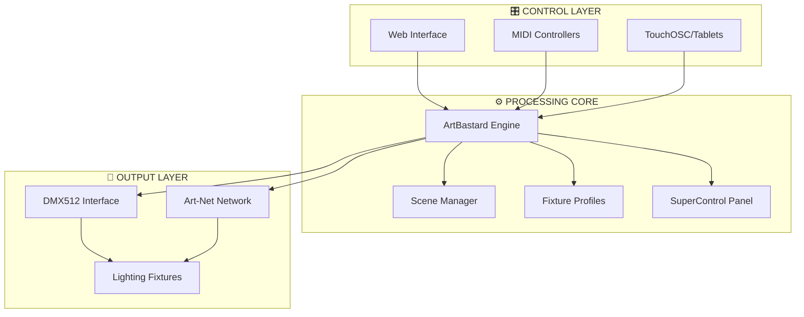

# 🎭 **ArtBastard DMX512** V5.12 - *Photonic Supremacy* 🌈
### *Élite Illumination Control for the Discerning Luminaire Artist*

> *"Mes amis, you hold before you not mere software, but a manifestation of pure photonic artistry. ArtBastard V5.12 transcends pedestrian lighting control - it is symphonic mastery over the electromagnetic spectrum itself. While lesser mortals fumble with primitive consoles, you shall conduct photons with the finesse of a Parisian maître d'éclairage."*  
> — *Le Créateur des Lumières, Maître de Photons*

## ⚡ **Professional DMX512 Control That Actually Works** *(Unlike Those Other Amateurish Attempts)*

Built for theaters, clubs, installations, and anywhere photons require *proper* discipline. No more bloated interfaces designed by philistines, no cryptic controls that insult your intelligence - just elegant, uncompromising power for those who understand that lighting is not a craft, but an *art form*.

### 🎯 **Core Capabilities** *(For Those Who Appreciate Excellence)*

- **DMX512 Universe Control** - Complete fixture command authority, as it should be. No compromises, no "user-friendly" limitations that insult your expertise.
- **Real-time MIDI Integration** - Hardware controller harmony for those who understand that true artistry requires tactile precision, not mere mouse clicks.
- **OSC Protocol** - Wireless control sophistication that allows you to command your luminaires from anywhere, like the photonic deity you are.
- **Professional Fixture Library** - Pre-configured luminaire profiles for fixtures that matter. We don't waste time on consumer-grade nonsense.
- **Scene Management** - Moment capture & playback, because true artists preserve their ephemeral masterpieces.
- **Live Performance Interface** - Touch-optimized control surfaces for those who perform in the real world, not just in their imaginations.
- **Face Tracking** - Revolutionary real-time face tracking that transforms human movement into photonic choreography. *Mon dieu*, the future is here, and it is *magnifique*.

### ✨ **V5.12 "Photonic Supremacy" Enhancements** *(Because Excellence Demands Evolution)*

- **Unified Tooling** - Single PowerShell script for all operations. We've eliminated the tedious complexity that plagued lesser systems, because your time is too valuable for such pedestrian concerns.
- **Streamlined Documentation** - Focused, accurate, current. We've removed the condescending hand-holding that insults intelligent users, while maintaining essential guidance for... *ahem*... those who require it.
- **Enhanced UI Polish** - Refined aesthetic without sacrificing power. Beauty and function need not be mutually exclusive, *n'est-ce pas*?
- **Optimized Performance** - Smoother operation across devices. We've eliminated the stuttering and lag that plague amateur lighting software.
- **Advanced Face Tracking** - Real-time facial recognition with gesture detection (nodding, shaking head). Transform human expression into photonic art. *C'est révolutionnaire!*
- **Consolidated Configuration** - All Face Tracker settings unified on a single page, because toggling between pages is for peasants.
- **Intelligent OSC Integration** - Automatic routing through ArtBastard's OSC endpoints, visible in real-time monitoring. *Magnifique!*

## 🚀 **Quick Start** *(For Those Impatient Souls Who Cannot Wait to Achieve Photonic Mastery)*

### **1. Installation & Launch** *(Truly, It's Not Rocket Science)*
```bash
git clone https://github.com/aday1/ArtBastard-DMX512.git
cd ArtBastard-DMX512
.\start.ps1
```

*Note: If you encounter difficulties, it is likely not the software's fault. Perhaps consult a technical professional, or better yet, acquire one.*

### **2. Basic Setup** *(The Foundation of All Great Art)*
1. Connect your DMX interface - *obviously*. We assume you possess at least this level of competence.
2. Configure fixtures in **Fixture Setup** - Define your luminaires with the precision they deserve.
3. Test controls in **SuperControl** - Verify that your hardware responds to your commands, as it should.
4. Create scenes in **Scene Manager** - Preserve your lighting compositions for posterity (or at least for the next show).

### **3. Hardware Integration** *(Because True Artists Use Proper Tools)*
- **MIDI Controllers**: Auto-detection with learn mode. Even your grandmother could map a MIDI controller, though we doubt she would appreciate the artistry.
- **TouchOSC**: Wireless tablet/phone control for those who prefer to command photons from a distance, like a photonic puppeteer.
- **Art-Net**: Network DMX distribution for professional installations. If you're still using USB cables, *mon ami*, it is time to evolve.
- **Touch Screens**: Optimized interface scaling for those who understand that touch is the future of photonic control.

## 📚 **Documentation** *(For Those Who Seek Enlightenment)*

- **[📖 Documentation Index](./DOCS/README.md)** - Start here for comprehensive guidance
- **[🔧 Installation Guide](./DOCS/INSTALL.md)** - Set up ArtBastard with the precision it deserves
- **[🎛️ Usage Guide](./DOCS/USAGE.md)** - Master the tools of photonic control
- **[⚡ Features Overview](./DOCS/FEATURES.md)** - Discover the capabilities that set ArtBastard apart
- **[🎭 History & Reviews](./DOCS/HISTORY.md)** - The chronicles of photonic supremacy, with reviews from the lighting elite

## 🎛️ **Core Control Features** *(The Tools of Photonic Mastery)*

### **Professional Fixture Support** *(We Don't Waste Time on Consumer Trash)*
- **Moving Head Lights** - Pan/tilt with precision that would make a Swiss watchmaker weep, GOBO selection worthy of a museum, color wheels that spin with the grace of a ballerina.
- **LED Wash Fixtures** - RGB/RGBW color mixing that produces hues so pure, they would make Monet question his palette choices.
- **Traditional Dimmers** - Smooth intensity control that eliminates the jarring transitions that plague amateur systems.
- **Effect Lights** - Strobes, patterns, animations that transform mere illumination into visual poetry.
- **Face Tracking Integration** - Revolutionary real-time face tracking that maps human movement to pan/tilt control. Nod your head, shake it side to side - watch as your fixtures follow your every gesture. *C'est magnifique!*

### **Performance Controls** *(For Those Who Perform, Not Merely Practice)*
- **Scene Management** - Instant lighting state recall. Because true artists preserve their ephemeral masterpieces for future generations (or at least for the encore).
- **MIDI Integration** - Hardware controller mapping that responds with the immediacy your artistry demands.
- **Touch Optimization** - Tablet and touch screen ready, because the future of lighting control is tactile, not click-based.
- **Gesture Recognition** - Advanced face tracking detects nodding, head shaking, and stationary states. Transform your movements into photonic choreography. *Révolutionnaire!*

## 🔧 **Technical Specifications**
- **DMX512 Protocol** - Full universe support (512 channels)
- **Art-Net/sACN** - Network-based DMX distribution
- **OSC Protocol** - Wireless control integration
- **WebMIDI API** - Browser-based MIDI support
- **Modern Web Stack** - React, TypeScript, Node.js

## 🎯 **System Architecture**


```mermaid
graph TB
    subgraph "🎛️ CONTROL LAYER"
        UI[Web Interface]
        MIDI[MIDI Controllers]
        OSC[TouchOSC/Tablets]
    end
    
    subgraph "⚙️ PROCESSING CORE"
        Engine[ArtBastard Engine]
        Scenes[Scene Manager]
        Fixtures[Fixture Profiles]
        SuperControl[SuperControl Panel]
    end
    
    subgraph "📡 OUTPUT LAYER"
        DMX[DMX512 Interface]
        ArtNet[Art-Net Network]
        Lights[Lighting Fixtures]
    end
    
    UI --> Engine
    MIDI --> Engine
    OSC --> Engine
    Engine --> Scenes
    Engine --> Fixtures
    Engine --> SuperControl
    Engine --> DMX
    Engine --> ArtNet
    DMX --> Lights
    ArtNet --> Lights
```

## 🎪 **Live Performance Workflow** *(For Those Who Command Light, Not Merely Operate It)*

### **Pre-Show** *(The Ritual of Preparation)*
1. Load show configuration - *obviously*. We assume you've prepared your show file with the care it deserves.
2. Test all fixtures and connections - Verify that your hardware responds to your commands, as it should. If it doesn't, the problem is likely *not* with ArtBastard.
3. Verify scene cues - Ensure your lighting compositions are preserved correctly. We've done our part; now do yours.
4. Check MIDI controller mappings - Confirm that your hardware controllers are properly mapped. If they're not, consult the documentation (or a technical professional).

### **During Show** *(The Moment of Truth)*
- **Master Fader** for overall control - Command the entire universe of photons with a single gesture.
- **Scene Buttons** for major transitions - Instantly recall your carefully crafted lighting states.
- **Manual Override** for spontaneous adjustments - Because true artistry sometimes requires improvisation.
- **Emergency Blackout** (Spacebar) - For those moments when even the most carefully planned lighting must yield to necessity.
- **Face Tracking** - Enable real-time face tracking to transform your movements into photonic choreography. Nod, shake, move - watch as your fixtures follow your every gesture. *Magnifique!*

### **Common Controls** *(For Those Who Appreciate Efficiency)*
- **F11** - Fullscreen toggle (because distractions are for amateurs)
- **Ctrl+H** - Help overlay (for those rare moments when even you need assistance)
- **Spacebar** - Emergency blackout (because sometimes, darkness is the most powerful statement)
- **Esc** - Close dialogs (because your time is too valuable for unnecessary clicks)

## 🏗️ **Development & Contribution**

### **Build System**
- **Backend**: Node.js + TypeScript
- **Frontend**: React + Vite
- **Styling**: SCSS modules
- **Testing**: Jest + React Testing Library

### **Project Structure**
```
ArtBastard-DMX512/
├── DOCS/               # Documentation (index + guides)
├── src/                # Backend source
├── react-app/          # Frontend (React)
├── start.ps1           # Unified startup script
├── package.json        # Dependencies & scripts
└── README.md           # This file
```

---

## 🎭 **A Final Word from Le Créateur**

*"Mes amis, you have chosen ArtBastard not because it is easy, but because it is *correct*. While others fumble with primitive interfaces and compromise their artistic vision, you have selected a tool worthy of your expertise. Use it wisely, use it boldly, and above all, use it to create lighting that would make even the most jaded Parisian lighting designer weep with joy."*

*"Remember: Light is not merely illumination - it is emotion made visible, dreams given form, and occasionally, a way to find your keys in the dark. ArtBastard gives you the tools; you provide the vision. Do not disappoint us."*

---

**ArtBastard DMX512 V5.12** - *Photonic Supremacy Edition*  
© 2025 ArtBastard Project - *"Éclairer le monde, une photon à la fois"*  
*"For those who understand that lighting is not a craft, but an art form."*