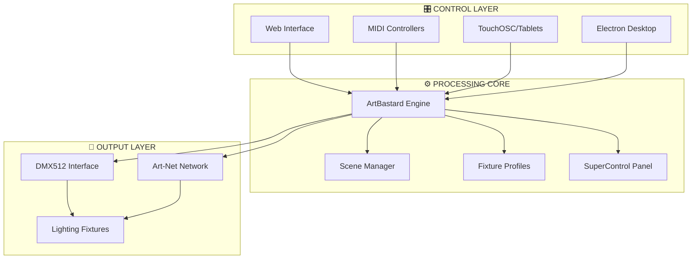

# 🌈 **ArtBastard DMX512** V5.12 - *Photonic Supremacy* 🎭
### *Élite Illumination Control for the Discerning Luminaire Artist*

> *"Light is not merely illumination - it is emotion made visible. ArtBastard V5.12 gives you the tools; you provide the vision."* - *Le Créateur des Lumières*

## ⚡ **Professional DMX512 Control That Actually Works**

Built for theaters, clubs, installations, and anywhere photons need proper discipline. No more bloated interfaces or cryptic controls - just elegant power.

### 🎯 **Core Capabilities**
- **DMX512 Universe Control** - Complete fixture command authority
- **Real-time MIDI Integration** - Hardware controller harmony  
- **OSC Protocol** - Wireless control sophistication
- **Professional Fixture Library** - Pre-configured luminaire profiles
- **Scene Management** - Moment capture & playback
- **Live Performance Interface** - Touch-optimized control surfaces

### ✨ **V5.12 "Photonic Supremacy" Enhancements**
- **Unified Tooling** - Single PowerShell script for all operations
- **Streamlined Documentation** - Focused, accurate, current
- **Enhanced UI Polish** - Refined aesthetic without sacrificing power
- **Optimized Performance** - Smoother operation across devices

## 🚀 **Quick Start**

### **1. Installation & Launch**
```bash
git clone https://github.com/aday1/ArtBastard-DMX512.git
cd ArtBastard-DMX512
.\start.ps1
```

### **2. Basic Setup**
1. Connect your DMX interface
2. Configure fixtures in **Fixture Setup**
3. Test controls in **SuperControl**  
4. Create scenes in **Scene Manager**

### **3. Hardware Integration** 
- **MIDI Controllers**: Auto-detection with learn mode
- **TouchOSC**: Wireless tablet/phone control
- **Art-Net**: Network DMX distribution
- **Touch Screens**: Optimized interface scaling

## 📚 **Documentation**

- **Start here: [DOCS/README](./DOCS/README.md)**
- Installation, Usage, Fixtures, Features, and History are all linked from the DOCS index

## 🎛️ **Core Control Features**

### **Professional Fixture Support**
- **Moving Head Lights** - Pan/tilt, GOBO, color wheels
- **LED Wash Fixtures** - RGB/RGBW color mixing
- **Traditional Dimmers** - Smooth intensity control
- **Effect Lights** - Strobes, patterns, animations

### **Performance Controls**  
- **Scene Management** - Instant lighting state recall
- **MIDI Integration** - Hardware controller mapping
- **Touch Optimization** - Tablet and touch screen ready

## 🔧 **Technical Specifications**
- **DMX512 Protocol** - Full universe support (512 channels)
- **Art-Net/sACN** - Network-based DMX distribution
- **OSC Protocol** - Wireless control integration
- **WebMIDI API** - Browser-based MIDI support
- **Modern Web Stack** - React, TypeScript, Node.js

## 🎯 **System Architecture**


```mermaid
graph TB
    subgraph "🎛️ CONTROL LAYER"
        UI[Web Interface]
        MIDI[MIDI Controllers]
        OSC[TouchOSC/Tablets]
        Electron[Electron Desktop]
    end
    
    subgraph "⚙️ PROCESSING CORE"
        Engine[ArtBastard Engine]
        Scenes[Scene Manager]
        Fixtures[Fixture Profiles]
        SuperControl[SuperControl Panel]
    end
    
    subgraph "📡 OUTPUT LAYER"
        DMX[DMX512 Interface]
        ArtNet[Art-Net Network]
        Lights[Lighting Fixtures]
    end
    
    UI --> Engine
    MIDI --> Engine
    OSC --> Engine
    Electron --> Engine
    Engine --> Scenes
    Engine --> Fixtures
    Engine --> SuperControl
    Engine --> DMX
    Engine --> ArtNet
    DMX --> Lights
    ArtNet --> Lights
```

## 🎪 **Live Performance Workflow**

### **Pre-Show**
1. Load show configuration
2. Test all fixtures and connections
3. Verify scene cues
4. Check MIDI controller mappings

### **During Show**
- **Master Fader** for overall control
- **Scene Buttons** for major transitions
- **Manual Override** for spontaneous adjustments
- **Emergency Blackout** (Spacebar)

### **Common Controls**
- **F11** - Fullscreen toggle
- **Ctrl+H** - Help overlay
- **Spacebar** - Emergency blackout
- **Esc** - Close dialogs

## 🏗️ **Development & Contribution**

### **Build System**
- **Backend**: Node.js + TypeScript
- **Frontend**: React + Vite
- **Styling**: SCSS modules
- **Testing**: Jest + React Testing Library

### **Project Structure**
```
ArtBastard-DMX512/
├── DOCS/               # Documentation (index + guides)
├── src/                # Backend source
├── react-app/          # Frontend (React)
├── electron/           # Electron desktop app
├── start.ps1           # Unified startup script
├── package.json        # Dependencies & scripts
└── README.md           # This file
```

---

**ArtBastard DMX512 V5.12** - *Photonic Supremacy Edition*  
© 2025 ArtBastard Project - "Éclairer le monde, une photon à la fois"