# 🎭 **ArtBastard DMX512FTW** 🎨
### *The Transcendental Illumination Orchestration Framework for Visionary Artistes*

> *"In the realm of photonic manipulation, only the truly enlightened dare to venture beyond the mundane into the ethereal symphony of controlled luminescence."* — Anonymous Lighting Virtuoso

---

## 🌟 **Philosophical Manifesto**

**ArtBastard DMX512FTW** is not merely a lighting control system—it is a **transformative digital canvas** for the contemporary illumination auteur. This avant-garde framework elevates the crude mechanics of DMX512 protocol into a **sublime choreography of photonic poetry**, where each lumens pulse becomes a brushstroke in your **magnum opus of luminous artistry**.

Crafted for the **elite echelon of lighting designers**, this system transcends the pedestrian limitations of conventional DMX controllers, offering an **unparalleled synthesis** of MIDI virtuosity, OSC telepathy, and TouchOSC haute couture—all orchestrated through a **resplendent React-based interface** that rivals the sophistication of a Venetian palazzo.

---

## 🎪 **Feature Constellation Architecture**

```mermaid
graph TD
    %% Main System Components - Level 1
    Root[ArtBastard DMX512] --> Backend[Backend System]
    Root --> Frontend[Frontend Interface]
    Root --> NetworkLayer[Network Layer]
    Root --> OutputDevices[Output Devices]
    Root --> Experience[Experience Layer]

    %% Backend System - Level 2
    Backend --> CoreEngine[Core Engine]
    Backend --> Protocols[Protocol Handlers]
    Backend --> DataManagement[Data Management]
    Backend --> ServerComponents[Server Components]

    %% Core Engine - Level 3
    CoreEngine --> EffectsProcessor[Effects Processor]
    CoreEngine --> ClockManager[Clock Manager]
    CoreEngine --> LogicEngine[Logic Engine]
    CoreEngine --> EventEmitter[Event Emission System]

    %% Protocol Handlers - Level 3
    Protocols --> DMXHandler[DMX Protocol]
    Protocols --> MIDIHandler[MIDI Protocol]
    Protocols --> OSCHandler[OSC Protocol]
    Protocols --> ArtNetHandler[ArtNet Protocol]

    %% Data Management - Level 3
    DataManagement --> SceneStorage[Scene Storage]
    DataManagement --> FixtureProfiles[Fixture Profiles]
    DataManagement --> ConfigurationState[Configuration State]
    DataManagement --> PersistentCache[Persistent Cache]

    %% Server Components - Level 3
    ServerComponents --> SocketIO[Socket.IO Communication]
    ServerComponents --> APIEndpoints[API Endpoints]
    ServerComponents --> Watchdog[System Watchdog]
    ServerComponents --> Logging[Logging System]

    %% Frontend Interface - Level 2
    Frontend --> UIComponents[UI Components]
    Frontend --> StateManagement[State Management]
    Frontend --> Visualizers[Visualizers]
    Frontend --> InteractionSystems[Interaction Systems]

    %% UI Components - Level 3
    UIComponents --> ControlPanels[Control Panels]
    UIComponents --> Faders[Fader Components]
    UIComponents --> Monitors[Monitoring Tools]
    UIComponents --> ModalDialogs[Modal Dialogs]

    %% Control Panels - Level 4
    ControlPanels --> DMXControlPanel[DMX Control Panel]
    ControlPanels --> AudioControlPanel[Audio Control Panel]
    ControlPanels --> MIDIControlPanel[MIDI Control Panel]
    ControlPanels --> FixtureSetup[Fixture Setup]

    %% Fader Components - Level 4
    Faders --> MasterFader[Master Fader]
    Faders --> ChannelFaders[Channel Faders]
    Faders --> GroupFaders[Group Faders]
    Faders --> SceneFaders[Scene Faders]

    %% Monitors - Level 4
    Monitors --> MIDIMonitor[MIDI Monitor]
    Monitors --> OSCMonitor[OSC Monitor]
    Monitors --> DMXMonitor[DMX Monitor]
    Monitors --> NetworkMonitor[Network Monitor]

    %% State Management - Level 3
    StateManagement --> ContextAPI[React Context]
    StateManagement --> StoreState[Zustand Store]
    StateManagement --> LocalStorage[Local Storage Cache]
    StateManagement --> SocketSync[Socket Syncing]

    %% Visualizers - Level 3
    Visualizers --> DMXWebGL[DMX WebGL Visualizer]
    Visualizers --> FixtureCanvas[Fixture Canvas 2D]
    Visualizers --> AudioFFT[Audio FFT Analyzer]
    Visualizers --> HeatmapViz[Channel Heatmap]

    %% Interaction Systems - Level 3
    InteractionSystems --> DragDrop[Drag & Drop Interface]
    InteractionSystems --> KeyboardShortcuts[Keyboard Shortcuts]
    InteractionSystems --> TouchGestures[Touch Gestures]
    InteractionSystems --> MIDILearn[MIDI Learn System]

    %% Network Layer - Level 2
    NetworkLayer --> ArtNetNetwork[ArtNet Network]
    NetworkLayer --> MIDIConnections[MIDI Connections]
    NetworkLayer --> OSCNetwork[OSC Network]
    NetworkLayer --> WebSockets[WebSocket Communication]

    %% Output Devices - Level 2
    OutputDevices --> DMXFixtures[DMX Fixtures]
    OutputDevices --> LEDMatrices[LED Matrices]
    OutputDevices --> Lasers[Laser Systems]
    OutputDevices --> FogMachines[Atmospheric Effects]

    %% DMX Fixtures - Level 3
    DMXFixtures --> MovingHeads[Moving Head Lights]
    DMXFixtures --> LEDPars[LED PAR Cans]
    DMXFixtures --> LaserProjectors[Laser Projectors]
    DMXFixtures --> PixelBars[Pixel LED Bars]

    %% LED Matrices - Level 3
    LEDMatrices --> PixelMappedPanels[Pixel-Mapped Panels]
    LEDMatrices --> VideoWalls[Video Walls]
    LEDMatrices --> LEDCurtains[LED Curtains]
    LEDMatrices --> CustomFixtures[Custom LED Constructions]

    %% Experience Layer - Level 2
    Experience --> Artists[Artist Personas]
    Experience --> Audience[Audience Members]
    Experience --> SensoryPhenomena[Sensory Phenomena]
    Experience --> PsychicEffects[Psychic Effects]
    Experience --> ArtisticOutcomes[Artistic Outcomes]

    %% Artist Personas - Level 3
    Artists --> VJ[Visual Jockey]
    Artists --> LightingDesigner[Lighting Designer]
    Artists --> Performer[Performer/Musician]
    Artists --> InstallationArtist[Installation Artist]

    %% VJ - Level 4
    VJ --> VJTools[VJ Tools]
    VJ --> VJWorkflow[VJ Workflow]
    VJ --> VJAesthetics[VJ Aesthetics]
    
    %% VJ Tools - Level 5
    VJTools --> MIDIController[MIDI Controller]
    VJTools --> TouchscreenInterface[Touchscreen Interface]
    VJTools --> CustomMappings[Custom Mappings]
    VJTools --> VisualLibrary[Visual Library]

    %% Lighting Designer - Level 4
    LightingDesigner --> Plotting[Light Plotting]
    LightingDesigner --> Programming[Programming Cues]
    LightingDesigner --> ColorTheory[Color Theory Application]
    LightingDesigner --> SpacialDesign[3D Spacial Design]

    %% Audience Members - Level 3
    Audience --> Dancers[Dancers]
    Audience --> Observers[Observers]
    Audience --> Trippers[Psychedelic Explorers]
    Audience --> ParticipatingArtists[Participating Artists]

    %% Dancers - Level 4
    Dancers --> RhythmicResponse[Rhythmic Response]
    Dancers --> MovementPatterns[Movement Patterns]
    Dancers --> SpatialNavigation[Spatial Navigation]
    
    %% Trippers - Level 4
    Trippers --> PsychedelicExperience[Psychedelic Experience]
    Trippers --> SensorySynchresis[Sensory Synchresis]
    Trippers --> PatternRecognition[Enhanced Pattern Recognition]
    Trippers --> TimePerception[Altered Time Perception]
    
    %% Psychedelic Experience - Level 5
    PsychedelicExperience --> VisualEnhancement[Enhanced Visual Processing]
    PsychedelicExperience --> SynestheticCrossover[Synesthetic Crossover]
    PsychedelicExperience --> EmotionalAmplification[Emotional Amplification]
    PsychedelicExperience --> PatternMatching[Pattern Matching & Discovery]

    %% Sensory Phenomena - Level 3
    SensoryPhenomena --> VisualStimuli[Visual Stimuli]
    SensoryPhenomena --> AudioVisualSync[Audio-Visual Synchronization]
    SensoryPhenomena --> EnvironmentalImmersion[Environmental Immersion]
    SensoryPhenomena --> HapticElements[Haptic Elements]

    %% Visual Stimuli - Level 4
    VisualStimuli --> Strobing[Strobing Effects]
    VisualStimuli --> ColorMixing[Color Mixing & Gradients]
    VisualStimuli --> BeamMovement[Dynamic Beam Movement]
    VisualStimuli --> GeometricPatterns[Geometric Light Patterns]

    %% AudioVisual Sync - Level 4
    AudioVisualSync --> BeatSynchronization[Beat Synchronization]
    AudioVisualSync --> FrequencyVisualization[Frequency Visualization]
    AudioVisualSync --> SceneTransitions[Musical Scene Transitions]
    AudioVisualSync --> EmotionalCueing[Emotional Cueing]

    %% Psychic Effects - Level 3
    PsychicEffects --> MoodModulation[Mood Modulation]
    PsychicEffects --> CollectiveConsciousness[Collective Consciousness]
    PsychicEffects --> EntrainmentPatterns[Neural Entrainment]
    PsychicEffects --> TransformativeExperience[Transformative Experience]

    %% Entrainment Patterns - Level 4
    EntrainmentPatterns --> AlphaStates[Alpha Wave Entrainment]
    EntrainmentPatterns --> ThetaInduction[Theta State Induction]
    EntrainmentPatterns --> GammaStimulation[Gamma Wave Stimulation]
    EntrainmentPatterns --> MeditativeStates[Meditative State Facilitation]

    %% Artistic Outcomes - Level 3
    ArtisticOutcomes --> EmotiveNarratives[Emotive Narratives]
    ArtisticOutcomes --> VisualCompositions[Visual Compositions]
    ArtisticOutcomes --> TimeBased[Time-Based Art]
    ArtisticOutcomes --> SpatialSculptures[Spatial Light Sculptures]

    %% Visual Compositions - Level 4
    VisualCompositions --> ColorTheories[Color Theory Applications]
    VisualCompositions --> GeometricAbstractions[Geometric Abstractions]
    VisualCompositions --> OrganicForms[Organic Form Generation]
    VisualCompositions --> TexturalLayers[Textural Light Layers]

    %% Connections between different branches for deeper integration
    MIDILearn --> MIDIHandler
    OSCNetwork --> OSCHandler
    ArtNetNetwork --> ArtNetHandler
    AudioFFT --> OSCHandler
    BeatSynchronization --> ClockManager
    VJWorkflow --> SceneStorage
    VisualStimuli --> DMXFixtures
    EffectsProcessor --> VisualStimuli
    Trippers --> MoodModulation
    ColorTheories --> ColorMixing
    DMXControlPanel --> DMXHandler
    MovingHeads --> BeamMovement
    AlphaStates --> GammaStimulation

    %% Style classes to improve visualization
    classDef hardware fill:#f9d5e5,stroke:#ff0066,stroke-width:1px
    classDef software fill:#d0e2f2,stroke:#0066ff,stroke-width:1px
    classDef experience fill:#d5f5e3,stroke:#00cc66,stroke-width:1px
    classDef artistic fill:#e8daef,stroke:#8e44ad,stroke-width:1px
    classDef phenomena fill:#fef9e7,stroke:#d4ac0d,stroke-width:1px

    class DMXFixtures,LEDMatrices,Lasers,FogMachines,MovingHeads,LEDPars,LaserProjectors,PixelBars,PixelMappedPanels,VideoWalls,LEDCurtains,CustomFixtures,MIDIController hardware
    class CoreEngine,Protocols,DataManagement,ServerComponents,UIComponents,StateManagement,Visualizers,InteractionSystems,NetworkLayer software
    class Experience,Artists,Audience,VJ,LightingDesigner,Performer,InstallationArtist,Dancers,Observers,Trippers,ParticipatingArtists experience
    class ArtisticOutcomes,EmotiveNarratives,VisualCompositions,TimeBased,SpatialSculptures,ColorTheories,GeometricAbstractions,OrganicForms,TexturalLayers artistic
    class SensoryPhenomena,PsychicEffects,VisualStimuli,AudioVisualSync,EnvironmentalImmersion,HapticElements,MoodModulation,CollectiveConsciousness,EntrainmentPatterns,TransformativeExperience,PsychedelicExperience phenomena
```

```mermaid
graph TB
    A[🎭 ArtBastard Core Engine<br/>*Transcendental DMX Orchestrator*] --> B[🎹 MIDI Consciousness Interface<br/>*Tactile Expression Translator*]
    A --> C[📡 OSC Ethereal Network<br/>*Wireless Thought Transmission*]
    A --> D[🎚️ TouchOSC Couture Designer<br/>*Bespoke Control Surface Atelier*]
    A --> E[🎵 Audio Spectrum Divination<br/>*Sonic Frequency Alchemy*]
    A --> F[🎨 Master Fader Supremacy<br/>*Global Luminance Conductor*]
    A --> G[🏛️ DMX Channel Pantheon<br/>*512 Dimensions of Light*]
    A --> H[🎪 Fixture Choreography Studio<br/>*Spatial Light Sculpture*]
    A --> I[🌈 Scene Memory Palace<br/>*Moment Crystallization Engine*]
    
    B --> B1[🧠 MIDI Learn Telepathy<br/>*Intuitive Control Bonding*]
    B --> B2[⚡ Real-time Value Transfusion<br/>*Instantaneous Signal Alchemy*]
    B --> B3[🎛️ Range Customization Artistry<br/>*Precision Response Calibration*]
    
    C --> C1[🌐 Network Configuration Wizardry<br/>*Protocol Communication Mastery*]
    C --> C2[📊 Live Activity Surveillance<br/>*Signal Intelligence Monitoring*]
    C --> C3[🔄 Bidirectional Data Ballet<br/>*Harmonious Information Exchange*]
    
    D --> D1[📱 Multi-Device Responsive Design<br/>*Universal Interface Adaptation*]
    D --> D2[🎨 Visual Control Element Curation<br/>*Aesthetic Interaction Design*]
    D --> D3[📦 Exportable Layout Archives<br/>*Portable Interface Collections*]
    D --> D4[🖱️ Drag-and-Drop Composition<br/>*Intuitive Layout Architecture*]
    
    E --> E1[🎼 FFT Spectral Analysis Engine<br/>*Frequency Domain Decomposition*]
    E --> E2[📈 Real-time Visualization Theater<br/>*Live Audio Data Performance*]
    E --> E3[🎯 Frequency Band Assignment<br/>*Selective Audio Mapping*]
    
    F --> F1[🎭 Global Intensity Sovereignty<br/>*Universal Dimming Authority*]
    F --> F2[💥 Instant Blackout Artillery<br/>*Emergency Darkness Command*]
    F --> F3[🌟 Full-Power Illumination Burst<br/>*Maximum Luminosity Override*]
    F --> F4[⏱️ Fade Timing Choreography<br/>*Temporal Transition Artistry*]
    
    G --> G1[🎛️ Individual Channel Mastery<br/>*Granular Light Control*]
    G --> G2[🔢 Direct Value Input Portal<br/>*Precise Numerical Command*]
    G --> G3[🎯 MIDI Learning Integration<br/>*Hardware Control Binding*]
    G --> G4[📊 Activity Indicator Matrix<br/>*Visual Feedback Symphony*]
    
    H --> H1[🏗️ Fixture Definition Library<br/>*Luminaire Specification Archive*]
    H --> H2[🎭 Control Layout Designer<br/>*Custom Interface Architect*]
    H --> H3[🌈 Color Management System<br/>*Chromatic Expression Engine*]
    
    I --> I1[💾 Scene State Preservation<br/>*Lighting Memory Crystallization*]
    I --> I2[⚡ Instant Scene Recall<br/>*Moment Restoration Magic*]
    I --> I3[🔄 Scene Transition Choreography<br/>*Smooth State Metamorphosis*]
    
    style A fill:#ff6b6b,stroke:#d63031,stroke-width:4px,color:#fff
    style B fill:#4ecdc4,stroke:#00b894,stroke-width:3px,color:#fff
    style C fill:#45b7d1,stroke:#0984e3,stroke-width:3px,color:#fff
    style D fill:#96ceb4,stroke:#00b894,stroke-width:3px,color:#fff
    style E fill:#feca57,stroke:#fdcb6e,stroke-width:3px,color:#fff
    style F fill:#ff7675,stroke:#d63031,stroke-width:3px,color:#fff
    style G fill:#a29bfe,stroke:#6c5ce7,stroke-width:3px,color:#fff
    style H fill:#fd79a8,stroke:#e84393,stroke-width:3px,color:#fff
    style I fill:#fdcb6e,stroke:#e17055,stroke-width:3px,color:#fff
```

<details>
<summary>ArtBastard DMX512 System & Experience Map</summary>
<div style="overflow: auto; max-height: 70vh;">

</div>
</details>

This diagram maps the entire ArtBastard DMX512 system across multiple dimensions:

1. **Technical Architecture** - From backend protocols to frontend components
2. **Physical Components** - Hardware devices and output systems
3. **Human Experience** - Artists, audience members, and their interactions
4. **Sensory & Psychic Phenomena** - The perceptual and psychological effects
5. **Artistic Outcomes** - The creative results enabled by the system

The diagram uses color-coding to distinguish between hardware components, software elements, experiential aspects, artistic outcomes, and sensory/psychic phenomena. Connections between nodes represent data flow, influence relationships, and sensory pathways.

<details>
<summary>ArtBastard DMX512 Enhanced System & Experience Map</summary>
<div style="overflow: auto; max-height: 70vh;">
```mermaid
graph TD
    %% Main System Components - Level 1
    Root[ArtBastard DMX512] --> Backend[Backend System]
    Root --> Frontend[Frontend Interface]
    Root --> NetworkLayer[Network Layer]
    Root --> OutputDevices[Output Devices]
    Root --> Experience[Experience Layer]
    Root --> MetaContext[Meta Context]

    %% Backend System - Level 2
    Backend --> CoreEngine[Core Engine]
    Backend --> Protocols[Protocol Handlers]
    Backend --> DataManagement[Data Management]
    Backend --> ServerComponents[Server Components]
    Backend --> OperationalSystems[Operational Systems]

    %% Core Engine - Level 3
    CoreEngine --> EffectsProcessor[Effects Processor]
    CoreEngine --> ClockManager[Clock Manager]
    CoreEngine --> LogicEngine[Logic Engine]
    CoreEngine --> EventEmitter[Event Emission System]
    CoreEngine --> ScriptEngine[Script Execution Engine]

    %% Script Engine - Level 4
    ScriptEngine --> DSLParser[DSL Parser]
    ScriptEngine --> ScriptInterpreter[Script Interpreter]
    ScriptEngine --> EffectChaining[Effect Chaining System]
    ScriptEngine --> SequenceCompiler[Sequence Compiler]

    %% Protocol Handlers - Level 3
    Protocols --> DMXHandler[DMX Protocol]
    Protocols --> MIDIHandler[MIDI Protocol]
    Protocols --> OSCHandler[OSC Protocol]
    Protocols --> ArtNetHandler[ArtNet Protocol]
    Protocols --> USBInterface[USB Interface]
    Protocols --> NDIProtocol[NDI Protocol]

    %% DMX Protocol - Level 4
    DMXHandler --> DMXPacketEncoder[Packet Encoder]
    DMXHandler --> DMXUniverseManager[Universe Manager]
    DMXHandler --> DMXChannelMapping[Channel Mapping]
    DMXHandler --> DMXTiming[Timing Controller]

    %% MIDI Protocol - Level 4
    MIDIHandler --> MIDIParser[MIDI Parser]
    MIDIHandler --> NoteEvents[Note Events]
    MIDIHandler --> CCEvents[CC Events]
    MIDIHandler --> ClockEvents[Clock Events]
    MIDIHandler --> SysExHandler[SysEx Handler]

    %% Data Management - Level 3
    DataManagement --> SceneStorage[Scene Storage]
    DataManagement --> FixtureProfiles[Fixture Profiles]
    DataManagement --> ConfigurationState[Configuration State]
    DataManagement --> PersistentCache[Persistent Cache]
    DataManagement --> ShowLibrary[Show Library]

    %% Scene Storage - Level 4
    SceneStorage --> SnapshotSystem[Snapshot System]
    SceneStorage --> TransitionEngine[Transition Engine]
    SceneStorage --> SceneComposer[Scene Composer]
    SceneStorage --> CrossfadeLogic[Crossfade Logic]

    %% Fixture Profiles - Level 4
    FixtureProfiles --> ProfileDatabase[Profile Database]
    FixtureProfiles --> ChannelDefinitions[Channel Definitions]
    FixtureProfiles --> CapabilityMaps[Capability Maps]
    FixtureProfiles --> ManufacturerLibrary[Manufacturer Library]
    FixtureProfiles --> CustomFixtures[Custom Fixture Definitions]

    %% Server Components - Level 3
    ServerComponents --> SocketIO[Socket.IO Communication]
    ServerComponents --> APIEndpoints[API Endpoints]
    ServerComponents --> Watchdog[System Watchdog]
    ServerComponents --> Logging[Logging System]
    ServerComponents --> Authentication[Auth System]

    %% Operational Systems - Level 3
    OperationalSystems --> ErrorHandling[Error Handling]
    OperationalSystems --> PerformanceMetrics[Performance Metrics]
    OperationalSystems --> ScheduledTasks[Scheduled Tasks]
    OperationalSystems --> SystemHealth[System Health Monitor]
    OperationalSystems --> BackupSystem[Backup System]

    %% Frontend Interface - Level 2
    Frontend --> UIComponents[UI Components]
    Frontend --> StateManagement[State Management]
    Frontend --> Visualizers[Visualizers]
    Frontend --> InteractionSystems[Interaction Systems]
    Frontend --> ResponsiveAdaptation[Responsive Adaptation]

    %% UI Components - Level 3
    UIComponents --> ControlPanels[Control Panels]
    UIComponents --> Faders[Fader Components]
    UIComponents --> Monitors[Monitoring Tools]
    UIComponents --> ModalDialogs[Modal Dialogs]
    UIComponents --> FixtureVisualizers[Fixture Visualizers]

    %% Control Panels - Level 4
    ControlPanels --> DMXControlPanel[DMX Control Panel]
    ControlPanels --> AudioControlPanel[Audio Control Panel]
    ControlPanels --> MIDIControlPanel[MIDI Control Panel]
    ControlPanels --> FixtureSetup[Fixture Setup]
    ControlPanels --> EffectsWorkbench[Effects Workbench]
    ControlPanels --> PatternGenerator[Pattern Generator]

    %% Effects Workbench - Level 5
    EffectsWorkbench --> EffectTemplates[Effect Templates]
    EffectsWorkbench --> ParameterAdjustment[Parameter Adjustment]
    EffectsWorkbench --> EffectChains[Effect Chains]
    EffectsWorkbench --> ModulationSources[Modulation Sources]
    EffectsWorkbench --> GenerativeSystems[Generative Systems]

    %% Fader Components - Level 4
    Faders --> MasterFader[Master Fader]
    Faders --> ChannelFaders[Channel Faders]
    Faders --> GroupFaders[Group Faders]
    Faders --> SceneFaders[Scene Faders]
    Faders --> EffectFaders[Effect Faders]
    Faders --> VelocityFaders[Velocity-Sensitive Faders]

    %% Monitors - Level 4
    Monitors --> MIDIMonitor[MIDI Monitor]
    Monitors --> OSCMonitor[OSC Monitor]
    Monitors --> DMXMonitor[DMX Monitor]
    Monitors --> NetworkMonitor[Network Monitor]
    Monitors --> CPUMonitor[CPU Monitor]
    Monitors --> LatencyMonitor[Latency Monitor]

    %% State Management - Level 3
    StateManagement --> ContextAPI[React Context]
    StateManagement --> StoreState[Zustand Store]
    StateManagement --> LocalStorage[Local Storage Cache]
    StateManagement --> SocketSync[Socket Syncing]
    StateManagement --> HistoryMechanism[History & Undo System]

    %% Visualizers - Level 3
    Visualizers --> DMXWebGL[DMX WebGL Visualizer]
    Visualizers --> FixtureCanvas[Fixture Canvas 2D]
    Visualizers --> AudioFFT[Audio FFT Analyzer]
    Visualizers --> HeatmapViz[Channel Heatmap]
    Visualizers --> StageDesigner[3D Stage Designer]
    Visualizers --> PatternSimulator[Pattern Simulator]

    %% Stage Designer - Level 4
    StageDesigner --> VenueModeling[Venue Modeling]
    StageDesigner --> FixturePlacement[Fixture Placement]
    StageDesigner --> BeamSimulation[Beam Simulation]
    StageDesigner --> ExportCapabilities[Export Capabilities]
    StageDesigner --> RealTimeRendering[Real-Time Rendering]

    %% Interaction Systems - Level 3
    InteractionSystems --> DragDrop[Drag & Drop Interface]
    InteractionSystems --> KeyboardShortcuts[Keyboard Shortcuts]
    InteractionSystems --> TouchGestures[Touch Gestures]
    InteractionSystems --> MIDILearn[MIDI Learn System]
    InteractionSystems --> AIAssistant[AI Assistant Interface]
    InteractionSystems --> VoiceControl[Voice Control]

    %% AI Assistant - Level 4
    AIAssistant --> PatternRecognition[Pattern Recognition]
    AIAssistant --> StyleSuggestion[Style Suggestion]
    AIAssistant --> SceneGeneration[Scene Generation]
    AIAssistant --> PerformanceAnalysis[Performance Analysis]
    AIAssistant --> CreativePrompting[Creative Prompting]

    %% Network Layer - Level 2
    NetworkLayer --> ArtNetNetwork[ArtNet Network]
    NetworkLayer --> MIDIConnections[MIDI Connections]
    NetworkLayer --> OSCNetwork[OSC Network]
    NetworkLayer --> WebSockets[WebSocket Communication]
    NetworkLayer --> WiFiControl[WiFi Control Protocol]
    NetworkLayer --> CloudSync[Cloud Synchronization]

    %% ArtNet Network - Level 3
    ArtNetNetwork --> NodeDiscovery[Node Discovery]
    ArtNetNetwork --> UniverseRouting[Universe Routing]
    ArtNetNetwork --> FailoverSystem[Failover System]
    ArtNetNetwork --> NetworkMonitoring[Network Monitoring]

    %% Output Devices - Level 2
    OutputDevices --> DMXFixtures[DMX Fixtures]
    OutputDevices --> LEDMatrices[LED Matrices]
    OutputDevices --> Lasers[Laser Systems]
    OutputDevices --> FogMachines[Atmospheric Effects]
    OutputDevices --> ProjectionSystems[Projection Systems]
    OutputDevices --> KineticSystems[Kinetic Systems]

    %% DMX Fixtures - Level 3
    DMXFixtures --> MovingHeads[Moving Head Lights]
    DMXFixtures --> LEDPars[LED PAR Cans]
    DMXFixtures --> LaserProjectors[Laser Projectors]
    DMXFixtures --> PixelBars[Pixel LED Bars]
    DMXFixtures --> BeamFixtures[Beam Fixtures]
    DMXFixtures --> BlackLights[Ultraviolet Fixtures]

    %% Moving Heads - Level 4
    MovingHeads --> Gobos[Gobo Systems]
    MovingHeads --> ColorWheels[Color Wheels]
    MovingHeads --> PanTiltMechanisms[Pan/Tilt Mechanisms]
    MovingHeads --> Prisms[Prism Effects]
    MovingHeads --> FocusSystems[Focus Systems]
    MovingHeads --> IrisControl[Iris Control]

    %% Gobo Systems - Level 5
    Gobos --> RotatingGobos[Rotating Gobos]
    Gobos --> StaticGobos[Static Gobos]
    Gobos --> AnimationWheels[Animation Wheels]
    Gobos --> CustomGoboSlots[Custom Gobo Slots]
    Gobos --> GlassGobos[Glass Gobos]

    %% LED Matrices - Level 3
    LEDMatrices --> PixelMappedPanels[Pixel-Mapped Panels]
    LEDMatrices --> VideoWalls[Video Walls]
    LEDMatrices --> LEDCurtains[LED Curtains]
    LEDMatrices --> CustomFixtures[Custom LED Constructions]
    LEDMatrices --> LEDStrips[Addressable LED Strips]
    LEDMatrices --> Modules3D[3D LED Modules]

    %% Experience Layer - Level 2
    Experience --> Artists[Artist Personas]
    Experience --> Audience[Audience Members]
    Experience --> SensoryPhenomena[Sensory Phenomena]
    Experience --> PsychicEffects[Psychic Effects]
    Experience --> ArtisticOutcomes[Artistic Outcomes]
    Experience --> CollectiveContext[Collective Context]

    %% Artist Personas - Level 3
    Artists --> VJ[Visual Jockey]
    Artists --> LightingDesigner[Lighting Designer]
    Artists --> Performer[Performer/Musician]
    Artists --> InstallationArtist[Installation Artist]
    Artists --> TechnicalDirector[Technical Director]
    Artists --> InteractionDesigner[Interaction Designer]

    %% VJ - Level 4
    VJ --> VJTools[VJ Tools]
    VJ --> VJWorkflow[VJ Workflow]
    VJ --> VJAesthetics[VJ Aesthetics]
    VJ --> RealTimeComposition[Real-Time Composition]
    VJ --> VisualLanguage[Visual Language Development]
    
    %% VJ Tools - Level 5
    VJTools --> MIDIController[MIDI Controller]
    VJTools --> TouchscreenInterface[Touchscreen Interface]
    VJTools --> CustomMappings[Custom Mappings]
    VJTools --> VisualLibrary[Visual Library]
    VJTools --> FeedbackSystems[Visual Feedback Systems]
    VJTools --> LiveCamera[Live Camera Integration]

    %% Visual Library - Level 6
    VisualLibrary --> GeometricContent[Geometric Content]
    VisualLibrary --> TexturalElements[Textural Elements]
    VisualLibrary --> OrganicoFractal[Organico-Fractal Patterns]
    VisualLibrary --> DigitalGlitch[Digital Glitch Aesthetics]
    VisualLibrary --> VideoLoops[Video Loops]
    VisualLibrary --> GenerativeContent[Generative Content]
    VisualLibrary --> AIVisuals[AI-Generated Visuals]

    %% Lighting Designer - Level 4
    LightingDesigner --> Plotting[Light Plotting]
    LightingDesigner --> Programming[Programming Cues]
    LightingDesigner --> ColorTheory[Color Theory Application]
    LightingDesigner --> SpacialDesign[3D Spacial Design]
    LightingDesigner --> TemporalComposition[Temporal Composition]
    LightingDesigner --> NarrativeStructuring[Narrative Structuring]

    %% Programming Cues - Level 5
    Programming --> CueStacks[Cue Stacks]
    Programming --> TimelineProgramming[Timeline Programming]
    Programming --> EffectLibraries[Effect Libraries]
    Programming --> ParameterControl[Parameter Control]
    Programming --> ChaserSequences[Chaser Sequences]
    Programming --> BusksMode[Busking Mode Setup]

    %% Technical Director - Level 4
    TechnicalDirector --> VenueCoordination[Venue Coordination]
    TechnicalDirector --> SystemArchitecture[System Architecture]
    TechnicalDirector --> BudgetAllocation[Budget Allocation]
    TechnicalDirector --> TeamManagement[Team Management]
    TechnicalDirector --> ClientInterface[Client Interface]
    TechnicalDirector --> TechnicalRider[Technical Rider Development]

    %% Audience Members - Level 3
    Audience --> Dancers[Dancers]
    Audience --> Observers[Observers]
    Audience --> Trippers[Psychedelic Explorers]
    Audience --> ParticipatingArtists[Participating Artists]
    Audience --> VenueStaff[Venue Staff]
    Audience --> FirstTimers[First-Time Attendees]

    %% Dancers - Level 4
    Dancers --> RhythmicResponse[Rhythmic Response]
    Dancers --> MovementPatterns[Movement Patterns]
    Dancers --> SpatialNavigation[Spatial Navigation]
    Dancers --> SocialInteraction[Social Dance Interaction]
    Dancers --> KinestheticAwareness[Kinesthetic Awareness]
    Dancers --> MuscleMemory[Muscle Memory]
    
    %% Trippers - Level 4
    Trippers --> PsychedelicExperience[Psychedelic Experience]
    Trippers --> SensorySynchresis[Sensory Synchresis]
    Trippers --> PatternRecognitionEnhanced[Enhanced Pattern Recognition]
    Trippers --> TimePerceptionAltered[Altered Time Perception]
    Trippers --> BoundaryDissolution[Boundary Dissolution]
    Trippers --> SynaestheticCrossing[Synaesthetic Crossing]
    
    %% Psychedelic Experience - Level 5
    PsychedelicExperience --> VisualEnhancement[Enhanced Visual Processing]
    PsychedelicExperience --> SynestheticCrossover[Synesthetic Crossover]
    PsychedelicExperience --> EmotionalAmplification[Emotional Amplification]
    PsychedelicExperience --> PatternMatching[Pattern Matching & Discovery]
    PsychedelicExperience --> GeometricHallucinations[Geometric Hallucinations]
    PsychedelicExperience --> EntityEncounters[Entity Encounters]
    PsychedelicExperience --> OceanicBoundarylessness[Oceanic Boundarylessness]

    %% Enhanced Visual Processing - Level 6
    VisualEnhancement --> TrailingEffects[Trailing Effects]
    VisualEnhancement --> ColorSaturation[Enhanced Color Saturation]
    VisualEnhancement --> DepthPerception[Altered Depth Perception]
    VisualEnhancement --> MorphingStructures[Morphing Structures]
    VisualEnhancement --> FractalVision[Fractal Vision]
    VisualEnhancement --> AuralHaloes[Aural Haloes]
    VisualEnhancement --> FluidDynamics[Fluid Dynamics Perception]

    %% Boundary Dissolution - Level 5
    BoundaryDissolution --> EgoDissolution[Ego Dissolution]
    BoundaryDissolution --> NonDuality[Non-Dual Awareness]
    BoundaryDissolution --> UnityConsciousness[Unity Consciousness]
    BoundaryDissolution --> MergingWithMusic[Merging With Music]
    BoundaryDissolution --> SpaceTimeTranfiguration[Space-Time Transfiguration]
    BoundaryDissolution --> SimultaneityState[Simultaneity State]

    %% Sensory Phenomena - Level 3
    SensoryPhenomena --> VisualStimuli[Visual Stimuli]
    SensoryPhenomena --> AudioVisualSync[Audio-Visual Synchronization]
    SensoryPhenomena --> EnvironmentalImmersion[Environmental Immersion]
    SensoryPhenomena --> HapticElements[Haptic Elements]
    SensoryPhenomena --> ThermalEffects[Thermal Effects]
    SensoryPhenomena --> ProprioceptionShifts[Proprioception Shifts]

    %% Visual Stimuli - Level 4
    VisualStimuli --> Strobing[Strobing Effects]
    VisualStimuli --> ColorMixing[Color Mixing & Gradients]
    VisualStimuli --> BeamMovement[Dynamic Beam Movement]
    VisualStimuli --> GeometricPatterns[Geometric Light Patterns]
    VisualStimuli --> ProjectionMapping[Projection Mapping]
    VisualStimuli --> ShadowPlay[Shadow Play]
    VisualStimuli --> SilhouetteEffects[Silhouette Effects]

    %% Strobing Effects - Level 5
    Strobing --> StrobeFrequency[Strobe Frequency]
    Strobing --> StrobeDuration[Strobe Duration]
    Strobing --> ColorStrobe[Color Strobe]
    Strobing --> AngleModulation[Angle Modulation]
    Strobing --> RandomStrobe[Random Strobing]
    Strobing --> PhasePatterns[Phase Patterns]
    Strobing --> NeuralEntrainment[Neural Entrainment]

    %% AudioVisual Sync - Level 4
    AudioVisualSync --> BeatSynchronization[Beat Synchronization]
    AudioVisualSync --> FrequencyVisualization[Frequency Visualization]
    AudioVisualSync --> SceneTransitions[Musical Scene Transitions]
    AudioVisualSync --> EmotionalCueing[Emotional Cueing]
    AudioVisualSync --> BreakdownMapping[Breakdown Mapping]
    AudioVisualSync --> HarmonicStructure[Harmonic Structure Visualization]
    AudioVisualSync --> TexturalSync[Textural Synchronization]

    %% Beat Synchronization - Level 5
    BeatSynchronization --> TransientDetection[Transient Detection]
    BeatSynchronization --> OnsetEffect[Onset Effect Triggering]
    BeatSynchronization --> BeatDivision[Beat Division]
    BeatSynchronization --> PolyrythmicPatterns[Polyrhythmic Patterns]
    BeatSynchronization --> PerceptualLatency[Perceptual Latency Compensation]
    BeatSynchronization --> SwingDetection[Swing Detection]

    %% Psychic Effects - Level 3
    PsychicEffects --> MoodModulation[Mood Modulation]
    PsychicEffects --> CollectiveConsciousness[Collective Consciousness]
    PsychicEffects --> EntrainmentPatterns[Neural Entrainment]
    PsychicEffects --> TransformativeExperience[Transformative Experience]
    PsychicEffects --> AestheticRapture[Aesthetic Rapture]
    PsychicEffects --> ArchetypalEmergence[Archetypal Emergence]
    PsychicEffects --> TranspersonalStates[Transpersonal States]

    %% Entrainment Patterns - Level 4
    EntrainmentPatterns --> AlphaStates[Alpha Wave Entrainment]
    EntrainmentPatterns --> ThetaInduction[Theta State Induction]
    EntrainmentPatterns --> GammaStimulation[Gamma Wave Stimulation]
    EntrainmentPatterns --> MeditativeStates[Meditative State Facilitation]
    EntrainmentPatterns --> HypnoticPatterning[Hypnotic Patterning]
    EntrainmentPatterns --> CoherenceInduction[Neural Coherence Induction]

    %% Transformative Experience - Level 4
    TransformativeExperience --> CatharticRelease[Cathartic Release]
    TransformativeExperience --> ExistentialInsight[Existential Insight]
    TransformativeExperience --> PersonalNarrative[Personal Narrative Shift]
    TransformativeExperience --> SpiritualAwakening[Spiritual Awakening]
    TransformativeExperience --> EmotionalProcessing[Emotional Processing]
    TransformativeExperience --> CreativeUnblocking[Creative Unblocking]

    %% Collective Context - Level 3
    CollectiveContext --> SocialAttunement[Social Attunement]
    CollectiveContext --> CrowdDynamics[Crowd Dynamics]
    CollectiveContext --> SharedMythos[Shared Mythos]
    CollectiveContext --> CulturalResonance[Cultural Resonance]
    CollectiveContext --> SceneIdentity[Scene Identity Formation]
    CollectiveContext --> TribalConnection[Tribal Connection]
    CollectiveContext --> GroupIntentionality[Group Intentionality]

    %% CrowdDynamics - Level 4
    CrowdDynamics --> FlowStates[Flow States]
    CrowdDynamics --> EmotionalContagion[Emotional Contagion]
    CrowdDynamics --> CollectiveMovement[Collective Movement]
    CrowdDynamics --> PublicFeedbackLoop[Public Feedback Loop]
    CrowdDynamics --> EmergentPatterns[Emergent Behavioral Patterns]
    CrowdDynamics --> SynchronizedResponse[Synchronized Response]

    %% Artistic Outcomes - Level 3
    ArtisticOutcomes --> EmotiveNarratives[Emotive Narratives]
    ArtisticOutcomes --> VisualCompositions[Visual Compositions]
    ArtisticOutcomes --> TimeBased[Time-Based Art]
    ArtisticOutcomes --> SpatialSculptures[Spatial Light Sculptures]
    ArtisticOutcomes --> GenerativeProcesses[Generative Processes]
    ArtisticOutcomes --> PerformativeMoments[Performative Moments]
    ArtisticOutcomes --> PerceptualInquiry[Perceptual Inquiry]

    %% Visual Compositions - Level 4
    VisualCompositions --> ColorTheories[Color Theory Applications]
    VisualCompositions --> GeometricAbstractions[Geometric Abstractions]
    VisualCompositions --> OrganicForms[Organic Form Generation]
    VisualCompositions --> TexturalLayers[Textural Light Layers]
    VisualCompositions --> NarrativeProgression[Narrative Progression]
    VisualCompositions --> SymbolicContent[Symbolic Content]
    VisualCompositions --> SpatialComposition[Spatial Composition]

    %% Meta Context - Level 2
    MetaContext --> SocietalContext[Societal Context]
    MetaContext --> HistoricalLineage[Historical Lineage]
    MetaContext --> TechnologicalContext[Technological Context]
    MetaContext --> PhilosophicalFrameworks[Philosophical Frameworks]
    MetaContext --> SpiritualTraditions[Spiritual Traditions]
    MetaContext --> CounterculturalHistory[Countercultural History]

    %% Historical Lineage - Level 3
    HistoricalLineage --> PsychedelicArt[Psychedelic Art History]
    HistoricalLineage --> ClubCulture[Club Culture Evolution]
    HistoricalLineage --> LightShowTradition[Light Show Tradition]
    HistoricalLineage --> PerformancePractice[Performance Practice]
    HistoricalLineage --> MediaTheory[Media Theory]
    HistoricalLineage --> ExperimentalPerception[Experimental Perception]

    %% Philosophical Frameworks - Level 3
    PhilosophicalFrameworks --> Phenomenology[Phenomenological Approach]
    PhilosophicalFrameworks --> Cybernetics[Cybernetic Theory]
    PhilosophicalFrameworks --> Postmodernism[Postmodernist Perspectives]
    PhilosophicalFrameworks --> MediaAesthetics[Media Aesthetics]
    PhilosophicalFrameworks --> TechnologicalDeterminism[Technological Determinism]
    PhilosophicalFrameworks --> ArtTheory[Art Theory]

    %% Connections between different branches for deeper integration
    MIDILearn --> MIDIHandler
    OSCNetwork --> OSCHandler
    ArtNetNetwork --> ArtNetHandler
    AudioFFT --> OSCHandler
    BeatSynchronization --> ClockManager
    VJWorkflow --> SceneStorage
    VisualStimuli --> DMXFixtures
    EffectsProcessor --> VisualStimuli
    Trippers --> MoodModulation
    ColorTheories --> ColorMixing
    DMXControlPanel --> DMXHandler
    MovingHeads --> BeamMovement
    AlphaStates --> GammaStimulation
    PatternRecognitionEnhanced --> GeometricPatterns
    AIVisuals --> GenerativeContent
    ProjectionMapping --> SymbolicContent
    BoundaryDissolution --> TransformativeExperience
    GeometricHallucinations --> FractalVision
    MoodModulation --> EmotionalContagion
    PanTiltMechanisms --> BeamMovement
    FrequencyVisualization --> AudioFFT
    EgoDissolution --> OceanicBoundarylessness
    VisualEnhancement --> SpatialComposition
    CoherenceInduction --> MeditativeStates
    Strobing --> NeuralEntrainment
    CustomMappings --> MIDILearn
    PerformativeMoments --> TemporalComposition
    FlowStates --> SynchronizedResponse
    EmotionalAmplification --> CatharticRelease
    FixturePlacement --> SpatialSculptures
    PatternRecognition --> EmergentPatterns
    AIAssistant --> EffectChains
    NodeDiscovery --> SystemHealth
    Logging --> PerformanceMetrics
    
    %% Style classes to improve visualization
    classDef hardware fill:#f9d5e5,stroke:#ff0066,stroke-width:1px
    classDef software fill:#d0e2f2,stroke:#0066ff,stroke-width:1px
    classDef experience fill:#d5f5e3,stroke:#00cc66,stroke-width:1px
    classDef artistic fill:#e8daef,stroke:#8e44ad,stroke-width:1px
    classDef phenomena fill:#fef9e7,stroke:#d4ac0d,stroke-width:1px
    classDef psychedelic fill:#fcf3cf,stroke:#d4ac0d,stroke-width:2px
    classDef meta fill:#f0e4fa,stroke:#8e44ad,stroke-width:2px

    class DMXFixtures,LEDMatrices,Lasers,FogMachines,MovingHeads,LEDPars,LaserProjectors,PixelBars,PixelMappedPanels,VideoWalls,LEDCurtains,CustomFixtures,MIDIController,ProjectionSystems hardware
    class CoreEngine,Protocols,DataManagement,ServerComponents,UIComponents,StateManagement,Visualizers,InteractionSystems,NetworkLayer,OperationalSystems,ScriptEngine software
    class Experience,Artists,Audience,VJ,LightingDesigner,Performer,InstallationArtist,Dancers,Observers,ParticipatingArtists,TechnicalDirector,InteractionDesigner,CrowdDynamics experience
    class ArtisticOutcomes,EmotiveNarratives,VisualCompositions,TimeBased,SpatialSculptures,ColorTheories,GeometricAbstractions,OrganicForms,TexturalLayers,GenerativeProcesses,PerformativeMoments artistic
    class SensoryPhenomena,VisualStimuli,AudioVisualSync,EnvironmentalImmersion,HapticElements,ThermalEffects,ProprioceptionShifts phenomena
    class PsychicEffects,MoodModulation,CollectiveConsciousness,EntrainmentPatterns,TransformativeExperience,AestheticRapture,ArchetypalEmergence,TranspersonalStates,Trippers,PsychedelicExperience,BoundaryDissolution,EgoDissolution psychedelic
    class MetaContext,SocietalContext,HistoricalLineage,TechnologicalContext,PhilosophicalFrameworks,SpiritualTraditions,CounterculturalHistory,PsychedelicArt,ClubCulture meta
```
</div>
</details>

This enhanced diagram maps the entire ArtBastard DMX512 system across multiple dimensions, expanding on the previous diagram with significantly greater detail:

## Technical Architecture
The diagram expands the technical layers of the system, incorporating:
- More detailed backend components matching the codebase structure
- Advanced protocol handling and data management systems
- Comprehensive frontend interface systems with AI assistance capabilities
- Expanded network layer options with failover and cloud integration

## Hardware Components
Detailed breakdown of output devices and their capabilities:
- Moving head lights expanded to include detailed mechanics like gobo systems
- LED matrix systems with different deployment configurations
- Advanced lighting fixture profiles with capability maps and manufacturer libraries

## Human Experience
The human experience layers are significantly expanded:
- Artist personas include detailed workflows and tools
- Audience types are expanded beyond dancers and trippers to include venue staff and observers
- Deeper connections between creators and experiencers

## Sensory & Psychic Phenomena
The sensory and psychic dimensions are greatly enhanced:
- Detailed breakdown of psychedelic experiences through six layers
- Neural entrainment patterns and their effects
- Enhanced visual processing phenomena including fractal vision
- Boundary dissolution states including ego death and non-dual awareness
- Collective consciousness dynamics including crowd behaviors and tribal connections

## Artistic Outcomes
The creative and artistic results are more thoroughly mapped:
- Expanded visual composition techniques
- Narrative and temporal progression elements
- Detailed textural and color theory applications

## Meta Context
A new meta layer exploring the broader context:
- Historical lineage of light show and psychedelic art traditions
- Philosophical frameworks including phenomenology and cybernetics
- Societal and countercultural influences

The diagram uses expanded color-coding to distinguish:
- Hardware components (pink)
- Software elements (blue)
- Experiential aspects (green)
- Artistic outcomes (purple)
- Sensory phenomena (yellow)
- Psychedelic effects (gold)
- Meta context elements (lavender)

The connections between nodes represent data flow, influence relationships, sensory pathways, and conceptual integration points.




---

## 🏛️ **Architectural Elegance**

### **🎨 Frontend Atelier** *(React Sanctuary)*
- **TypeScript Sophistication**: Type-safe artistic expression
- **SCSS Styling Virtuosity**: Modular aesthetic architecture  
- **Component Orchestration**: Reusable UI elements of supreme elegance
- **Real-time Socket Ballet**: Instantaneous server communication
- **Responsive Design Mastery**: Adaptive interface metamorphosis

### **⚡ Backend Cathedral** *(Node.js Powerhouse)*
- **DMXnet Integration**: ART-Net protocol enlightenment
- **MIDI Consciousness**: Hardware controller telepathy
- **OSC Network Transcendence**: Wireless parameter transmission
- **Socket.IO Real-time Symphony**: Live data orchestration
- **Express.js RESTful Harmony**: HTTP API sophistication

---

## 🚀 **Installation Ceremony**

### **Prerequisites for the Enlightened**
```bash
# Ensure your development altar is properly consecrated
node >= 18.0.0
npm >= 9.0.0
```

### **The Sacred Installation Ritual**

#### **Option 1: The Automated Enlightenment**
```bash
# Clone the repository of divine illumination
git clone https://github.com/your-username/ArtBastard-DMX512.git
cd ArtBastard-DMX512

# Execute the sacred PowerShell incantation (Windows)
./QUICKSTART.ps1

# Or invoke the ancient shell ritual (Linux/Mac)
./QUICKSTART.sh
```

#### **Option 2: The Manual Orchestration** *(For True Artistes)*
```bash
# Install the foundational dependencies
npm run install-all

# Build the architectural masterpiece
npm run build

# Ignite the engines of creation
npm start
```

---

## 🎭 **Operational Artistry**

### **🎹 MIDI Consciousness Configuration**
1. Navigate to the **MIDI/OSC Setup** sanctuary
2. Discover available MIDI interfaces through divine revelation
3. Activate **MIDI Learn** mode on any DMX channel
4. Manipulate your physical controller to establish metaphysical bonds
5. Witness the **transcendental mapping** manifest in real-time

### **📡 OSC Network Enlightenment**
- **Default Host**: `localhost` *(or your network's IP address)*
- **Default Port**: `8000` *(customizable for advanced practitioners)*
- Configure your OSC client to commune with the system
- Experience **bidirectional communication** with TouchOSC or similar applications

### **🎚️ TouchOSC Interface Curation**
1. Open the **TouchOSC Exporter** atelier
2. Design your **bespoke control surface** with drag-and-drop precision
3. Configure fixture layouts and master slider arrangements
4. Export your creation as a `.tosc` file
5. Import into TouchOSC and witness your **digital dreams** materialize

### **🎵 Audio Spectrum Divination**
- Enable **real-time FFT analysis** for audio-reactive illumination
- Assign frequency bands to DMX channels
- Watch your lights dance to the **cosmic rhythm** of sound

---

## 🌟 **Advanced Artistry**

### **Custom Fixture Definition**
```typescript
interface Fixture {
  name: string;
  channels: {
    name: string;
    default: number;
    range?: [number, number];
  }[];
  manufacturer?: string;
  model?: string;
}
```

### **Scene State Architecture**
```typescript
interface Scene {
  name: string;
  oscAddress: string;
  state: number[]; // 512 channel values
  timestamp: Date;
}
```

---

## 🎪 **Keyboard Shortcuts** *(For the Virtuoso)*
- `Ctrl + A`: Select all DMX channels
- `Ctrl + Shift + B`: Emergency blackout
- `Ctrl + Shift + F`: Full intensity burst
- `Ctrl + S`: Save current state as scene
- `Ctrl + L`: Toggle MIDI learn mode
- `Space`: Pause/resume master fader

---

## 🏆 **Technical Specifications**

| **Component** | **Technology** | **Purpose** |
|---------------|----------------|-------------|
| **Frontend** | React 18 + TypeScript | *User Interface Magnificence* |
| **Backend** | Node.js + Express | *Server-side Orchestration* |
| **DMX Protocol** | ART-Net via dmxnet | *Professional Lighting Control* |
| **MIDI Integration** | easymidi | *Hardware Controller Binding* |
| **OSC Communication** | osc.js | *Network Parameter Control* |
| **Real-time Updates** | Socket.IO | *Live Data Synchronization* |
| **Audio Analysis** | Web Audio API | *Spectral Frequency Processing* |

---

## 🎨 **Contributing to the Collective**

We welcome contributions from fellow **lighting virtuosos** and **digital artisans**. Please ensure your code maintains the **aesthetic excellence** and **architectural purity** befitting this transcendental framework.

### **Contribution Guidelines**
1. Fork the repository with **respectful reverence**
2. Create feature branches with **poetic naming conventions**
3. Maintain **TypeScript type safety** throughout
4. Write **comprehensive tests** for your artistic additions
5. Submit pull requests with **detailed explanations** of your creative vision

---

## 📜 **License**

This project is licensed under the **MIT License** - see the [LICENSE](LICENSE) file for details.

---

## 🙏 **Acknowledgments**

*Special gratitude to the pantheon of lighting designers, digital artists, and technological pioneers who have illuminated the path to this **transcendental achievement**.*

---

**🎭 May your photons dance with unparalleled grace, and may your luminescence transcend the ordinary into the realm of the extraordinary. 🌟**

---

*For technical support, feature requests, or philosophical discussions about the nature of light itself, please visit our [Issues](https://github.com/aday01/ArtBastard-DMX512/issues) sanctuary.*

**🎨 Created with passion, precision, and an unwavering commitment to lighting excellence. 🎨**
