# 🎭 **ArtBastard DMX512FTW** 🎨
### *The Transcendental Illumination Orchestration Framework for Visionary Artistes*

> *"In the realm of photonic manipulation, only the truly enlightened dare to venture beyond the mundane into the ethereal symphony of controlled luminescence."* — Anonymous Lighting Virtuoso

---

## 🌟 **Philosophical Manifesto**

**ArtBastard DMX512FTW** is not merely a lighting control system—it is a **transformative digital canvas** for the contemporary illumination auteur. This avant-garde framework elevates the crude mechanics of DMX512 protocol into a **sublime choreography of photonic poetry**, where each lumens pulse becomes a brushstroke in your **magnum opus of luminous artistry**.

Crafted for the **elite echelon of lighting designers**, this system transcends the pedestrian limitations of conventional DMX controllers, offering an **unparalleled synthesis** of MIDI virtuosity, OSC telepathy, and TouchOSC haute couture—all orchestrated through a **resplendent React-based interface** that rivals the sophistication of a Venetian palazzo.

---

## 🎪 **Feature Constellation Architecture**

```mermaid
graph TB
    A[🎭 ArtBastard Core Engine<br/>*Transcendental DMX Orchestrator*] --> B[🎹 MIDI Consciousness Interface<br/>*Tactile Expression Translator*]
    A --> C[📡 OSC Ethereal Network<br/>*Wireless Thought Transmission*]
    A --> D[🎚️ TouchOSC Couture Designer<br/>*Bespoke Control Surface Atelier*]
    A --> E[🎵 Audio Spectrum Divination<br/>*Sonic Frequency Alchemy*]
    A --> F[🎨 Master Fader Supremacy<br/>*Global Luminance Conductor*]
    A --> G[🏛️ DMX Channel Pantheon<br/>*512 Dimensions of Light*]
    A --> H[🎪 Fixture Choreography Studio<br/>*Spatial Light Sculpture*]
    A --> I[🌈 Scene Memory Palace<br/>*Moment Crystallization Engine*]
    
    B --> B1[🧠 MIDI Learn Telepathy<br/>*Intuitive Control Bonding*]
    B --> B2[⚡ Real-time Value Transfusion<br/>*Instantaneous Signal Alchemy*]
    B --> B3[🎛️ Range Customization Artistry<br/>*Precision Response Calibration*]
    
    C --> C1[🌐 Network Configuration Wizardry<br/>*Protocol Communication Mastery*]
    C --> C2[📊 Live Activity Surveillance<br/>*Signal Intelligence Monitoring*]
    C --> C3[🔄 Bidirectional Data Ballet<br/>*Harmonious Information Exchange*]
    
    D --> D1[📱 Multi-Device Responsive Design<br/>*Universal Interface Adaptation*]
    D --> D2[🎨 Visual Control Element Curation<br/>*Aesthetic Interaction Design*]
    D --> D3[📦 Exportable Layout Archives<br/>*Portable Interface Collections*]
    D --> D4[🖱️ Drag-and-Drop Composition<br/>*Intuitive Layout Architecture*]
    
    E --> E1[🎼 FFT Spectral Analysis Engine<br/>*Frequency Domain Decomposition*]
    E --> E2[📈 Real-time Visualization Theater<br/>*Live Audio Data Performance*]
    E --> E3[🎯 Frequency Band Assignment<br/>*Selective Audio Mapping*]
    
    F --> F1[🎭 Global Intensity Sovereignty<br/>*Universal Dimming Authority*]
    F --> F2[💥 Instant Blackout Artillery<br/>*Emergency Darkness Command*]
    F --> F3[🌟 Full-Power Illumination Burst<br/>*Maximum Luminosity Override*]
    F --> F4[⏱️ Fade Timing Choreography<br/>*Temporal Transition Artistry*]
    
    G --> G1[🎛️ Individual Channel Mastery<br/>*Granular Light Control*]
    G --> G2[🔢 Direct Value Input Portal<br/>*Precise Numerical Command*]
    G --> G3[🎯 MIDI Learning Integration<br/>*Hardware Control Binding*]
    G --> G4[📊 Activity Indicator Matrix<br/>*Visual Feedback Symphony*]
    
    H --> H1[🏗️ Fixture Definition Library<br/>*Luminaire Specification Archive*]
    H --> H2[🎭 Control Layout Designer<br/>*Custom Interface Architect*]
    H --> H3[🌈 Color Management System<br/>*Chromatic Expression Engine*]
    
    I --> I1[💾 Scene State Preservation<br/>*Lighting Memory Crystallization*]
    I --> I2[⚡ Instant Scene Recall<br/>*Moment Restoration Magic*]
    I --> I3[🔄 Scene Transition Choreography<br/>*Smooth State Metamorphosis*]
    
    style A fill:#ff6b6b,stroke:#d63031,stroke-width:4px,color:#fff
    style B fill:#4ecdc4,stroke:#00b894,stroke-width:3px,color:#fff
    style C fill:#45b7d1,stroke:#0984e3,stroke-width:3px,color:#fff
    style D fill:#96ceb4,stroke:#00b894,stroke-width:3px,color:#fff
    style E fill:#feca57,stroke:#fdcb6e,stroke-width:3px,color:#fff
    style F fill:#ff7675,stroke:#d63031,stroke-width:3px,color:#fff
    style G fill:#a29bfe,stroke:#6c5ce7,stroke-width:3px,color:#fff
    style H fill:#fd79a8,stroke:#e84393,stroke-width:3px,color:#fff
    style I fill:#fdcb6e,stroke:#e17055,stroke-width:3px,color:#fff
```



---

## 🏛️ **Architectural Elegance**

### **🎨 Frontend Atelier** *(React Sanctuary)*
- **TypeScript Sophistication**: Type-safe artistic expression
- **SCSS Styling Virtuosity**: Modular aesthetic architecture  
- **Component Orchestration**: Reusable UI elements of supreme elegance
- **Real-time Socket Ballet**: Instantaneous server communication
- **Responsive Design Mastery**: Adaptive interface metamorphosis

### **⚡ Backend Cathedral** *(Node.js Powerhouse)*
- **DMXnet Integration**: ART-Net protocol enlightenment
- **MIDI Consciousness**: Hardware controller telepathy
- **OSC Network Transcendence**: Wireless parameter transmission
- **Socket.IO Real-time Symphony**: Live data orchestration
- **Express.js RESTful Harmony**: HTTP API sophistication

---

## 🚀 **Installation Ceremony**

### **Prerequisites for the Enlightened**
```bash
# Ensure your development altar is properly consecrated
node >= 18.0.0
npm >= 9.0.0
```

### **The Sacred Installation Ritual**

#### **Option 1: The Automated Enlightenment**
```bash
# Clone the repository of divine illumination
git clone https://github.com/your-username/ArtBastard-DMX512.git
cd ArtBastard-DMX512

# Execute the sacred PowerShell incantation (Windows)
./QUICKSTART.ps1

# Or invoke the ancient shell ritual (Linux/Mac)
./QUICKSTART.sh
```

#### **Option 2: The Manual Orchestration** *(For True Artistes)*
```bash
# Install the foundational dependencies
npm run install-all

# Build the architectural masterpiece
npm run build

# Ignite the engines of creation
npm start
```

---

## 🎭 **Operational Artistry**

### **🎹 MIDI Consciousness Configuration**
1. Navigate to the **MIDI/OSC Setup** sanctuary
2. Discover available MIDI interfaces through divine revelation
3. Activate **MIDI Learn** mode on any DMX channel
4. Manipulate your physical controller to establish metaphysical bonds
5. Witness the **transcendental mapping** manifest in real-time

### **📡 OSC Network Enlightenment**
- **Default Host**: `localhost` *(or your network's IP address)*
- **Default Port**: `8000` *(customizable for advanced practitioners)*
- Configure your OSC client to commune with the system
- Experience **bidirectional communication** with TouchOSC or similar applications

### **🎚️ TouchOSC Interface Curation**
1. Open the **TouchOSC Exporter** atelier
2. Design your **bespoke control surface** with drag-and-drop precision
3. Configure fixture layouts and master slider arrangements
4. Export your creation as a `.tosc` file
5. Import into TouchOSC and witness your **digital dreams** materialize

### **🎵 Audio Spectrum Divination**
- Enable **real-time FFT analysis** for audio-reactive illumination
- Assign frequency bands to DMX channels
- Watch your lights dance to the **cosmic rhythm** of sound

---

## 🌟 **Advanced Artistry**

### **Custom Fixture Definition**
```typescript
interface Fixture {
  name: string;
  channels: {
    name: string;
    default: number;
    range?: [number, number];
  }[];
  manufacturer?: string;
  model?: string;
}
```

### **Scene State Architecture**
```typescript
interface Scene {
  name: string;
  oscAddress: string;
  state: number[]; // 512 channel values
  timestamp: Date;
}
```

---

## 🎪 **Keyboard Shortcuts** *(For the Virtuoso)*
- `Ctrl + A`: Select all DMX channels
- `Ctrl + Shift + B`: Emergency blackout
- `Ctrl + Shift + F`: Full intensity burst
- `Ctrl + S`: Save current state as scene
- `Ctrl + L`: Toggle MIDI learn mode
- `Space`: Pause/resume master fader

---

## 🏆 **Technical Specifications**

| **Component** | **Technology** | **Purpose** |
|---------------|----------------|-------------|
| **Frontend** | React 18 + TypeScript | *User Interface Magnificence* |
| **Backend** | Node.js + Express | *Server-side Orchestration* |
| **DMX Protocol** | ART-Net via dmxnet | *Professional Lighting Control* |
| **MIDI Integration** | easymidi | *Hardware Controller Binding* |
| **OSC Communication** | osc.js | *Network Parameter Control* |
| **Real-time Updates** | Socket.IO | *Live Data Synchronization* |
| **Audio Analysis** | Web Audio API | *Spectral Frequency Processing* |

---

## 🎨 **Contributing to the Collective**

We welcome contributions from fellow **lighting virtuosos** and **digital artisans**. Please ensure your code maintains the **aesthetic excellence** and **architectural purity** befitting this transcendental framework.

### **Contribution Guidelines**
1. Fork the repository with **respectful reverence**
2. Create feature branches with **poetic naming conventions**
3. Maintain **TypeScript type safety** throughout
4. Write **comprehensive tests** for your artistic additions
5. Submit pull requests with **detailed explanations** of your creative vision

---

## 📜 **License**

This project is licensed under the **MIT License** - see the [LICENSE](LICENSE) file for details.

---

## 🙏 **Acknowledgments**

*Special gratitude to the pantheon of lighting designers, digital artists, and technological pioneers who have illuminated the path to this **transcendental achievement**.*

---

**🎭 May your photons dance with unparalleled grace, and may your luminescence transcend the ordinary into the realm of the extraordinary. 🌟**

---

*For technical support, feature requests, or philosophical discussions about the nature of light itself, please visit our [Issues](https://github.com/your-username/ArtBastard-DMX512/issues) sanctuary.*

**🎨 Created with passion, precision, and an unwavering commitment to lighting excellence. 🎨**
