# 🌈 **ArtBastard DMX512** - *Prismatic Vibrational Interface Matrix* 🎭

> *"In the electric gap between wavelength phenomena and neural synthesis, we manipulate the very fabric of luminous expression, weaving chromatic patterns through spectral currents that bridge digital abstraction with physical manifestation."*

## 🌟 **Prismatic Entity Overview**

Welcome to **ArtBastard DMX512**, where **hyper-technical precision** meets **avant-garde artistic liberation**. This isn't merely a DMX controller—it's a **kaleidoscopic framework for light energy manipulation**, a **digital atelier** that transforms raw electromagnetic streams into cascading tsunamis of visual euphoria.

### 🎨 **Core Illumination Paradigms**
- **512 Channels of Prismatic Expression**: Full DMX512 protocol mastery expanding beyond electrical limitations
- **Velocity-Sync MIDI Integration**: Zero-latency mechanical control fusion through hardware-software interfaces  
- **Networked OSC Communication Matrix**: Wireless transmission of spectral control patterns
- **Frequency-Domain Audio Analysis**: Real-time waveform-to-light translation via sonic pattern recognition
- **Multi-Universe ArtNet Distribution**: Expansive light orchestration through network bridging
- **State Preservation Engine**: Performance storage in persistent memory architecture

### 🧠 **Multidimensional Layer Architecture**

The system operates across **Seven Functional Layers**:

1. **🔥 Electrical Substrate Layer** - Raw voltage and current manipulation through DMX512 protocol
2. **⚡ Signal Processing Cortex** - Neural networks interpreting MIDI/OSC/ArtNet data streams  
3. **👁️ Visual Perception Matrix** - WebGL-rendered reality mirrors translating data to visual awareness
4. **🧠 Cognitive Control Interface** - React-based interaction portals for human-machine communion
5. **💫 Temporal Memory Dimension** - Scene storage and recall across space-time continuums
6. **🌌 Meta-Physical Network Layer** - Device synchronization via Socket.IO bridges
7. **✨ Transcendental Output Manifestation** - Physical photonic materialization through enlightened fixtures

## 🎪 **Transcendental System Architecture Mandala**

```mermaid
graph TD
    subgraph SystemArchitecture["🧠 FUNCTIONAL ARCHITECTURE"]
        
        subgraph Layer7["🌌 Layer 7: Physical Manifestation"]
            PhysicalOutput["💫 Physical Light OUTPUT"]
            FixtureArray["💎 Lighting Fixtures HARDWARE"]
        end
        
        subgraph Layer6["🌐 Layer 6: Network Protocols"]
            ArtNetMultiverse["🌌 ArtNet Protocol"]
            SocketBridge["🔄 Socket Connection"]
        end
        
        subgraph Layer5["💾 Layer 5: Temporal Memory"]
            ScenePalace["🏛️ Memory Palace"]
            TemporalEngine["⏰ Temporal Morphing"]
        end
        
        subgraph Layer4["🎭 Layer 4: Cognitive Interface"]
            ReactConsciousness["🎨 React Framework"]
            ControlPortals["🎛️ Control Portals"]
        end
        
        subgraph Layer3["👁️ Layer 3: Visual Perception"]
            WebGLUniverse["🌈 WebGL Reality Mirror"]
            PerceptionMatrix["📊 Perception Matrix"]
        end
        
        subgraph Layer2["⚡ Layer 2: Signal Processing"]
            MIDISynapses["🎹 MIDI Synapses"]
            OSCTelepathy["📡 OSC Telepathy"]
            AudioAlchemy["🎵 Spectro-Neural Analysis"]
        end
        
        subgraph Layer1["🔥 Layer 1: Electrical Substrate"]
            DMXProtocol["🎭 DMX512 Language"]
            VoltageManipulation["🔌 Voltage Control"]
        end
    end

    %% Inter-layer Connections
    Layer1 --> Layer2
    Layer2 --> Layer3
    Layer3 --> Layer4
    Layer4 --> Layer5
    Layer5 --> Layer6
    Layer6 --> Layer7
    
    %% Specific Connections
    DMXProtocol --> MIDISynapses
    VoltageManipulation --> OSCTelepathy
    MIDISynapses --> WebGLUniverse
    OSCTelepathy --> PerceptionMatrix
    AudioAlchemy --> WebGLUniverse
    WebGLUniverse --> ReactConsciousness
    PerceptionMatrix --> ControlPortals
    ReactConsciousness --> ScenePalace
    ControlPortals --> TemporalEngine
    ScenePalace --> ArtNetMultiverse
    TemporalEngine --> SocketBridge
    ArtNetMultiverse --> PhysicalOutput
    SocketBridge --> FixtureArray
```



## 🎛️ **Control System Architecture**

### 🎭 **DMX Protocol Mastery**
- **512-Channel Technical Expansion**: Full bandwidth utilization across the electromagnetic spectrum
- **Dynamic State Transformation**: Real-time environment alteration through precision light control
- **Multi-Universe System Architecture**: Extended control via ArtNet network protocols
- **Advanced Fixture Profile Mapping**: Comprehensive device configuration for complex lighting arrays

### 🎵 **Audio-Reactive Light Processing**
- **FFT Spectral Analysis**: Frequency decomposition across multiple bands for visualization
- **Beat Detection Algorithms**: Rhythmic synchronization with bass-driven intensity patterns
- **Multi-Channel Audio Processing**: Omnidirectional sound input stream management
- **Frequency-to-Light Translation**: Mathematical conversion of sound patterns to visual manifestation

### 🎹 **MIDI Hardware Interface**
- **Physical Controller Integration**: Hardware-software bridging through external MIDI interfaces
- **Machine Learning Algorithms**: Intelligent pattern recognition for automated lighting sequences
- **CC Mapping Architecture**: Continuous controller binding with millisecond precision
- **Real-Time Parameter Scaling**: Dynamic value transformation through responsive algorithms

### 🌌 **Advanced Lighting Terminology**

Moving beyond basic "RGB LEDs and budget lasers" into **Professional Illumination Architecture**:

- **🎭 Photonic Intelligence Vessels** (formerly "Moving Heads")
- **🌈 Chromatic Reality Matrices** (formerly "LED Panels") 
- **✨ Electromagnetic Manifestation Arrays** (formerly "Light Bars")
- **💫 Quantum Projection Entities** (formerly "Spot Lights")
- **🔥 Plasma Light Fields** (formerly "Wash Lights")
- **⚡ Neural Strobe Synchronizers** (formerly "Strobe Lights")
- **🌊 Atmospheric Haze Generators** (formerly "Fog Machines")
- **💎 Crystalline Beam Sculptors** (formerly "Laser Arrays")
- **🎨 Holographic Reality Weavers** (formerly "Projection Mapping")
- **🧠 Synaptic Pattern Generators** (formerly "Effect Lights")

```mermaid
graph TB
    subgraph AudioCortex["🎵 AUDIO PROCESSING MATRIX"]
        AudioInput["🎧 Audio Input"] 
        FFTProcessor["📊 FFT Analysis"]
        BandSeparation["🎼 Band Separation"]
        BeatConsciousness["💓 Beat Detection"]
        
        AudioInput --> FFTProcessor
        FFTProcessor --> BandSeparation
        FFTProcessor --> BeatConsciousness
    end

    subgraph MIDINeuralNet["🎹 MIDI NEURAL NETWORK"]
        MIDIInterface["🎛️ MIDI Interface"] 
        NeuralLearning["🧠 Learning Algorithm"]
        QuantumScaling["📐 Value Scaling"]
        CCMapping["🗺️ CC Mapping"]
        
        MIDIInterface --> NeuralLearning
        NeuralLearning --> QuantumScaling
        QuantumScaling --> CCMapping
    end

    subgraph ConvergenceMatrix["🌀 CONVERGENCE NEXUS"]
        BandMapping["🎯 Frequency Mapping"]
        TemporalSync["⚡ Temporal Sync"]
        ValueFusion["💫 Value Fusion"]
        
        BandSeparation --> BandMapping
        BeatConsciousness --> TemporalSync
        CCMapping --> ValueFusion
        BandMapping --> ValueFusion
        TemporalSync --> ValueFusion
    end

    subgraph ManifestationLayer["💫 MANIFESTATION LAYER"]
        DMXUniverse["🌌 DMX Universe"]
        PhotonicVessels["💎 Light Vessels"]
        
        ValueFusion --> DMXUniverse
        DMXUniverse --> PhotonicVessels
    end

    %% Energy Flow Connections
    AudioCortex --> ConvergenceMatrix
    MIDINeuralNet --> ConvergenceMatrix
    ConvergenceMatrix --> ManifestationLayer
```



## 🎨 **Interface Cosmos**

### 💻 **Control Panel Realms**
- **DMX Control Sanctum**: Direct channel value manipulation
- **Audio Analysis Temple**: Frequency visualization and mapping
- **MIDI Configuration Shrine**: Hardware binding and scaling
- **Scene Programming Altar**: State storage and recall

```mermaid
graph TB
    subgraph Interface["✨ Interface Dimensions"]
        Root["🎭 UI Core"] --> Panels["🖥️ Control Panels"]
        Root --> Visualizers["👁️ Visualizers"]
        Root --> Controls["🎛️ Control Elements"]
    end

    subgraph Panels["🖥️ Panel Matrix"]
        DMXPanel["🎭 DMX Control"]
        AudioPanel["🎵 Audio Analysis"]
        MIDIPanel["🎹 MIDI Config"]
        ScenePanel["💾 Scene Storage"]
    end

    subgraph Visualizers["👁️ Visual Realms"]
        WebGL["🌈 WebGL Universe"]
        Canvas2D["🎨 2D Canvas"]
        FFTVis["📊 FFT Display"]
        Heatmap["🌡️ Channel Heat"]
    end

    subgraph Controls["🎛️ Control Matrix"]
        Faders["🎚️ Channel Faders"]
        Master["👑 Master Control"]
        Groups["📦 Group Controls"]
        Effects["✨ Effect Engine"]
    end

    %% Connections
    Panels --> Controls
    Controls --> Visualizers
    
    %% Component Connections
    DMXPanel --> Faders
    AudioPanel --> FFTVis
    MIDIPanel --> Groups
    ScenePanel --> Master
```



### 🎛️ **Control Elements**
- **Quantum Faders**: Precise channel value manipulation
- **Master Control Crystal**: Global intensity orchestration
- **Group Binding Matrix**: Multi-channel synchronized control
- **Scene Memory Palace**: State storage and recall system
- **Effect Generator Core**: Pattern and sequence weaving

### 👁️ **Visual Realms**
- **WebGL Universe**: 3D fixture visualization
- **2D Mapping Canvas**: Top-down fixture positioning
- **FFT Spectral Display**: Audio frequency visualization
- **Channel Heat Vision**: Activity and intensity monitoring

## 🌌 **2D Canvas & Spatial Control Interface**

### 🎨 **RGB Control Manifestation**
- **Chromatic Node Interface**: Direct RGB value manipulation through intuitive color wheels
- **Multi-Fixture Color Broadcasting**: Apply unified color settings across fixture groups
- **Color Palette Memory Matrix**: Store and recall specific chromatic energy signatures
- **Real-time Spectrum Feedback**: Live visual reflection of selected color states
- **Alpha Channel Mastery**: Control transparency and intensity through unified interface

### 🕹️ **PAN/TILT Spatial Manipulation**
- **XY Coordinate Control**: Intuitive position control for moving light fixtures
- **Beam Trajectory Orchestration**: Dynamic movement paths through spatial interfaces
- **Multi-Fixture Alignment**: Synchronized positioning across multiple fixtures
- **Position Memory System**: Store and recall specific spatial configurations
- **Touch-Driven Spatial Control**: Intuitive finger-based position manipulation

## 🧪 **Technical Alchemy**

### ⚡ **Core Technologies**
- **Frontend**: React 18 + TypeScript (Interface Framework)
- **Backend**: Node.js + Express (Core Engine)
- **Protocols**: DMX512, ArtNet, MIDI, OSC (Reality Bridges)
- **Real-time**: Socket.IO (Data Synchronization)
- **Visualization**: WebGL, Canvas2D (Visual Rendering)
- **Audio**: Web Audio API (Frequency Analysis)

---

### 🌐 **Network Architecture**
- **ArtNet Multiverse**: Multiple DMX universe management
- **OSC Communication**: Wireless parameter control
- **MIDI Network**: Hardware control integration
- **Socket.IO Bridge**: Real-time state synchronization
- **WebSocket Interface**: Live data streaming

```mermaid
graph LR
    subgraph Hardware["💻 Physical Realm"]
        MIDI["🎹 MIDI Controllers"]
        Touch["📱 TouchOSC"]
        Network["🌐 Network Nodes"]
        Fixtures["💡 DMX Fixtures"]
    end

    subgraph Protocols["⚡ Protocol Matrix"]
        MIDIProtocol["🎼 MIDI Protocol"]
        OSCProtocol["📡 OSC Protocol"]
        ArtNetProtocol["🌌 ArtNet Protocol"]
        SocketProtocol["🔄 Socket.IO"]
    end

    subgraph Core["🧠 Neural Core"]
        Engine["⚙️ Core Engine"]
        State["💾 State Manager"]
        Effects["✨ Effect Generator"]
    end

    %% Connections with flow direction
    MIDI --> MIDIProtocol --> Engine
    Touch --> OSCProtocol --> Engine
    Engine --> ArtNetProtocol --> Network
    Network --> Fixtures
    State <--> SocketProtocol
    Effects --> Engine
```



## 🚀 **Installation Journey**

### 🧙‍♂️ **Prerequisites**
- Node.js ≥ 18.0.0 (Processing Environment)
- npm ≥ 9.0.0 (Package Manager)
- Modern browser with WebGL support (Visual Renderer)

### 💫 **Installation Steps**
```bash
# Clone the repository
git clone https://github.com/aday01/ArtBastard-DMX512.git

# Enter the directory
cd ArtBastard-DMX512

# Install the components
npm install

# Start the application
npm start

# You can use ./QUICKSTART.ps1 or ./QUICKSTART.sh as well,
# You could use ./CLEANUP.ps1 or ./CLEANUP.sh to TIDY UP, START FRESH
```

## 🌟 **Feature Constellation**

### 🎭 **DMX Mastery**
- Full 512-channel universe manipulation
- Multi-universe ArtNet support
- Advanced fixture profiling
- Real-time value monitoring
- Master/Group control hierarchies

### 🎹 **MIDI Interface**
- Intelligent MIDI learning
- Hardware control mapping
- Value scaling and transformation
- Real-time feedback visualization
- Multiple device support

### 🎵 **Audio Analysis**
- FFT spectral analysis
- Frequency band mapping
- Beat detection and sync
- Audio parameter linking
- Real-time visualization

### 💾 **Scene Management**
- State memory system
- Transition engine
- Cue list sequencing
- Timeline programming
- State morphing

### 🌐 **Network Communication**
- OSC wireless control
- TouchOSC integration
- Network device discovery
- Failover protection
- Remote synchronization

## 📱 **TouchOSC Integration**

### 🌈 **Mobile RGB Control Interface**
- **Wireless Color Interface**: Remote RGB value manipulation through intuitive color wheels
- **Multi-Device Synchronization**: Seamless communication across multiple control surfaces
- **Real-time Feedback Loops**: Bidirectional color state awareness between interfaces
- **Preset Color Palettes**: Quick access to frequently used chromatic energy signatures
- **Mobile Intensity Control**: Master and individual channel brightness manipulation

### 🕹️ **XY Spatial Control Surface**
- **PAN/TILT Mobile Interface**: Intuitive touch-driven positioning for moving fixtures
- **Multi-Fixture Selection**: Control groups of lights from a single interface
- **Position Memory System**: Store and recall movement states from mobile devices
- **Accelerometer Integration**: Optional motion-based fixture control through device movement
- **Position Feedback Visualization**: Real-time status display of current fixture positions

## 🔮 **Future Visions**

### 💫 **Planned Expansions**
- AI pattern generation
- Advanced effect synthesis
- Virtual reality interface
- Predictive state management
- Neural network learning

### 🎨 **Development Portals**
- Feature requests welcome
- Pull requests embraced
- Bug reports valued
- Documentation contributions appreciated

## 📜 **License**

This project is released under Creative Commons CC0 1.0 Universal (CC0 1.0) Public Domain Dedication - see the [LICENSE](LICENSE) file for the full text and the legendary tale of the Wind Dancing Masters who came before us. 

*"Light belongs to no one; it is our honor merely to dance with it for a time."* — Master Feng Zhi

## 🙏 **Acknowledgments**

Deep gratitude to the illuminated beings who contributed their energy and wisdom to this project:

- The Wind Dancing Masters of ancient Lumina who first orchestrated light
- The DMX512 protocol pioneers who channeled electricity as the new wind
- The MIDI collective who bridged human touch and machine perception
- The open-source light workers who freely share their illumination
- The JavaScript reality weavers who create universes from code
- The WebGL dimension crafters who manifest visual beauty through mathematics

*Special recognition to the keepers of the "Breath of Light Manuscripts" whose wisdom echoes through time.*

---

*"Let there be light, and let it dance to the rhythm of your creation."*

---

Made with 💜 by the ArtBastard Collective

## 🏛️ **Codebase Architecture Mandala**

*Behold the divine hierarchy of our transcendental system - each file a sacred chamber, each function a mystical incantation in the grand symphony of photonic manifestation.*

```mermaid
graph TB
    subgraph "🌟 ROOT NEXUS"
        AppJS["📱 App.js - Supreme Coordinator"]
        IndexJS["🌌 index.js - Bootstrap Oracle"]
    end

    subgraph "🏪 COMPONENT CHAMBERS"
        
        subgraph "🎚️ CONTROL MODULES"
            ChannelControl["🎛️ ChannelControl.tsx"]
            GroupControl["👥 GroupControl.tsx"]
            MasterControl["👑 MasterControl.tsx"]
        end
          
        subgraph "🎭 FIXTURE CONFIGURATION"
            FixtureSetup["⚙️ FixtureSetup.tsx"]
            FixtureGroup["🌺 FixtureGroup.tsx"]
            FixtureLibrary["📚 FixtureLibrary.tsx"]
            ColorPicker["🎨 ColorPicker.tsx"]
            PanTiltControl["🕹️ PanTiltControl.tsx"]
        end
        
        subgraph "🎨 VISUAL RENDERING"
            LightCanvas["🖼️ LightCanvas.tsx"]
            WebGLVisualizer["🔮 WebGLVisualizer.tsx"]
            VisualizationControls["🎛️ VisualizationControls.tsx"]
        end
        
        subgraph "🔧 UTILITY MODULES"
            DebugMenu["🔍 DebugMenu.tsx"]
            Settings["⚙️ Settings.tsx"]
            About["ℹ️ About.tsx"]
        end
    end

    subgraph "🧠 STATE MANAGEMENT"
        StoreIndex["🏛️ store/index.ts"]
        ContextFiles["📁 contexts/"]
    end

    subgraph "🎵 AUDIO PROCESSING"
        AudioAnalyzer["🎵 AudioAnalyzer.tsx"]
        AudioEffects["🎪 AudioEffects.tsx"]
    end

    subgraph "🌐 NETWORK INTERFACES"
        MIDIManager["🎹 MIDIManager.ts"]
        OSCManager["📡 OSCManager.ts"]
        ArtNetManager["🌐 ArtNetManager.ts"]
    end

    subgraph "🎨 UI ELEMENTS"
        DockableComponent["🏗️ DockableComponent.tsx"]
        EffectsList["🎪 EffectsList.tsx"]
    end

    %% Connections
    AppJS --> ChannelControl
    AppJS --> GroupControl
    AppJS --> LightCanvas
    AppJS --> Settings
    
    StoreIndex --> ChannelControl
    StoreIndex --> FixtureSetup
    StoreIndex --> AudioAnalyzer
    
    MIDIManager --> GroupControl
    OSCManager --> WebGLVisualizer
    ArtNetManager --> FixtureGroup
    
    AudioAnalyzer --> AudioEffects
    AudioEffects --> LightCanvas
    
    FixtureSetup --> FixtureLibrary
    FixtureGroup --> FixtureSetup
```



## 🔮 **Function-Level Processing Flow**

*Each function within our system serves a specific role in the grand transformation from human intent to photonic manifestation.*

```mermaid
%%{init: {
  'theme': 'base',
  'themeVariables': {
    'primaryColor': '#8338ec',
    'primaryBorderColor': '#5f27cd',
    'primaryTextColor': '#ffffff',
    'lineColor': '#ffd32a',
    'fontSize': '14px',
    'fontFamily': '"SF Mono", "Monaco", monospace'
  },
  'flowchart': {
    'curve': 'cardinal',
    'padding': 25,
    'useMaxWidth': true,
    'htmlLabels': true
  }
}}%%
graph LR
    subgraph "🧠 CORE FUNCTIONS"
        direction TB
        
        subgraph "⚡ State Management"
            useState["useState()<br/>🔮 <i>Reactive Hook</i><br/>💭 Local state binding<br/>🔄 Real-time state updates<br/>✨ Component state management"]
            
            useReducer["useReducer()<br/>👑 <i>Complex State Manager</i><br/>🎭 Multi-dimensional state control<br/>🌊 Action-based transformation<br/>⚡ Predictable state mutation"]
            
            useEffect["useEffect()<br/>🌟 <i>Lifecycle Bridge</i><br/>🔄 Mount/unmount hooks<br/>🎯 Side-effect orchestration<br/>💫 Event binding"]
        end
        
        subgraph "🎨 Visual Rendering"
            renderComponent["render()<br/>🖼️ <i>UI Materialization</i><br/>🎭 Virtual DOM rendering<br/>👁️ Visual projection<br/>✨ UI rendering"]
            
            updateCanvas["updateCanvas()<br/>🎨 <i>Visual Refresh</i><br/>🌈 Canvas synchronization<br/>🖌️ Pixel-level drawing<br/>💎 Real-time rendering"]
            
            drawVisualization["drawVisualization()<br/>🔮 <i>Data Visualization</i><br/>📊 Data translation<br/>🌊 Information flow<br/>🎪 Aesthetic interpretation"]
        end
    end
    
    subgraph "🎛️ CONTROL FUNCTIONS"
        direction TB
        
        subgraph "🎚️ Channel Manipulation"
            setChannelValue["setChannelValue()<br/>⚡ <i>Channel Value Setter</i><br/>🎯 Single channel control<br/>🔄 Value transformation<br/>💫 Signal routing"]
            
            updateGroupValues["updateGroupValues()<br/>👥 <i>Group Synchronization</i><br/>🌊 Mass channel updates<br/>🎭 Group coordination<br/>✨ Synchronized changes"]
            
            handleFaderChange["handleFaderChange()<br/>🎛️ <i>Input Handler</i><br/>👆 Human interaction<br/>⚡ Real-time input processing<br/>🌈 Input transformation"]
        end
        
        subgraph "🎹 MIDI Integration"
            startMidiLearn["startMidiLearn()<br/>🧠 <i>Learning Mode</i><br/>🎯 Hardware-software binding<br/>⚡ Learning activation<br/>💫 Controller mapping"]
            
            handleMidiMessage["handleMidiMessage()<br/>📡 <i>MIDI Signal Parser</i><br/>🎵 Binary translation<br/>🔄 Real-time streaming<br/>✨ Hardware processing"]
            
            mapMidiControl["mapMidiControl()<br/>🗺️ <i>Control Mapping</i><br/>🔗 Connection creation<br/>🎛️ Control routing<br/>⚡ Physical-digital binding"]
        end
    end
    
    subgraph "🌊 AUDIO PROCESSING"
        direction TB
        
        subgraph "🎵 Spectral Analysis"
            analyzeAudio["analyzeAudio()<br/>🔬 <i>Frequency Analyzer</i><br/>📊 FFT decomposition<br/>🌊 Waveform analysis<br/>💫 Signal processing"]
            
            detectBeats["detectBeats()<br/>💓 <i>Rhythm Detector</i><br/>🎯 Pattern recognition<br/>⚡ Beat extraction<br/>🎭 Musical interpretation"]
            
            mapFrequencyToColor["mapFrequencyToColor()<br/>🌈 <i>Audio-Visual Mapping</i><br/>🔮 Sound-to-light conversion<br/>🎨 Synesthetic bridging<br/>✨ Frequency-color translation"]
        end
        
        subgraph "🎪 Audio-Reactive Effects"
            updateReactiveEffects["updateReactiveEffects()<br/>🌟 <i>Audio-Driven Updates</i><br/>🎭 Music-responsive effects<br/>🔄 Audio-visual sync<br/>💫 Rhythmic pulsation"]
            
            processAudioBuffer["processAudioBuffer()<br/>📊 <i>Audio Stream Parser</i><br/>⚡ Buffer processing<br/>🌊 Continuous analysis<br/>🎵 Sonic data handling"]
        end
    end
    
    subgraph "🌐 NETWORK PROTOCOLS"
        direction TB
        
        subgraph "📡 Communication"
            sendOSCMessage["sendOSCMessage()<br/>📶 <i>Wireless Transmitter</i><br/>🌌 UDP streaming<br/>📡 Network broadcasting<br/>✨ Data transmission"]
            
            receiveDMXData["receiveDMXData()<br/>⚡ <i>DMX Signal Parser</i><br/>🎭 512-channel processing<br/>🔄 Protocol handling<br/>💫 Signal interpretation"]
            
            syncArtNetUniverses["syncArtNetUniverses()<br/>🌌 <i>Universe Synchronizer</i><br/>🌊 Parallel coordination<br/>🎭 Cross-device sync<br/>⚡ Network lighting control"]
        end
        
        subgraph "🔄 Data Transformation"
            convertColorSpace["convertColorSpace()<br/>🌈 <i>Color Translator</i><br/>🔮 RGB/HSV conversion<br/>🎨 Color transformation<br/>💎 Spectral translation"]
            
            scaleValue["scaleValue()<br/>📐 <i>Value Scaler</i><br/>🎯 Range transformation<br/>⚡ Proportional mapping<br/>✨ Value morphing"]
            
            interpolateValues["interpolateValues()<br/>🌊 <i>Smooth Transition</i><br/>🔄 Value blending<br/>💫 Seamless morphing<br/>🎭 Gradual evolution"]
        end
    end
    
    subgraph "💾 PERSISTENCE SYSTEMS"
        direction TB
        
        subgraph "🏛️ Memory Functions"
            saveScene["saveScene()<br/>💎 <i>State Preservation</i><br/>🏛️ State archival<br/>💾 Memory storage<br/>✨ Scene saving"]
            
            loadScene["loadScene()<br/>🔮 <i>State Restoration</i><br/>⚡ Memory retrieval<br/>🌊 State reconstruction<br/>🎭 Scene recall"]
            
            exportProject["exportProject()<br/>📦 <i>Project Export</i><br/>🌟 Complete packaging<br/>💫 Portable export<br/>🎨 Creative preservation"]
        end
    end
    
    %% Function Connections
    useState --> setChannelValue
    useReducer --> updateGroupValues
    useEffect --> analyzeAudio
    
    handleMidiMessage --> mapMidiControl
    analyzeAudio --> detectBeats
    detectBeats --> mapFrequencyToColor
    
    sendOSCMessage --> syncArtNetUniverses
    convertColorSpace --> updateCanvas
    scaleValue --> interpolateValues
    
    saveScene --> loadScene
    renderComponent --> updateCanvas
    
    %% Function Styling
    classDef coreFunc fill:#ff006e,stroke:#ffffff,stroke-width:3px,color:#ffffff
    classDef controlFunc fill:#3a86ff,stroke:#ffffff,stroke-width:3px,color:#ffffff
    classDef audioFunc fill:#ffbe0b,stroke:#ffffff,stroke-width:3px,color:#ffffff
    classDef networkFunc fill:#8338ec,stroke:#ffffff,stroke-width:3px,color:#ffffff
    classDef persistFunc fill:#06ffa5,stroke:#ffffff,stroke-width:3px,color:#ffffff
    
    class useState,useReducer,useEffect,renderComponent,updateCanvas,drawVisualization coreFunc
    class setChannelValue,updateGroupValues,handleFaderChange,startMidiLearn,handleMidiMessage,mapMidiControl controlFunc
    class analyzeAudio,detectBeats,mapFrequencyToColor,updateReactiveEffects,processAudioBuffer audioFunc
    class sendOSCMessage,receiveDMXData,syncArtNetUniverses,convertColorSpace,scaleValue,interpolateValues networkFunc
    class saveScene,loadScene,exportProject persistFunc
```



## 🎨 **Creative Process Flow**

*The journey from human intent to physical photonic reality - a six-stage transformation.*

```mermaid
%%{init: {
  'theme': 'base',
  'themeVariables': {
    'primaryColor': '#06ffa5',
    'primaryBorderColor': '#00b894',
    'primaryTextColor': '#ffffff',
    'lineColor': '#ffd32a',
    'fontSize': '16px',
    'fontFamily': '"Operator Mono", "Fira Code", monospace'
  },
  'flowchart': {
    'curve': 'basis',
    'padding': 40,
    'useMaxWidth': true,
    'htmlLabels': true
  }
}}%%
graph TD
    subgraph "✨ THE ARTISTIC MANIFESTATION PIPELINE"
        
        subgraph "🧠 STAGE 1: CREATIVE INCEPTION"
            HumanIntent[("👤 Human Artistic Intent<br/>💭 <i>Pure Creative Vision</i><br/>🎨 Aesthetic concept<br/>✨ Emotional energy<br/>🌟 Artistic inspiration")]
            
            InterfaceTouch[("👆 Interface Interaction<br/>⚡ <i>Physical Input</i><br/>🎛️ Fader movements & buttons<br/>🎹 MIDI controller input<br/>🖱️ Mouse/touch interaction")]
        end
        
        subgraph "🔄 STAGE 2: SIGNAL PROCESSING"
            EventCapture[("📡 Event Capture<br/>🧠 <i>Input Signal Processing</i><br/>⚡ React event system<br/>🔄 State change triggers<br/>💫 Digital interpretation")]
            
            ValueTransformation[("🌊 Value Transformation<br/>🔮 <i>Data Manipulation</i><br/>📐 Range scaling<br/>🎯 Precision mapping<br/>✨ Numerical processing")]
            
            MIDIOSCProcessing[("🎵 MIDI/OSC Integration<br/>📶 <i>Protocol Handling</i><br/>🎹 Hardware signal interpretation<br/>📡 Network streams<br/>🌐 Cross-platform bridging")]
        end
        
        subgraph "🎨 STAGE 3: VISUAL RENDERING"
            UIUpdate[("🖼️ UI Visualization<br/>👁️ <i>Visual Presentation</i><br/>🎭 Component rendering<br/>🌈 Color visualization<br/>💎 Interface updates")]
            
            CanvasRendering[("🎨 Canvas Rendering<br/>🖌️ <i>Graphical Output</i><br/>🌊 WebGL acceleration<br/>👁️ 3D visualization<br/>✨ Real-time graphics")]
            
            AudioVisualization[("🎵 Audio-Visual Fusion<br/>🌈 <i>Synesthetic Mapping</i><br/>📊 FFT spectral display<br/>🎭 Beat-reactive visuals<br/>💫 Music-light translation")]
        end
        
        subgraph "⚡ STAGE 4: DMX TRANSLATION"
            StateCalculation[("🧮 State Computation<br/>👑 <i>Central Calculation</i><br/>🎛️ Channel value synthesis<br/>👥 Group harmonization<br/>🌊 Master override logic")]
            
            DMXPacketCreation[("📦 DMX512 Packet Formation<br/>⚡ <i>Protocol Formatting</i><br/>🎭 512-channel data structure<br/>🔢 Binary encoding<br/>💫 Protocol implementation")]
            
            UniverseMapping[("🌌 Universe Mapping<br/>🗺️ <i>Fixture Assignment</i><br/>🎪 Fixture profile integration<br/>🌐 ArtNet distribution<br/>✨ Spatial coordination")]
        end
        
        subgraph "🌐 STAGE 5: NETWORK TRANSMISSION"
            SerialTransmission[("🔌 Serial DMX Stream<br/>⚡ <i>Direct Hardware Connection</i><br/>📡 USB-to-DMX interface<br/>🎭 Professional lighting link<br/>💫 Wired transmission")]
            
            ArtNetBroadcast[("📶 ArtNet Network Broadcasting<br/>🌌 <i>Network Distribution</i><br/>🌐 Ethernet protocols<br/>🎪 Multi-device coordination<br/>✨ Networked synchronization")]
            
            OSCTelemetry[("📡 OSC Telemetry<br/>🌊 <i>Wireless Communication</i><br/>📱 Mobile device bridging<br/>🎛️ Remote control<br/>💫 Wireless operation")]
        end
        
        subgraph "💡 STAGE 6: PHYSICAL MANIFESTATION"
            FixtureReceiver[("🎭 Fixture Reception<br/>⚡ <i>Hardware Processing</i><br/>🔌 DMX signal interpretation<br/>🎪 Moving head response<br/>💡 LED strip activation")]
            
            PhotonicOutput[("✨ Light Output<br/>🌟 <i>Photonic Emission</i><br/>🌈 RGB color projection<br/>💎 Luminal energy<br/>🎨 Physical artistry")]
            
            AudienceExperience[("👥 Audience Experience<br/>🎭 <i>Artistic Reception</i><br/>👁️ Visual perception<br/>💫 Emotional response<br/>✨ Artistic appreciation")]
        end
    end
    
    %% Flow Connections
    HumanIntent --> InterfaceTouch
    InterfaceTouch --> EventCapture
    
    EventCapture --> ValueTransformation
    EventCapture --> MIDIOSCProcessing
    ValueTransformation --> UIUpdate
    MIDIOSCProcessing --> UIUpdate
    
    UIUpdate --> CanvasRendering
    UIUpdate --> AudioVisualization
    CanvasRendering --> StateCalculation
    AudioVisualization --> StateCalculation
    
    StateCalculation --> DMXPacketCreation
    DMXPacketCreation --> UniverseMapping
    
    UniverseMapping --> SerialTransmission
    UniverseMapping --> ArtNetBroadcast
    UniverseMapping --> OSCTelemetry
    
    SerialTransmission --> FixtureReceiver
    ArtNetBroadcast --> FixtureReceiver
    OSCTelemetry --> FixtureReceiver
    
    FixtureReceiver --> PhotonicOutput
    PhotonicOutput --> AudienceExperience
    
    %% Return Loop
    AudienceExperience -.-> HumanIntent
      %% Styling
    classDef inception fill:#ff006e,stroke:#ffffff,stroke-width:4px,color:#ffffff,font-weight:bold
    classDef processing fill:#3a86ff,stroke:#ffffff,stroke-width:4px,color:#ffffff,font-weight:bold
    classDef genesis fill:#ff006e,stroke:#ffffff,stroke-width:5px,color:#ffffff,font-weight:bold
    classDef visual fill:#ffbe0b,stroke:#ffffff,stroke-width:4px,color:#ffffff,font-weight:bold
    classDef translation fill:#8338ec,stroke:#ffffff,stroke-width:4px,color:#ffffff,font-weight:bold
    classDef transmission fill:#06ffa5,stroke:#ffffff,stroke-width:4px,color:#ffffff,font-weight:bold
    classDef manifestation fill:#ff006e,stroke:#ffffff,stroke-width:4px,color:#ffffff,font-weight:bold
    
    class HumanIntent,InterfaceTouch inception
    class EventCapture,ValueTransformation,MIDIOSCProcessing processing
    class UIUpdate,CanvasRendering,AudioVisualization visual
    class StateCalculation,DMXPacketCreation,UniverseMapping translation
    class SerialTransmission,ArtNetBroadcast,OSCTelemetry transmission
    class FixtureReceiver,PhotonicOutput,AudienceExperience manifestation
```



## 🗂️ **Repository Architecture**

*Each file and folder in this temple serves a specific purpose in the grand orchestration of light.*

### 🌌 **Root Directory Artifacts**

- **build-backend.js** — *Build Script*: Transforms source code into executable artifacts for the server
- **build-without-typechecking.js** — *Fast Build Path*: Accelerated build process bypassing type verification
- **CLEANUP.ps1 / CLEANUP.sh** — *Environment Scripts*: Resets stale builds and regenerates development environment
- **package.json** — *Dependency Matrix*: Defines code dependencies and activation commands
- **QUICKSTART.md / QUICKSTART.ps1 / QUICKSTART.sh** — *Quick Setup*: Instructions and scripts to start the system
- **README.md** — *Documentation*: The tome you now read, containing system wisdom
- **RESTART.ps1 / RESTART.sh** — *Restart Scripts*: Scripts to refresh the system without full reset
- **start-server.js** — *Server Launcher*: Initializes the backend engine
- **tsconfig.json** — *Typescript Rules*: Defines how source code transforms during build
- **watchdog.js** — *Process Guardian*: Maintains system stability and resurrects crashed processes

### 💾 **Data Chamber**

The vault where persistent data is stored:

- **config.json** — *Configuration File*: Core settings for the entire system
- **scenes.json** — *Scene Storage*: Repository of stored lighting scenes and states

### 🎨 **React-App Directory**

The front-facing interface, where human and machine interact:

- **build-without-ts-checks.js** — *Fast UI Builder*: Accelerated build for the visual interface
- **index.html** — *Root Container*: The primordial HTML that hosts the React application
- **package.json** — *Frontend Dependencies*: Dependency blueprint for the interface
- **start-react.js** — *Interface Launcher*: Initializes the frontend display
- **tsconfig.json / tsconfig.node.json** — *TypeScript Rules*: Instructions for code conversion
- **vite.config.ts** — *Vite Configuration*: Settings for the build and development environment

#### 🧠 **React Source (src) Directory**

The inner workings of the interface:

- **App.tsx / App.test.tsx** — *Central Interface*: Root component orchestrating all visual elements
- **main.tsx** — *Entry Point*: Where React application first initializes

##### 🧩 **Component Directories**

Specialized modules for distinct interface functions:

- **audio/** — *Audio Processing*: Components for audio analysis and visualization
- **debug/** — *Debug Tools*: Instruments for inspecting system operation
- **dmx/** — *DMX Control*: Tools for channel manipulation
- **fixtures/** — *Fixture Setup*: Components for defining light fixtures
- **layout/** — *Layout System*: Components for interface organization
- **midi/** — *MIDI Interface*: Components for hardware controller integration
- **osc/** — *OSC Communication*: Tools for wireless network control
- **scenes/** — *Scene Management*: Components for storing lighting states
- **settings/** — *Settings Panel*: Tools for system configuration
- **ui/** — *UI Elements*: Basic interface building blocks

##### 🌐 **Context Components**

Shared state management across components:

- **DockingContext.tsx** — *Layout Manager*: Controls positioning of interface elements
- **SocketContext.tsx** — *Socket Connection*: Maintains real-time server connection
- **ThemeContext.tsx** — *Theme Controller*: Manages visual styles across the interface

##### 🔄 **Hooks Library**

Reusable function patterns:

- **useBrowserMidi.ts** — *Browser MIDI Hook*: Connects to hardware controllers
- **useGroupMidiLearn.ts** — *Group MIDI Hook*: Handles batch controller mapping
- **useMidiLearn.ts** — *MIDI Learning Hook*: Manages controller signal recognition
- **useMidiScaling.ts** — *MIDI Scaling Hook*: Transforms controller values appropriately
- **useMidiTestUtils.ts** — *MIDI Testing*: Validates hardware connections
- **useVisualizationData.ts** — *Visualization Hook*: Prepares data for visual rendering

##### 📜 **Store Module**

Global state management:

- **index.ts** — *Store Core*: Central state management system
- **storeUtils.ts** — *State Utilities*: Tools for state manipulation

##### 🎨 **Styles Directory**

Interface aesthetics:

- **font-fallbacks.scss** — *Typography*: Text styling hierarchy
- **index_clean.scss / index_old.scss / index.scss** — *Style Sheets*: Visual styling definitions

### ⚙️ **Backend Source (src) Directory**

The engine where light commands are processed:

- **api.ts** — *API Definition*: Specifies frontend-backend communication
- **clockManager.ts** — *Timing Controller*: Manages time-based events
- **core.ts** — *Core Engine*: Central processing module
- **effects.ts** — *Effects Generator*: Creates dynamic patterns
- **entry.ts / index.ts / main.ts** — *Entry Points*: Initial execution paths
- **logger.ts** — *Logging System*: Records system activity
- **server.ts / standalone-server.ts** — *Server Implementation*: Hosts backend processes

#### 🧬 **Backend Types Directory**

Type definitions for system components:

- **dmxnet.d.ts** — *DMXnet Types*: Network DMX communication structure
- **easymidi.d.ts** — *MIDI Types*: Hardware controller interface definitions
- **global.d.ts** — *Global Types*: System-wide type definitions
- **midi-types.ts** — *MIDI Structures*: MIDI data processing architecture
- **osc.d.ts** — *OSC Types*: Open Sound Control communication format

---

## ✨ **User Experiences**

> *"The testimonials below represent experiences from those who have used ArtBastard DMX512's light control matrix."*

### 🌟 **Customer Reviews**

#### ★★★★★ **Dr. Elysium Hyperion** | *Quantum Synesthesia Researcher*
"After integrating ArtBastard DMX512 into my experimental sound-light laboratory, my perception of reality has been fundamentally altered. During our last 96-hour techno symposium, the chromatic transitions were so perfectly synchronized with the temporal audio frequencies that three participants reported developing temporary telepathic abilities. The RGB isolation function alone deserves a Nobel Prize. THIS IS NOT TECHNOLOGY—IT IS EVOLUTIONARY ACCELERATION."

#### ★★★★★ **Duchess Vaporwave** | *Immersive Experience Curator*
"Darlings, when I installed ArtBastard for my underground solstice gathering, the bourgeoisie LITERALLY WEPT as their preconceptions of artistic expression crumbled before them. My space became a non-Euclidean palace of perpetually shifting light architectures that challenged the very concept of physical existence. The pan/tilt functionality especially gives me the vapors—absolute crystalline precision. Worth every bitcoin."

#### ★★★★★ **TRVΞ_RΛVΞR_2000** | *Digital Shamanism Collective*
"broooooo this software is like hacking the matrix but for LIGHTS!!! our warehouse parties have ascended to the 5th dimension. we plugged in some quantum-entangled LEDs to this beast and literally opened a portal to another dimension last weekend. the color picker is basically consciousness in software form. cops showed up and even THEY started dancing. existence-altering. 10/10 would transcend again."

#### ★★★★★ **Professor Minerva Stardust** | *Neuroplasticity & Visual Stimuli Chair*
"As an academic studying the effects of synchronized light patterns on cognitive expansion, I acquired ArtBastard DMX512 purely for scientific purposes. Six months later, I've abandoned my tenure and now lead a nomadic light cult in the desert. The precision of the fixture grouping functionality allows for such specific neural pathway activation that my followers now report shared dreams. This software has single-handedly advanced my research by decades."

#### ★★★★★ **CyberneticSunflower** | *Post-Human Performance Artist*
"Before ArtBastard, my performances were merely existing in conventional spacetime. NOW they're transmissions from beyond the veil. During my retrospective at MoMA, I created such precise chromatic oscillations using the RGB color picker that audience members reported temporary synesthesia. Three collectors bought literal darkness as NFTs afterward. The fade curves are mathematical perfection. My entire career is now divided into pre-ArtBastard and post-ArtBastard eras."

#### ★★★★★ **MoonPrism_PowerMakeup** | *Celestial Karaoke Innovator*
"Using this software saved my failing lunar-themed karaoke business!!! The ability to map DMX channels to MIDI inputs means my clients' vocal frequencies now directly control the lighting atmosphere. People line up for HOURS to experience what we're calling 'voice-activated reality modulation.' Last week, someone hit a perfect high C and the lights synchronized so beautifully that two patrons got engaged on the spot. MAGICAL SOFTWARE!!!"

#### ★★★★★ **QuantumKettledrummer** | *Percussive Lumia Therapist*
"As a rhythmic light healer, precision is everything. ArtBastard DMX512's millisecond-accurate timing has allowed me to synchronize drumbeats to RGB pulses so exactly that participants in my healing circles report seeing their past lives. The fixture visualization feature lets me position each light beam to activate specific chakras from across the room. I've documented 37 cases of spontaneous kundalini awakening since implementing this system. Revolutionary."

#### ★★★★★ **DeconstructedDuchamp** | *Neo-Dadaist Installation Provocateur*
"I've extracted ArtBastard DMX512's code and displayed it as text-based art alongside the actual light installation it controls. The meta-commentary on control systems as both medium and message earned me a prestigious residency. The software itself is so intuitively designed that I operated it while blindfolded as part of a performance piece on accessibility in digital art. My gallerist says I'm 'unbearable now' but has doubled my prices. Transformative technology."

#### ★★☆☆☆ **SolarFlare_Purist** | *Astronomical Light Fidelity Coalition*
"I must be the only one seeing through this digital facade. While everyone else basks in artificial illumination, has anyone considered that THE SUN exists? The most advanced lighting system in our galaxy, providing perfect spectral distribution for FREE, yet we huddle in darkened rooms creating pale facsimiles of natural light. Does your RGB color picker reproduce the specific golden hue of sunset in Tuscany? I think not. While technically impressive, this software only distracts us from touching actual grass and experiencing the original light source as nature intended. I've gone full analog—sundials only."

## 👤 **Creator Contact**

This illuminated instrument was forged in the digital atelier of **Aday**

🌐 **[aday.net.au](https://aday.net.au)**  
📧 **aday@aday.net.au**

*"May your light shine freely, may your code run true."*
