# ArtBastard DMX512 Script Documentation

This document provides a visual overview of all the scripts in the project and their functions.

## Script Flow Diagram

```mermaid
graph TD
    %% PowerShell Scripts
    subgraph "PowerShell Scripts (.ps1)"
        PS_QUICKSTART["QUICKSTART.ps1<br/>🎭 Main Launcher<br/>- Cleans build artifacts<br/>- Installs dependencies<br/>- Builds & starts both backend/frontend<br/>- Shows localhost URLs"]
        PS_CLEANUP["CLEANUP.ps1<br/>🧼 Deep Clean<br/>- Kills running processes<br/>- Removes all builds/caches<br/>- Clears node_modules<br/>- Clears logs & temp files"]
        PS_RESTART["RESTART.ps1<br/>🔄 Phoenix Protocol<br/>- Runs CLEANUP.ps1<br/>- Then runs QUICKSTART.ps1<br/>- Full reset & restart"]
        PS_GIT["git-manager.ps1<br/>🌿 Git Management<br/>- Interactive git operations<br/>- Branch management<br/>- Commit & push workflows<br/>- Status visualization"]
        PS_DUMBASS["dumbass.ps1<br/>🔧 PowerShell Policy Fix<br/>- (Currently empty)<br/>- Was for execution policy"]
    end

    %% Shell Scripts
    subgraph "Shell Scripts (.sh)"
        SH_QUICKSTART["QUICKSTART.sh<br/>🎭 Unix Launcher<br/>- Same as PS version<br/>- For Linux/Mac/WSL<br/>- Cleans & starts app<br/>- Shows localhost URLs"]
        SH_CLEANUP["CLEANUP.sh<br/>🧼 Unix Deep Clean<br/>- Same as PS version<br/>- Kills processes<br/>- Removes builds/caches<br/>- Clears dependencies"]
        SH_RESTART["RESTART.sh<br/>🔄 Unix Phoenix<br/>- Runs CLEANUP.sh<br/>- Then runs QUICKSTART.sh<br/>- Full reset & restart"]
        SH_GIT["git-manager.sh<br/>🌿 Unix Git Management<br/>- Same as PS version<br/>- Interactive git operations<br/>- Cross-platform compatibility"]
        SH_HELP_MANUAL["help-manual-test-guide.sh<br/>📖 Help Test Guide<br/>- Manual testing instructions<br/>- Console test commands<br/>- UI validation steps"]
        SH_HELP_VALIDATION["run-help-validation.sh<br/>🔍 Help Validator<br/>- Automated help system tests<br/>- Checks app connectivity<br/>- Validation checklist"]
    end

    %% JavaScript Files
    subgraph "JavaScript Build Scripts (.js)"
        JS_BUILD_BACKEND["build-backend.js<br/>🏗️ Backend Builder<br/>- TypeScript compilation<br/>- Backend build process"]
        JS_BUILD_NO_TS["build-without-typechecking.js<br/>⚡ Fast Build<br/>- Skip type checking<br/>- Quick development builds"]
        JS_START_SERVER["start-server.js<br/>🚀 Server Starter<br/>- Starts DMX backend<br/>- Production server launch"]
        JS_WATCHDOG["watchdog.js<br/>🐕 Process Monitor<br/>- Monitors app health<br/>- Auto-restart on crash"]
        JS_TESTS["test-*.js<br/>🧪 Test Scripts<br/>- Auto scene tests<br/>- Random mode tests<br/>- Feature validation"]
    end

    %% Flow connections
    PS_RESTART --> PS_CLEANUP
    PS_RESTART --> PS_QUICKSTART
    SH_RESTART --> SH_CLEANUP
    SH_RESTART --> SH_QUICKSTART
    
    PS_QUICKSTART --> JS_BUILD_BACKEND
    PS_QUICKSTART --> JS_START_SERVER
    SH_QUICKSTART --> JS_BUILD_BACKEND
    SH_QUICKSTART --> JS_START_SERVER

    %% Styling
    classDef powershell fill:#012456,stroke:#1f77b4,stroke-width:2px,color:#fff
    classDef shell fill:#2d5a27,stroke:#2ca02c,stroke-width:2px,color:#fff
    classDef javascript fill:#f7931e,stroke:#ff7f0e,stroke-width:2px,color:#000
    
    class PS_QUICKSTART,PS_CLEANUP,PS_RESTART,PS_GIT,PS_DUMBASS powershell
    class SH_QUICKSTART,SH_CLEANUP,SH_RESTART,SH_GIT,SH_HELP_MANUAL,SH_HELP_VALIDATION shell
    class JS_BUILD_BACKEND,JS_BUILD_NO_TS,JS_START_SERVER,JS_WATCHDOG,JS_TESTS javascript
```

## Script Categories

### 🎭 Main Launchers
- **QUICKSTART.ps1/sh**: Primary application launcher - cleans, builds, and starts the entire DMX system
- **RESTART.ps1/sh**: Full reset protocol - deep clean followed by fresh start

### 🧼 Maintenance Scripts  
- **CLEANUP.ps1/sh**: Deep cleaning - removes all builds, caches, dependencies, and kills running processes

### 🌿 Git Management
- **git-manager.ps1/sh**: Interactive git workflow management with branch visualization and commit helpers

### 🔧 Development Tools
- **build-backend.js**: Backend TypeScript compilation
- **build-without-typechecking.js**: Fast builds without type checking
- **start-server.js**: Production server launcher
- **watchdog.js**: Process monitoring and auto-restart

### 🧪 Testing & Validation
- **test-*.js**: Various test scripts for scenes, random mode, and features
- **help-manual-test-guide.sh**: Manual testing instructions for help system
- **run-help-validation.sh**: Automated help system validation

### 📱 Platform Support
All major scripts have both PowerShell (.ps1) and Shell (.sh) versions for cross-platform compatibility:
- Windows: Use .ps1 scripts
- Linux/Mac/WSL: Use .sh scripts

## Quick Reference

| Task | Windows | Unix |
|------|---------|------|
| Start App | `.\QUICKSTART.ps1` | `./QUICKSTART.sh` |
| Clean Everything | `.\CLEANUP.ps1` | `./CLEANUP.sh` |
| Full Restart | `.\RESTART.ps1` | `./RESTART.sh` |
| Git Management | `.\git-manager.ps1` | `./git-manager.sh` |
